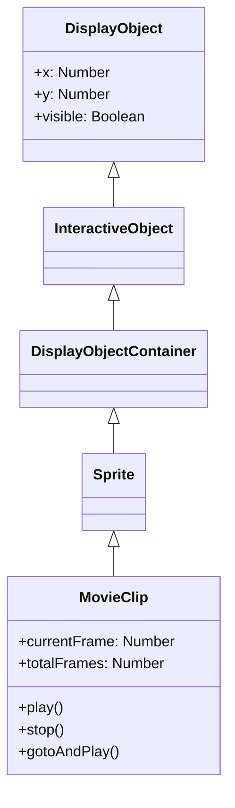

# MovieClip

MovieClip is a DisplayObjectContainer with timeline animation. Animations created with Open Animation Tool are played as MovieClips.

## Inheritance



## Properties

### Timeline Related

| Property | Type | Description |
|----------|------|-------------|
| `currentFrame` | Number | Current frame number (starts from 1) |
| `currentFrameLabel` | String | Label of current frame |
| `currentLabels` | Array | Array of FrameLabel objects for current scene |
| `totalFrames` | Number | Total number of frames |
| `framesLoaded` | Number | Number of frames loaded |
| `isPlaying` | Boolean | Whether playing |

## Methods

### play()

Starts timeline playback.

```typescript
movieClip.play();
```

### stop()

Stops timeline playback.

```typescript
movieClip.stop();
```

### gotoAndPlay(frame)

Moves to specified frame and starts playback.

```typescript
// Specify by frame number
movieClip.gotoAndPlay(10);

// Specify by frame label
movieClip.gotoAndPlay("start");
```

### gotoAndStop(frame)

Moves to specified frame and stops.

```typescript
// Specify by frame number
movieClip.gotoAndStop(1);

// Specify by frame label
movieClip.gotoAndStop("end");
```

### nextFrame()

Advances to next frame and stops.

```typescript
movieClip.nextFrame();
```

### prevFrame()

Returns to previous frame and stops.

```typescript
movieClip.prevFrame();
```

## Events

### enterFrame

Event that occurs each frame:

```typescript
import type { Event, MovieClip } from "@next2d/player";

movieClip.addEventListener("enterFrame", (event: Event): void => {
  const target: MovieClip = event.target as MovieClip;
  console.log("Frame:", target.currentFrame);
});
```

### frameConstructed

Occurs when frame construction is complete:

```typescript
import type { Event } from "@next2d/player";

movieClip.addEventListener("frameConstructed", (event: Event): void => {
  // Before frame script execution
});
```

### exitFrame

Occurs when leaving a frame:

```typescript
import type { Event } from "@next2d/player";

movieClip.addEventListener("exitFrame", (event: Event): void => {
  // Before moving to next frame
});
```

## Usage Examples

### Basic Animation Control

```typescript
import { next2d } from "@next2d/player";
import type { Loader, LoaderInfo, Event, MovieClip, Sprite } from "@next2d/player";

// Load MovieClip from JSON
const loader: Loader = new next2d.display.Loader();
loader.contentLoaderInfo.addEventListener("complete", (event: Event): void => {
  const loaderInfo: LoaderInfo = event.currentTarget as LoaderInfo;
  const mc: MovieClip = loaderInfo.content as MovieClip;
  stage.addChild(mc);

  // Stop initially
  mc.stop();

  // Play/pause on button click
  button.addEventListener("click", (): void => {
    if (mc.isPlaying) {
      mc.stop();
    } else {
      mc.play();
    }
  });
});
loader.load(new next2d.net.URLRequest("animation.json"));
```

### Control with Frame Labels

```typescript
// Move to label position
mc.gotoAndStop("idle");

// State change
function changeState(state: string): void {
  switch (state) {
    case "idle":
      mc.gotoAndPlay("idle");
      break;
    case "walk":
      mc.gotoAndPlay("walk_start");
      break;
    case "attack":
      mc.gotoAndPlay("attack");
      break;
  }
}
```

### Controlling Nested MovieClips

```typescript
import type { MovieClip } from "@next2d/player";

// Access child MovieClip
const childMc: MovieClip = mc.getChildByName("character") as MovieClip;
childMc.gotoAndPlay("run");

// Access grandchild MovieClip
const grandChild: MovieClip = (mc as any).character.arm as MovieClip;
grandChild.play();
```

### Changing Frame Rate

```typescript
// Change stage frame rate
stage.frameRate = 30;
```

## FrameLabel

A class that holds frame label information:

```typescript
import type { FrameLabel } from "@next2d/player";

// Get all labels in current scene
const labels: FrameLabel[] = mc.currentLabels;
labels.forEach((label: FrameLabel): void => {
  console.log(`${label.name}: frame ${label.frame}`);
});
```

## Related

- [DisplayObjectContainer](./display-object-container.md)
- [Sprite](./sprite.md)
- [Event System](./events.md)
