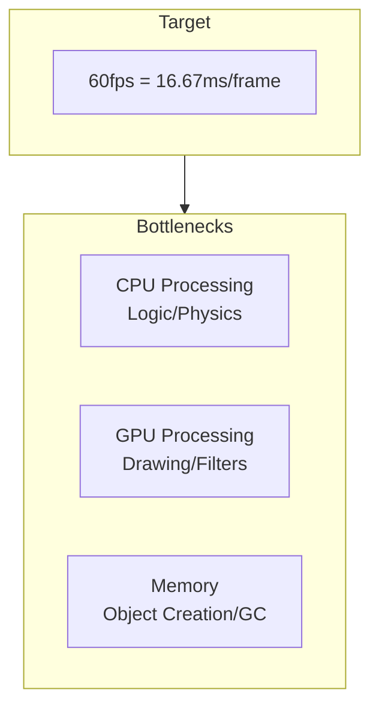

# Performance Optimization

Performance optimization techniques for maintaining 60fps.

## Performance Metrics



## Object Pooling

Pool and reuse frequently created/destroyed objects.

```typescript
import type { Sprite } from "@next2d/player";

class ObjectPool<T> {
  private _pool: T[] = [];
  private _factory: () => T;

  constructor(factory: () => T, initialSize: number = 10) {
    this._factory = factory;

    // Pre-create
    for (let i = 0; i < initialSize; i++) {
      this._pool.push(factory());
    }
  }

  acquire(): T {
    if (this._pool.length > 0) {
      return this._pool.pop()!;
    }
    return this._factory();
  }

  release(obj: T): void {
    this._pool.push(obj);
  }

  get size(): number {
    return this._pool.length;
  }
}

// Bullet pool
const bulletPool = new ObjectPool<Bullet>(() => {
  const sprite: Sprite = new next2d.display.Sprite();
  sprite.graphics.beginFill(0xFFFF00);
  sprite.graphics.drawCircle(0, 0, 5);
  sprite.graphics.endFill();
  sprite.visible = false;
  stage.addChild(sprite);
  return { sprite, x: 0, y: 0, vx: 0, vy: 0, isActive: false };
}, 50);

// Usage
function fireBullet(x: number, y: number): void {
  const bullet = bulletPool.acquire();
  bullet.x = x;
  bullet.y = y;
  bullet.isActive = true;
  bullet.sprite.visible = true;
}

// Return
function deactivateBullet(bullet: Bullet): void {
  bullet.isActive = false;
  bullet.sprite.visible = false;
  bulletPool.release(bullet);
}
```

## cacheAsBitmap

Cache complex vector drawings as bitmaps.

```typescript
import type { Sprite, Shape } from "@next2d/player";

// Complex background
const background: Shape = new next2d.display.Shape();
// Many drawing commands...
background.graphics.beginFill(0x001122);
for (let i = 0; i < 100; i++) {
  background.graphics.drawCircle(
    Math.random() * 800,
    Math.random() * 600,
    Math.random() * 20 + 5
  );
}
background.graphics.endFill();

// Enable cache (prevents redrawing every frame)
background.cacheAsBitmap = true;

stage.addChild(background);
```

### Cache Considerations

```typescript
// Cache is effective for:
// - Static objects
// - Complex vector drawings
// - When filters are applied

// Cache should be disabled for (set to false):
sprite.cacheAsBitmap = false;
// - Frequently transforming objects
// - Objects with changing sizes
// - Objects with content changing every frame
```

## Display List Optimization

### Hiding Unnecessary Objects

```typescript
// Use visible (lightweight)
sprite.visible = false;  // Skip drawing

// Remove completely with removeChild
parent.removeChild(sprite);  // Remove from display list
```

### Off-Screen Detection

```typescript
function updateEntities(): void {
  for (const entity of entities) {
    // Skip update/draw for off-screen objects
    if (isOffScreen(entity)) {
      entity.sprite.visible = false;
      continue;
    }

    entity.sprite.visible = true;
    entity.update();
  }
}

function isOffScreen(entity: Entity): boolean {
  const margin: number = 50;  // Buffer
  return entity.x < -margin ||
         entity.x > stage.stageWidth + margin ||
         entity.y < -margin ||
         entity.y > stage.stageHeight + margin;
}
```

### Display Order Optimization

```typescript
// Group objects with same texture
// Batch rendering becomes more efficient

// Bad example: Textures alternating
container.addChild(spriteA1);  // Texture A
container.addChild(spriteB1);  // Texture B
container.addChild(spriteA2);  // Texture A
container.addChild(spriteB2);  // Texture B

// Good example: Group same textures
container.addChild(spriteA1);  // Texture A
container.addChild(spriteA2);  // Texture A
container.addChild(spriteB1);  // Texture B
container.addChild(spriteB2);  // Texture B
```

## Filter Optimization

```typescript
// Filters are expensive
// Only apply when necessary

// Dynamically toggle filters
function setDamageEffect(sprite: Sprite, enabled: boolean): void {
  if (enabled) {
    sprite.filters = [
      new next2d.filters.GlowFilter(0xFF0000, 1, 10, 10)
    ];
  } else {
    sprite.filters = null;  // Remove filters
  }
}

// Avoid multiple filters
// Bad example
sprite.filters = [
  new next2d.filters.BlurFilter(4, 4),
  new next2d.filters.DropShadowFilter(4, 45),
  new next2d.filters.GlowFilter(0xFF0000)
];

// Good example: Minimal filters
sprite.filters = [
  new next2d.filters.DropShadowFilter(4, 45)
];
```

## Memory Management

### Reduce Object Creation

```typescript
// Bad example: Create new objects every frame
function update(): void {
  const position = { x: player.x, y: player.y };  // Created each time
  const velocity = new Point(vx, vy);  // Created each time
}

// Good example: Pre-create and reuse
const position = { x: 0, y: 0 };
const velocity = new next2d.geom.Point(0, 0);

function update(): void {
  position.x = player.x;
  position.y = player.y;
  velocity.x = vx;
  velocity.y = vy;
}
```

### Array Reuse

```typescript
// Bad example: New array each time
function getActiveEnemies(): Enemy[] {
  return enemies.filter(e => e.isActive);  // Creates new array
}

// Good example: Reuse pre-allocated array
const activeEnemies: Enemy[] = [];

function getActiveEnemies(): Enemy[] {
  activeEnemies.length = 0;  // Clear
  for (const enemy of enemies) {
    if (enemy.isActive) {
      activeEnemies.push(enemy);
    }
  }
  return activeEnemies;
}
```

## Calculation Optimization

### Math Function Optimization

```typescript
// Avoid Math.sqrt
// Compare squared distances for distance comparison
function isInRange(e1: Entity, e2: Entity, range: number): boolean {
  const dx: number = e1.x - e2.x;
  const dy: number = e1.y - e2.y;
  // return Math.sqrt(dx * dx + dy * dy) < range;  // Slow
  return dx * dx + dy * dy < range * range;  // Fast
}

// Cache trigonometric functions
const SIN_TABLE: number[] = [];
const COS_TABLE: number[] = [];
for (let i = 0; i < 360; i++) {
  SIN_TABLE[i] = Math.sin(i * Math.PI / 180);
  COS_TABLE[i] = Math.cos(i * Math.PI / 180);
}

function fastSin(degrees: number): number {
  return SIN_TABLE[Math.floor(degrees) % 360];
}
```

### Loop Optimization

```typescript
// Bad example: Reference length each iteration
for (let i = 0; i < enemies.length; i++) {
  // ...
}

// Good example: Cache length
const len: number = enemies.length;
for (let i = 0; i < len; i++) {
  // ...
}

// Even better: for-of (when readability is priority)
for (const enemy of enemies) {
  // ...
}
```

## Frame Skipping

Fallback when processing can't keep up:

```typescript
let lastTime: number = 0;
const TARGET_FPS: number = 60;
const FRAME_TIME: number = 1000 / TARGET_FPS;
const MAX_SKIP: number = 5;

function gameLoop(): void {
  const now: number = Date.now();
  let delta: number = now - lastTime;
  let skipCount: number = 0;

  // Multiple updates if large delay
  while (delta >= FRAME_TIME && skipCount < MAX_SKIP) {
    update();  // Logic update
    delta -= FRAME_TIME;
    skipCount++;
  }

  // Render only once
  render();

  lastTime = now - delta;  // Keep remainder
}
```

## Profiling

```typescript
// Performance measurement
class Profiler {
  private _times: Map<string, number[]> = new Map();

  start(label: string): void {
    if (!this._times.has(label)) {
      this._times.set(label, []);
    }
    (this._times.get(label) as any).startTime = performance.now();
  }

  end(label: string): void {
    const times = this._times.get(label);
    if (times && (times as any).startTime) {
      const elapsed: number = performance.now() - (times as any).startTime;
      times.push(elapsed);

      // Keep latest 100 entries
      if (times.length > 100) {
        times.shift();
      }
    }
  }

  getAverage(label: string): number {
    const times = this._times.get(label);
    if (!times || times.length === 0) return 0;
    return times.reduce((a, b) => a + b, 0) / times.length;
  }

  report(): void {
    console.log("=== Performance Report ===");
    for (const [label, times] of this._times) {
      console.log(`${label}: ${this.getAverage(label).toFixed(2)}ms`);
    }
  }
}

const profiler = new Profiler();

function gameLoop(): void {
  profiler.start("total");

  profiler.start("input");
  processInput();
  profiler.end("input");

  profiler.start("update");
  update();
  profiler.end("update");

  profiler.start("collision");
  checkCollisions();
  profiler.end("collision");

  profiler.end("total");
}

// Periodic report
setInterval(() => profiler.report(), 5000);
```

## Checklist

- [ ] Using object pooling
- [ ] cacheAsBitmap set on static objects
- [ ] Off-screen objects hidden
- [ ] Unnecessary filters removed
- [ ] Avoiding per-frame object creation
- [ ] Using spatial partitioning (for many objects)
- [ ] Avoiding Math.sqrt
- [ ] Array length cached

## Related

- [Game Loop](./game-loop.md)
- [Collision Detection](./collision.md)
- [Rendering Pipeline](./index.md#rendering-pipeline)
