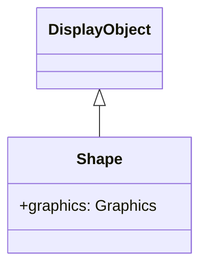

# Shape

Shape is a class dedicated to vector graphics drawing. Unlike Sprite, it cannot hold child objects, but it is lightweight and offers better performance.

## Inheritance



## Properties

| Property | Type | Description |
|----------|------|-------------|
| `graphics` | Graphics | The Graphics object that belongs to this Shape object, where vector drawing commands can occur (read-only) |
| `isShape` | boolean | Returns whether the display object has Shape functionality (read-only) |
| `cacheKey` | number | Built cache key |
| `cacheParams` | number[] | Parameters used to build the cache (read-only) |
| `isBitmap` | boolean | Bitmap drawing judgment flag |
| `src` | string | Reads images from the specified path and generates Graphics |
| `bitmapData` | BitmapData | Returns the bitmap data (read-only) |
| `namespace` | string | Returns the space name of the specified object (read-only) |

## Methods

| Method | Return Type | Description |
|--------|-------------|-------------|
| `load(url: string)` | Promise\<void\> | Asynchronously loads images from the specified URL and generates Graphics |
| `clearBitmapBuffer()` | void | Releases bitmap data |
| `setBitmapBuffer(width: number, height: number, buffer: Uint8Array)` | void | Sets the RGBA image data |

## Difference Between Sprite and Shape

| Feature | Shape | Sprite |
|---------|-------|--------|
| Child objects | Cannot hold | Can hold |
| Interaction | None | Click etc. possible |
| Performance | Lightweight | Slightly heavier |
| Use case | Static backgrounds, decorations | Buttons, containers |

## Usage Examples

### Basic Drawing

```javascript
const { Shape } = next2d.display;

const shape = new Shape();

// Filled rectangle
shape.graphics.beginFill(0x3498db);
shape.graphics.drawRect(0, 0, 150, 100);
shape.graphics.endFill();

stage.addChild(shape);
```

### Compound Shape Drawing

```javascript
const { Shape } = next2d.display;

const shape = new Shape();
const g = shape.graphics;

// Background
g.beginFill(0xecf0f1);
g.drawRoundRect(0, 0, 200, 150, 10, 10);
g.endFill();

// Border
g.lineStyle(2, 0x2c3e50);
g.drawRoundRect(0, 0, 200, 150, 10, 10);

// Inner decoration
g.beginFill(0xe74c3c);
g.drawCircle(100, 75, 30);
g.endFill();

stage.addChild(shape);
```

### Path Drawing

```javascript
const { Shape } = next2d.display;

const shape = new Shape();
const g = shape.graphics;

g.beginFill(0x9b59b6);

// Draw star shape
g.moveTo(50, 0);
g.lineTo(61, 35);
g.lineTo(98, 35);
g.lineTo(68, 57);
g.lineTo(79, 91);
g.lineTo(50, 70);
g.lineTo(21, 91);
g.lineTo(32, 57);
g.lineTo(2, 35);
g.lineTo(39, 35);
g.lineTo(50, 0);

g.endFill();

stage.addChild(shape);
```

### Bezier Curves

```javascript
const { Shape } = next2d.display;

const shape = new Shape();
const g = shape.graphics;

g.lineStyle(3, 0x1abc9c);

// Quadratic bezier curve
g.moveTo(0, 100);
g.curveTo(50, 0, 100, 100);  // control point, end point

g.curveTo(150, 200, 200, 100);

stage.addChild(shape);
```

### Gradient Background

```javascript
const { Shape } = next2d.display;
const { Matrix } = next2d.geom;

const shape = new Shape();
const g = shape.graphics;

// Matrix for gradient
const matrix = new Matrix();
matrix.createGradientBox(
    stage.stageWidth,
    stage.stageHeight,
    Math.PI / 2,  // 90 degrees (vertical)
    0, 0
);

// Radial gradient
g.beginGradientFill(
    "radial",
    [0x667eea, 0x764ba2],
    [1, 1],
    [0, 255],
    matrix
);
g.drawRect(0, 0, stage.stageWidth, stage.stageHeight);
g.endFill();

// Place at back
stage.addChildAt(shape, 0);
```

### Dynamic Redrawing

```javascript
const { Shape } = next2d.display;

const shape = new Shape();
stage.addChild(shape);

let angle = 0;

// Redraw each frame
stage.addEventListener("enterFrame", function() {
    const g = shape.graphics;

    // Clear previous drawing
    g.clear();

    // Draw at new position
    const x = 200 + Math.cos(angle) * 100;
    const y = 150 + Math.sin(angle) * 100;

    g.beginFill(0xe74c3c);
    g.drawCircle(x, y, 20);
    g.endFill();

    angle += 0.05;
});
```

### Composed of Multiple Shapes

```javascript
const { Shape } = next2d.display;

// Background layer
const bgShape = new Shape();
bgShape.graphics.beginFill(0x2c3e50);
bgShape.graphics.drawRect(0, 0, 400, 300);
bgShape.graphics.endFill();

// Decoration layer
const decorShape = new Shape();
decorShape.graphics.beginFill(0x3498db, 0.5);
decorShape.graphics.drawCircle(100, 100, 80);
decorShape.graphics.drawCircle(300, 200, 60);
decorShape.graphics.endFill();

// Front layer
const frontShape = new Shape();
frontShape.graphics.lineStyle(2, 0xecf0f1);
frontShape.graphics.drawRect(50, 50, 300, 200);

stage.addChild(bgShape);
stage.addChild(decorShape);
stage.addChild(frontShape);
```

## Performance Tips

1. **Use Shape for static drawing**: Shape is optimal for backgrounds and decorations that don't need interaction
2. **Minimize drawing**: Only draw once if content doesn't change frequently
3. **Use clear()**: Always call clear() when dynamically redrawing
4. **Cache complex shapes**: Cache drawing with cacheAsBitmap property

```javascript
// Cache complex shapes as bitmap
shape.cacheAsBitmap = true;
```

## Related

- [DisplayObject](./display-object.md)
- [Sprite](./sprite.md)
- [Filters](./filters/index.md)
