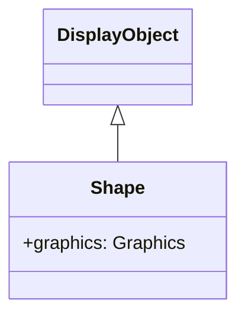

# Shape

Shape is a class dedicated to vector graphics drawing. Unlike Sprite, it cannot hold child objects, but it is lightweight and offers better performance.

## Inheritance


```mermaid
classDiagram
    DisplayObject <|-- Shape

    class Shape {
        +graphics: Graphics
    }
```

## Properties

| Property | Type | Description |
|----------|------|-------------|
| `graphics` | Graphics | The Graphics object that belongs to this Shape object, where vector drawing commands can occur (read-only) |
| `isShape` | boolean | Returns whether the display object has Shape functionality (read-only) |
| `cacheKey` | number | Built cache key |
| `cacheParams` | number[] | Parameters used to build the cache (read-only) |
| `isBitmap` | boolean | Bitmap drawing judgment flag |
| `src` | string | Reads images from the specified path and generates Graphics |
| `bitmapData` | BitmapData | Returns the bitmap data (read-only) |
| `namespace` | string | Returns the space name of the specified object (read-only) |

## Methods

| Method | Return Type | Description |
|--------|-------------|-------------|
| `load(url: string)` | Promise\<void\> | Asynchronously loads images from the specified URL and generates Graphics |
| `clearBitmapBuffer()` | void | Releases bitmap data |
| `setBitmapBuffer(width: number, height: number, buffer: Uint8Array)` | void | Sets the RGBA image data |

## Difference Between Sprite and Shape

| Feature | Shape | Sprite |
|---------|-------|--------|
| Child objects | Cannot hold | Can hold |
| Interaction | None | Click etc. possible |
| Performance | Lightweight | Slightly heavier |
| Use case | Static backgrounds, decorations | Buttons, containers |

## Loading Images (Recommended)

Recommended APIs when using images (bitmaps) with Shape:

| Use case | Recommended API | Notes |
|----------|-----------------|-------|
| Load a single image | `shape.load(url)` | Asynchronously loads an image from the specified URL and generates Graphics |
| Draw an image repeatedly (tiling) | `graphics.beginBitmapFill(bitmapData, matrix?, repeat?, smooth?)` | Pass `repeat: true` to draw repeatedly as a tile |
| Fill with an image | `graphics.beginBitmapFill(bitmapData, ...)` | Fill shapes such as rectangles and circles with a bitmap |

- **`load()` is recommended when loading an Image with Shape**
- **`beginBitmapFill` should be used when drawing an Image repeatedly or using it as a fill**

See [Bitmap Fill](#bitmap-fill) for a usage example.

## Usage Examples

### Basic Drawing

```javascript
const { Shape } = next2d.display;

const shape = new Shape();

// Filled rectangle
shape.graphics.beginFill(0x3498db);
shape.graphics.drawRect(0, 0, 150, 100);
shape.graphics.endFill();

stage.addChild(shape);
```

### Compound Shape Drawing

```javascript
const { Shape } = next2d.display;

const shape = new Shape();
const g = shape.graphics;

// Background
g.beginFill(0xecf0f1);
g.drawRoundRect(0, 0, 200, 150, 10, 10);
g.endFill();

// Border
g.lineStyle(2, 0x2c3e50);
g.drawRoundRect(0, 0, 200, 150, 10, 10);

// Inner decoration
g.beginFill(0xe74c3c);
g.drawCircle(100, 75, 30);
g.endFill();

stage.addChild(shape);
```

### Path Drawing

```javascript
const { Shape } = next2d.display;

const shape = new Shape();
const g = shape.graphics;

g.beginFill(0x9b59b6);

// Draw star shape
g.moveTo(50, 0);
g.lineTo(61, 35);
g.lineTo(98, 35);
g.lineTo(68, 57);
g.lineTo(79, 91);
g.lineTo(50, 70);
g.lineTo(21, 91);
g.lineTo(32, 57);
g.lineTo(2, 35);
g.lineTo(39, 35);
g.lineTo(50, 0);

g.endFill();

stage.addChild(shape);
```

### Bezier Curves

```javascript
const { Shape } = next2d.display;

const shape = new Shape();
const g = shape.graphics;

g.lineStyle(3, 0x1abc9c);

// Quadratic bezier curve
g.moveTo(0, 100);
g.curveTo(50, 0, 100, 100);  // control point, end point

g.curveTo(150, 200, 200, 100);

stage.addChild(shape);
```

### Gradient Background

```javascript
const { Shape } = next2d.display;
const { Matrix } = next2d.geom;

const shape = new Shape();
const g = shape.graphics;

// Matrix for gradient
const matrix = new Matrix();
matrix.createGradientBox(
    stage.stageWidth,
    stage.stageHeight,
    Math.PI / 2,  // 90 degrees (vertical)
    0, 0
);

// Radial gradient
g.beginGradientFill(
    "radial",
    [0x667eea, 0x764ba2],
    [1, 1],
    [0, 255],
    matrix
);
g.drawRect(0, 0, stage.stageWidth, stage.stageHeight);
g.endFill();

// Place at back
stage.addChildAt(shape, 0);
```

### Dynamic Redrawing

```javascript
const { Shape } = next2d.display;

const shape = new Shape();
stage.addChild(shape);

let angle = 0;

// Redraw each frame
stage.addEventListener("enterFrame", function() {
    const g = shape.graphics;

    // Clear previous drawing
    g.clear();

    // Draw at new position
    const x = 200 + Math.cos(angle) * 100;
    const y = 150 + Math.sin(angle) * 100;

    g.beginFill(0xe74c3c);
    g.drawCircle(x, y, 20);
    g.endFill();

    angle += 0.05;
});
```

### Composed of Multiple Shapes

```javascript
const { Shape } = next2d.display;

// Background layer
const bgShape = new Shape();
bgShape.graphics.beginFill(0x2c3e50);
bgShape.graphics.drawRect(0, 0, 400, 300);
bgShape.graphics.endFill();

// Decoration layer
const decorShape = new Shape();
decorShape.graphics.beginFill(0x3498db, 0.5);
decorShape.graphics.drawCircle(100, 100, 80);
decorShape.graphics.drawCircle(300, 200, 60);
decorShape.graphics.endFill();

// Front layer
const frontShape = new Shape();
frontShape.graphics.lineStyle(2, 0xecf0f1);
frontShape.graphics.drawRect(50, 50, 300, 200);

stage.addChild(bgShape);
stage.addChild(decorShape);
stage.addChild(frontShape);
```

## Performance Tips

1. **Use Shape for static drawing**: Shape is optimal for backgrounds and decorations that don't need interaction
2. **Minimize drawing**: Only draw once if content doesn't change frequently
3. **Use clear()**: Always call clear() when dynamically redrawing
4. **Cache complex shapes**: Cache drawing with cacheAsBitmap property
5. **Loading Images**: Use `load()` for a single image, and `beginBitmapFill` for repeated drawing or fills

```javascript
// Cache complex shapes as bitmap
const { Matrix } = next2d.geom;
shape.cacheAsBitmap = new Matrix(1, 0, 0, 1, 0, 0);
```

### Path Caching in graphics

Shape's `graphics` **generates a cache key from path information**. As a result, even if you create a new `Shape()`, a Shape that has the same graphics information (path information) is drawn from the cache.

```typescript
// Same path information → cache is reused (no GPU load)
const shape1 = new Shape();
shape1.graphics.beginFill(0xFF0000).drawCircle(0, 0, 50).endFill();

const shape2 = new Shape();
shape2.graphics.beginFill(0xFF0000).drawCircle(0, 0, 50).endFill(); // cache hit
```

**Property changes that keep the cache valid:**

Color, opacity, x/y position, and rotation (`alpha`, `x`, `y`, `rotation`) can be changed while reusing the cache, so the rendering load is very small.

```typescript
// These can be changed while keeping the cache (low load)
shape.alpha = 0.5;
shape.x = 100;
shape.y = 200;
shape.rotation = 45;
```

**Cache strategy when using scale:**

When using `scaleX` / `scaleY`, **set `cacheAsBitmap` at the maximum size the object will be displayed at**, and display that cache scaled down. This keeps the rendering load low.

```typescript
const { Shape } = next2d.display;
const { Matrix } = next2d.geom;

const shape = new Shape();
shape.graphics.beginFill(0x3498db).drawRect(0, 0, 100, 100).endFill();

// Cache at the maximum size (2x) and adjust with scale
shape.cacheAsBitmap = new Matrix(2, 0, 0, 2, 0, 0); // cache at 2x quality
shape.scaleX = 0.5; // display the cache scaled down (no rendering load)
shape.scaleY = 0.5;
```

## Graphics Class

The Graphics class provides a drawing API for rendering vector graphics. Access it through the Shape.graphics property.

### Fill Methods

| Method | Description |
|--------|-------------|
| `beginFill(color: number, alpha?: number)` | Starts a solid color fill. Alpha defaults to 1 |
| `beginGradientFill(type, colors, alphas, ratios, matrix?, spreadMethod?, interpolationMethod?, focalPointRatio?)` | Starts a gradient fill |
| `beginBitmapFill(bitmapData, matrix?, repeat?, smooth?)` | Starts a bitmap fill |
| `endFill()` | Ends the current fill |

#### beginGradientFill Parameters

| Parameter | Type | Description |
|-----------|------|-------------|
| `type` | string | "linear" or "radial" |
| `colors` | number[] | Array of colors (hexadecimal) |
| `alphas` | number[] | Alpha value for each color (0-1) |
| `ratios` | number[] | Position of each color (0-255) |
| `matrix` | Matrix | Transformation matrix for the gradient |
| `spreadMethod` | string | "pad", "reflect", "repeat" (default: "pad") |
| `interpolationMethod` | string | "rgb" or "linearRGB" (default: "rgb") |
| `focalPointRatio` | number | Focal point position for radial gradients (-1 to 1) |

### Line Style Methods

| Method | Description |
|--------|-------------|
| `lineStyle(thickness?, color?, alpha?, pixelHinting?, scaleMode?, caps?, joints?, miterLimit?)` | Sets the line style |
| `lineGradientStyle(type, colors, alphas, ratios, matrix?, spreadMethod?, interpolationMethod?, focalPointRatio?)` | Sets a gradient line style |
| `lineBitmapStyle(bitmapData, matrix?, repeat?, smooth?)` | Sets a bitmap line style |
| `endLine()` | Ends the line style |

#### lineStyle Parameters

| Parameter | Type | Default | Description |
|-----------|------|---------|-------------|
| `thickness` | number | 0 | Line thickness in pixels |
| `color` | number | 0 | Line color (hexadecimal) |
| `alpha` | number | 1 | Alpha transparency (0-1) |
| `pixelHinting` | boolean | false | Pixel snapping |
| `scaleMode` | string | "normal" | "normal", "none", "vertical", "horizontal" |
| `caps` | string | null | "none", "round", "square" |
| `joints` | string | null | "bevel", "miter", "round" |
| `miterLimit` | number | 3 | Miter joint limit |

### Path Methods

| Method | Description |
|--------|-------------|
| `moveTo(x: number, y: number)` | Moves the drawing position |
| `lineTo(x: number, y: number)` | Draws a line from current position to specified coordinates |
| `curveTo(controlX, controlY, anchorX, anchorY)` | Draws a quadratic Bezier curve |
| `cubicCurveTo(controlX1, controlY1, controlX2, controlY2, anchorX, anchorY)` | Draws a cubic Bezier curve |

### Shape Methods

| Method | Description |
|--------|-------------|
| `drawRect(x, y, width, height)` | Draws a rectangle |
| `drawRoundRect(x, y, width, height, ellipseWidth, ellipseHeight?)` | Draws a rounded rectangle |
| `drawCircle(x, y, radius)` | Draws a circle |
| `drawEllipse(x, y, width, height)` | Draws an ellipse |

### Utility Methods

| Method | Description |
|--------|-------------|
| `clear()` | Clears all drawing commands |
| `clone()` | Clones the Graphics object |
| `copyFrom(source: Graphics)` | Copies drawing commands from another Graphics |

### Detailed Usage Examples

#### Linear Gradient

```javascript
const { Shape } = next2d.display;
const { Matrix } = next2d.geom;

const shape = new Shape();
const g = shape.graphics;

const matrix = new Matrix();
matrix.createGradientBox(200, 100, 0, 0, 0);  // width, height, rotation, x, y

g.beginGradientFill(
    "linear",                          // type
    [0xff0000, 0x00ff00, 0x0000ff],    // colors
    [1, 1, 1],                         // alphas
    [0, 127, 255],                     // ratios
    matrix
);
g.drawRect(0, 0, 200, 100);
g.endFill();

stage.addChild(shape);
```

#### Cubic Bezier Curve

```javascript
const { Shape } = next2d.display;

const shape = new Shape();
const g = shape.graphics;

g.lineStyle(2, 0x3498db);

// Smooth S-curve
g.moveTo(0, 100);
g.cubicCurveTo(
    50, 0,     // control point 1
    150, 200,  // control point 2
    200, 100   // anchor point
);

stage.addChild(shape);
```

#### Bitmap Fill

```typescript
const { Shape } = next2d.display;

// Load image using Shape's load() method
const textureShape = new Shape();
await textureShape.load("texture.png");

// Use the loaded bitmapData for bitmap fill
const shape = new Shape();
const g = shape.graphics;

g.beginBitmapFill(textureShape.bitmapData, null, true, true);
g.drawRect(0, 0, 400, 300);
g.endFill();

stage.addChild(shape);
```

#### Gradient Line

```javascript
const { Shape } = next2d.display;
const { Matrix } = next2d.geom;

const shape = new Shape();
const g = shape.graphics;

const matrix = new Matrix();
matrix.createGradientBox(200, 200, 0, 0, 0);

g.lineGradientStyle(
    "linear",
    [0xff0000, 0x0000ff],
    [1, 1],
    [0, 255],
    matrix
);
g.lineStyle(5);

g.moveTo(10, 10);
g.lineTo(190, 10);
g.lineTo(190, 190);
g.lineTo(10, 190);
g.lineTo(10, 10);

stage.addChild(shape);
```

#### Complex Shape Composition

```javascript
const { Shape } = next2d.display;

const shape = new Shape();
const g = shape.graphics;

// Outer rectangle (filled)
g.beginFill(0x2c3e50);
g.drawRoundRect(0, 0, 200, 150, 15, 15);
g.endFill();

// Inner circle (different color fill)
g.beginFill(0xe74c3c);
g.drawCircle(100, 75, 40);
g.endFill();

// Decorative lines
g.lineStyle(2, 0xecf0f1);
g.moveTo(20, 20);
g.lineTo(180, 20);
g.moveTo(20, 130);
g.lineTo(180, 130);

stage.addChild(shape);
```

## Related

- [DisplayObject](/en/reference/player/display-object)
- [Sprite](/en/reference/player/sprite)
- [Filters](/en/reference/player/filters)
