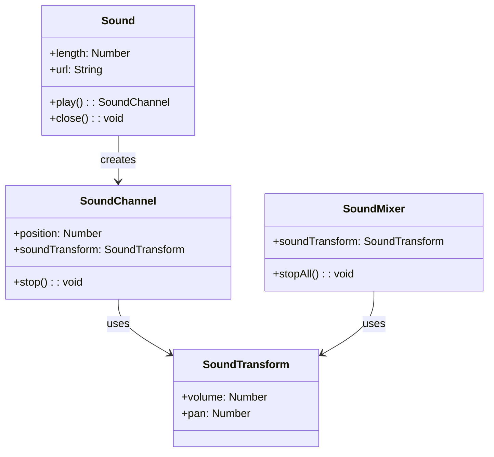

# Sound

Next2D Player provides audio functionality for games and applications, supporting BGM, sound effects, voice, and more.

## Class Structure



## Sound

A class for loading and playing audio files.

### Properties

| Property | Type | Description |
|----------|------|-------------|
| `length` | Number | Sound duration (milliseconds) |
| `url` | String | Loaded URL |
| `bytesLoaded` | Number | Bytes loaded |
| `bytesTotal` | Number | Total bytes |

### Methods

| Method | Description |
|--------|-------------|
| `play(startTime, loops, soundTransform)` | Start playback, returns SoundChannel |
| `close()` | Close the stream |

## Usage Examples

### Basic Audio Playback

```typescript
import { Sound, URLRequest } from "@next2d/player";
import type { SoundChannel, Event } from "@next2d/player";

// Create Sound object
const sound: Sound = new Sound();

// Load complete event
sound.addEventListener("complete", (event: Event): void => {
  // Start playback
  const channel: SoundChannel = sound.play();
});

// Load audio file
sound.load(new URLRequest("bgm.mp3"));
```

### Sound Effect Playback

```typescript
import { Sound, URLRequest } from "@next2d/player";
import type { SoundChannel } from "@next2d/player";

// Preload sound effects
const seJump: Sound = new Sound();
const seHit: Sound = new Sound();
const seCoin: Sound = new Sound();

// Load
seJump.load(new URLRequest("se/jump.mp3"));
seHit.load(new URLRequest("se/hit.mp3"));
seCoin.load(new URLRequest("se/coin.mp3"));

// Play function
function playSE(sound: Sound): SoundChannel {
  return sound.play();
}

// Use in game
player.addEventListener("jump", (): void => {
  playSE(seJump);
});
```

### BGM Loop Playback

```typescript
import { Sound, SoundTransform, URLRequest } from "@next2d/player";
import type { SoundChannel } from "@next2d/player";

const bgm: Sound = new Sound();
let bgmChannel: SoundChannel | null = null;

bgm.addEventListener("complete", (): void => {
  // Set volume and loop playback
  const transform: SoundTransform = new SoundTransform();
  transform.volume = 0.7;  // 70%

  // Second argument: loop count (9999 for infinite loop)
  bgmChannel = bgm.play(0, 9999, transform);
});

bgm.load(new URLRequest("bgm/stage1.mp3"));

// Stop BGM
function stopBGM(): void {
  if (bgmChannel) {
    bgmChannel.stop();
    bgmChannel = null;
  }
}
```

### Volume Control

```typescript
import { SoundTransform } from "@next2d/player";
import type { SoundChannel } from "@next2d/player";

let bgmChannel: SoundChannel;
let currentVolume: number = 1.0;

// Change volume
function setVolume(volume: number): void {
  currentVolume = Math.max(0, Math.min(1, volume));

  const transform: SoundTransform = new SoundTransform();
  transform.volume = currentVolume;
  bgmChannel.soundTransform = transform;
}

// Fade out
function fadeOut(duration: number = 1000): void {
  const startVolume: number = currentVolume;
  const startTime: number = Date.now();

  stage.addEventListener("enterFrame", function fade(): void {
    const elapsed: number = Date.now() - startTime;
    const progress: number = Math.min(1, elapsed / duration);

    setVolume(startVolume * (1 - progress));

    if (progress >= 1) {
      stage.removeEventListener("enterFrame", fade);
      bgmChannel.stop();
    }
  });
}
```

### Pan (Left/Right Balance) Settings

```typescript
import { SoundTransform } from "@next2d/player";
import type { SoundChannel } from "@next2d/player";

// Set pan (-1: left, 0: center, 1: right)
function setPan(channel: SoundChannel, pan: number): void {
  const transform: SoundTransform = new SoundTransform();
  transform.volume = channel.soundTransform.volume;
  transform.pan = Math.max(-1, Math.min(1, pan));
  channel.soundTransform = transform;
}

// Adjust pan based on enemy position
function playEnemySound(enemyX: number): void {
  const channel: SoundChannel = seEnemy.play();

  // Calculate pan based on screen center
  const centerX: number = stage.stageWidth / 2;
  const pan: number = (enemyX - centerX) / centerX;
  setPan(channel, pan);
}
```

### Sound Manager

```typescript
import { Sound, SoundTransform, URLRequest } from "@next2d/player";
import type { SoundChannel } from "@next2d/player";

class SoundManager {
  private _sounds: Map<string, Sound> = new Map();
  private _bgmChannel: SoundChannel | null = null;
  private _seChannels: SoundChannel[] = [];
  private _bgmVolume: number = 0.7;
  private _seVolume: number = 1.0;
  private _isMuted: boolean = false;

  // Preload sound
  async preload(id: string, url: string): Promise<void> {
    return new Promise((resolve) => {
      const sound: Sound = new Sound();
      sound.addEventListener("complete", (): void => {
        this._sounds.set(id, sound);
        resolve();
      });
      sound.load(new URLRequest(url));
    });
  }

  // Play BGM
  playBGM(id: string, loops: number = 9999): void {
    this.stopBGM();

    const sound: Sound | undefined = this._sounds.get(id);
    if (sound) {
      const transform: SoundTransform = new SoundTransform();
      transform.volume = this._isMuted ? 0 : this._bgmVolume;
      this._bgmChannel = sound.play(0, loops, transform);
    }
  }

  // Stop BGM
  stopBGM(): void {
    if (this._bgmChannel) {
      this._bgmChannel.stop();
      this._bgmChannel = null;
    }
  }

  // Play SE
  playSE(id: string): SoundChannel | null {
    const sound: Sound | undefined = this._sounds.get(id);
    if (sound) {
      const transform: SoundTransform = new SoundTransform();
      transform.volume = this._isMuted ? 0 : this._seVolume;
      const channel: SoundChannel = sound.play(0, 0, transform);
      this._seChannels.push(channel);
      return channel;
    }
    return null;
  }

  // Toggle mute
  toggleMute(): boolean {
    this._isMuted = !this._isMuted;
    this._updateVolumes();
    return this._isMuted;
  }

  // Set BGM volume
  setBGMVolume(volume: number): void {
    this._bgmVolume = Math.max(0, Math.min(1, volume));
    this._updateVolumes();
  }

  // Set SE volume
  setSEVolume(volume: number): void {
    this._seVolume = Math.max(0, Math.min(1, volume));
  }

  private _updateVolumes(): void {
    if (this._bgmChannel) {
      const transform: SoundTransform = new SoundTransform();
      transform.volume = this._isMuted ? 0 : this._bgmVolume;
      this._bgmChannel.soundTransform = transform;
    }
  }
}

// Usage example
const soundManager: SoundManager = new SoundManager();

// Preload on startup
async function initSounds(): Promise<void> {
  await soundManager.preload("bgm_title", "bgm/title.mp3");
  await soundManager.preload("bgm_stage1", "bgm/stage1.mp3");
  await soundManager.preload("se_jump", "se/jump.mp3");
  await soundManager.preload("se_coin", "se/coin.mp3");
  await soundManager.preload("se_damage", "se/damage.mp3");
}

// During game
soundManager.playBGM("bgm_stage1");
soundManager.playSE("se_jump");
```

## SoundMixer

A class for controlling all audio.

```typescript
import { SoundMixer, SoundTransform } from "@next2d/player";

// Stop all audio
SoundMixer.stopAll();

// Change global volume
const globalTransform: SoundTransform = new SoundTransform();
globalTransform.volume = 0.5;
SoundMixer.soundTransform = globalTransform;
```

## Supported Formats

| Format | Extension | Support |
|--------|-----------|---------|
| MP3 | .mp3 | Recommended |
| AAC | .m4a, .aac | Supported |
| Ogg Vorbis | .ogg | Browser dependent |
| WAV | .wav | Supported (large file size) |

## Best Practices

1. **Preload**: Preload all audio before game starts
2. **Format**: MP3 recommended (balance of compatibility and compression)
3. **Sound Effects**: Short sounds can use WAV (lower latency)
4. **Volume Management**: Manage BGM and SE volumes separately
5. **Mobile Support**: Start playback after user interaction

## Related

- [Event System](./events.md)
- [Game Loop](./game-loop.md)
