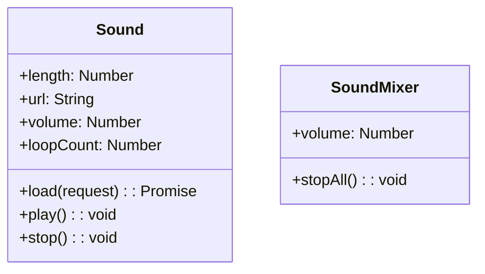

# Sound

Next2D Player provides audio functionality for games and applications, supporting BGM, sound effects, voice, and more.

## Class Structure



## Sound

A class for loading and playing audio files.

### Properties

| Property | Type | Description |
|----------|------|-------------|
| `length` | Number | Sound duration (milliseconds) |
| `url` | String | Loaded URL |
| `volume` | Number | Volume (0.0 - 1.0) |
| `loopCount` | Number | Number of loops (0 = no loop, 9999 = infinite) |

### Methods

| Method | Description |
|--------|-------------|
| `load(request)` | Load audio file (returns Promise) |
| `play()` | Start playback |
| `stop()` | Stop playback |

## Usage Examples

### Basic Audio Playback

```javascript
const { Sound } = next2d.media;
const { URLRequest } = next2d.net;

// Create Sound object
const sound = new Sound();

// Load audio file
await sound.load(new URLRequest("bgm.mp3"));

// Start playback
sound.play();
```

### Sound Effect Playback

```javascript
const { Sound } = next2d.media;
const { URLRequest } = next2d.net;

// Preload sound effects
const seJump = new Sound();
const seHit = new Sound();
const seCoin = new Sound();

// Load
await seJump.load(new URLRequest("se/jump.mp3"));
await seHit.load(new URLRequest("se/hit.mp3"));
await seCoin.load(new URLRequest("se/coin.mp3"));

// Play function
function playSE(sound) {
    sound.play();
}

// Use in game
player.addEventListener("jump", function() {
    playSE(seJump);
});
```

### BGM Loop Playback

```javascript
const { Sound } = next2d.media;
const { URLRequest } = next2d.net;

const bgm = new Sound();

await bgm.load(new URLRequest("bgm/stage1.mp3"));

// Set volume and loop count
bgm.volume = 0.7;  // 70%
bgm.loopCount = 9999;  // Infinite loop

bgm.play();

// Stop BGM
function stopBGM() {
    bgm.stop();
}
```

### Volume Control

```javascript
const { Sound } = next2d.media;
const { URLRequest } = next2d.net;

const bgm = new Sound();
await bgm.load(new URLRequest("bgm.mp3"));
bgm.volume = 1.0;
bgm.loopCount = 9999;
bgm.play();

// Change volume
function setVolume(volume) {
    bgm.volume = Math.max(0, Math.min(1, volume));
}

// Fade out
function fadeOut(duration) {
    duration = duration || 1000;
    const startVolume = bgm.volume;
    const startTime = Date.now();

    stage.addEventListener("enterFrame", function fade() {
        const elapsed = Date.now() - startTime;
        const progress = Math.min(1, elapsed / duration);

        setVolume(startVolume * (1 - progress));

        if (progress >= 1) {
            stage.removeEventListener("enterFrame", fade);
            bgm.stop();
        }
    });
}
```

### Sound Manager

```javascript
const { Sound } = next2d.media;
const { URLRequest } = next2d.net;

class SoundManager {
    constructor() {
        this._sounds = new Map();
        this._bgm = null;
        this._bgmVolume = 0.7;
        this._seVolume = 1.0;
        this._isMuted = false;
    }

    // Preload sound
    async preload(id, url) {
        const sound = new Sound();
        await sound.load(new URLRequest(url));
        this._sounds.set(id, sound);
    }

    // Play BGM
    playBGM(id, loops) {
        loops = loops || 9999;
        this.stopBGM();

        const sound = this._sounds.get(id);
        if (sound) {
            sound.volume = this._isMuted ? 0 : this._bgmVolume;
            sound.loopCount = loops;
            sound.play();
            this._bgm = sound;
        }
    }

    // Stop BGM
    stopBGM() {
        if (this._bgm) {
            this._bgm.stop();
            this._bgm = null;
        }
    }

    // Play SE
    playSE(id) {
        const sound = this._sounds.get(id);
        if (sound) {
            sound.volume = this._isMuted ? 0 : this._seVolume;
            sound.loopCount = 0;
            sound.play();
        }
    }

    // Toggle mute
    toggleMute() {
        this._isMuted = !this._isMuted;
        this._updateVolumes();
        return this._isMuted;
    }

    // Set BGM volume
    setBGMVolume(volume) {
        this._bgmVolume = Math.max(0, Math.min(1, volume));
        this._updateVolumes();
    }

    // Set SE volume
    setSEVolume(volume) {
        this._seVolume = Math.max(0, Math.min(1, volume));
    }

    _updateVolumes() {
        if (this._bgm) {
            this._bgm.volume = this._isMuted ? 0 : this._bgmVolume;
        }
    }
}

// Usage example
const soundManager = new SoundManager();

// Preload on startup
async function initSounds() {
    await soundManager.preload("bgm_title", "bgm/title.mp3");
    await soundManager.preload("bgm_stage1", "bgm/stage1.mp3");
    await soundManager.preload("se_jump", "se/jump.mp3");
    await soundManager.preload("se_coin", "se/coin.mp3");
    await soundManager.preload("se_damage", "se/damage.mp3");
}

// During game
soundManager.playBGM("bgm_stage1");
soundManager.playSE("se_jump");
```

## SoundMixer

A class for controlling all audio.

```javascript
const { SoundMixer } = next2d.media;

// Stop all audio
SoundMixer.stopAll();

// Change global volume
SoundMixer.volume = 0.5;
```

## Supported Formats

| Format | Extension | Support |
|--------|-----------|---------|
| MP3 | .mp3 | Recommended |
| AAC | .m4a, .aac | Supported |
| Ogg Vorbis | .ogg | Browser dependent |
| WAV | .wav | Supported (large file size) |

## Best Practices

1. **Preload**: Preload all audio before game starts
2. **Format**: MP3 recommended (balance of compatibility and compression)
3. **Sound Effects**: Short sounds can use WAV (lower latency)
4. **Volume Management**: Manage BGM and SE volumes separately
5. **Mobile Support**: Start playback after user interaction

## Related

- [Event System](./events.md)
