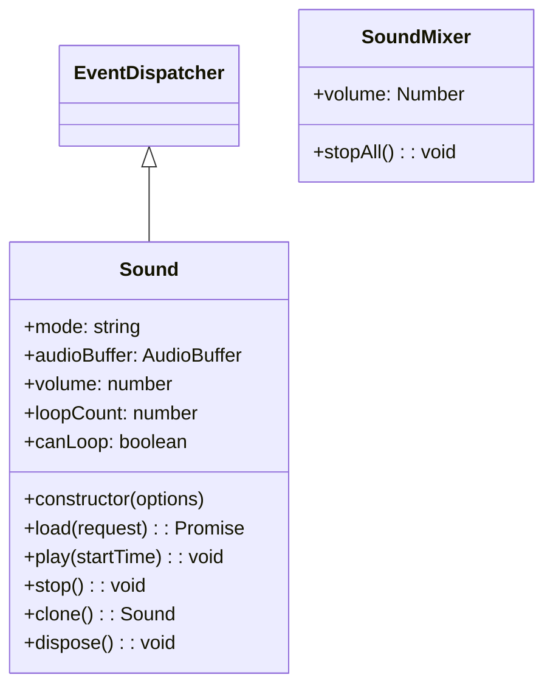

# Sound

Next2D Player provides audio functionality for games and applications, supporting BGM, sound effects, voice, and more.

## Class Structure


```mermaid
classDiagram
    EventDispatcher <|-- Sound
    class Sound {
        +constructor(options)
        +mode: string
        +audioBuffer: AudioBuffer
        +volume: number
        +loopCount: number
        +canLoop: boolean
        +load(request): Promise
        +play(startTime): void
        +stop(): void
        +clone(): Sound
        +dispose(): void
    }
    class SoundMixer {
        +volume: Number
        +stopAll(): void
    }
```

## Sound

A class for loading and playing audio files. Extends EventDispatcher.

### Constructor

```javascript
new Sound(options?: ISoundOptions)
```

| Option | Type | Default | Description |
|--------|------|---------|-------------|
| `mode` | "buffer" \| "stream" | "buffer" | Playback backend. When omitted, the existing AudioBuffer backend (`"buffer"`) is used. Specify `"stream"` for long BGM to enable streaming playback. Cannot be changed after construction |

### Properties

| Property | Type | Default | Read-only | Description |
|----------|------|---------|:---------:|-------------|
| `audioBuffer` | AudioBuffer \| null | null | - | Audio buffer. Stores audio data loaded by load() |
| `loopCount` | number | 0 | - | Loop count setting. 0 for no loop, 9999 for virtually infinite loop |
| `volume` | number | 1 | - | Volume, ranging from 0 (silent) to 1 (full volume). Cannot exceed SoundMixer.volume value |
| `canLoop` | boolean | - | Yes | Indicates whether the sound loops |
| `mode` | "buffer" \| "stream" | "buffer" | Yes | The playback backend specified at construction |

### Methods

| Method | Return | Description |
|--------|--------|-------------|
| `clone()` | Sound | Duplicates the Sound class. Copies volume, loopCount, and audioBuffer |
| `load(request: URLRequest)` | Promise\<void\> | Initiates loading of an external MP3 file from the specified URL |
| `play(startTime: number = 0)` | void | Plays a sound. startTime is the playback start time (in seconds). Does nothing if already playing |
| `stop()` | void | Stops the sound playing in the channel |
| `dispose()` | void | Releases held resources and clears `audioBuffer`. Call `load()` again before reusing (the mode remains unchanged) |

## Streaming BGM (stream mode)

Only when `new Sound({ mode: "stream" })` is specified, playback is streamed through `HTMLAudioElement → MediaElementAudioSourceNode → GainNode`. Since it neither decodes the whole track with `decodeAudioData()` nor reads the entire file into an ArrayBuffer/Blob, memory usage for long BGM is reduced.

`new Sound()` / `new Sound({ mode: "buffer" })` keep the existing behavior (events, `play(startTime)`, `audioBuffer`, volume rules, MovieClip integration, clone). The mode is never switched automatically based on file duration or loop count.

### Basic Usage

```javascript
const { Sound, SoundMixer } = next2d.media;
const { URLRequest } = next2d.net;

const bgm = new Sound({ mode: "stream" });
await bgm.load(new URLRequest("bgm/stage1.mp3"));
bgm.loopCount = Infinity;
bgm.volume = 0.5;
bgm.play();

bgm.volume = 0.2;     // Applied to the GainNode immediately, even during playback
bgm.stop();           // Releases media data; play() can restart the same Sound
bgm.play();
SoundMixer.stopAll(); // Stream sounds are also stopped
bgm.dispose();        // Releases resources; load() is required again before reuse

const se = new Sound(); // Use the existing buffer mode for SE
await se.load(new URLRequest("se/button.mp3"));
se.play();
```

### Stream Mode Specification

| Item | Specification |
|------|---------------|
| Volume | `Sound.volume` and `SoundMixer.volume` follow the existing rules (the smaller value applies; they are not multiplied). Inactive streams receive the current SoundMixer.volume on play. The HTMLAudioElement volume always stays at 1 |
| AudioContext | Shared with existing sounds |
| `load()` | Resolves and dispatches `Event.COMPLETE` **when metadata is available**, not when the whole file has downloaded. Dispatches `Event.OPEN` at load start. Byte-based `ProgressEvent.PROGRESS` is not dispatched |
| Request restrictions | Only GET URLs without `request.data` or custom `requestHeaders` are supported. Unsupported requests reject with `TypeError`. `withCredentials` selects `crossOrigin="use-credentials"`; otherwise `"anonymous"` is used. Cross-origin servers must allow CORS |
| Load errors | Rejects and dispatches `IOErrorEvent.IO_ERROR`. There is no automatic fallback to full-file decoding |
| `play()` | Always starts from the beginning. A nonzero `play(startTime)` throws `RangeError` (scheduled start is buffer-mode only). `play()` before `load()` completes is ignored |
| `loopCount` | Set before play. 0 plays once, N adds N repetitions, and `Infinity` uses native media looping. Finite playback dispatches `Event.COMPLETE` once at the final end. Stop/dispose and intermediate loops do not dispatch it. Sample-accurate gapless looping is not guaranteed |
| Autoplay blocking | When autoplay is blocked, playback is retried on pointerdown / touchend / keydown gestures. An interrupted AudioContext is also resumed. Stopped/disposed sounds never retry. Non-autoplay playback failures stop the stream and dispatch `IO_ERROR` |
| `stop()` | Cancels an outstanding load with `AbortError`, disconnects the audio graph and clears the media source to release inactive data. A loaded stream retains its URL and reuses its element/source node on replay. After cancelling an unfinished load, call `load()` again before playing |
| `clone()` | Copies a loaded stream's URL, credential mode, volume and loopCount. The clone owns a separate media element/graph, allocated on play. No global URL cache is used, so reuse BGM instances or `dispose()` them when unused |
| `audioBuffer` / `$build()` | Buffer-mode only. Stream mode never uses `audioBuffer`, and `$build()` throws `TypeError`. Sounds embedded in MovieClips continue to use buffer mode |
| `dispose()` | Disconnects and releases owned resources and clears `audioBuffer`. AudioBuffers shared with other clones are unaffected |

> **Note:** Browser buffering still consumes memory. Serve long tracks as separate audio file URLs rather than embedding them in JavaScript or data URLs. `preload="metadata"` is a browser hint, not a strict download limit.

> **Note:** Persisting volume and managing BGM/SE settings is the application's responsibility. For iOS apps, measuring the WebContent process memory on target devices during long-track playback and repeated scene transitions is recommended (JavaScript heap size alone does not include native audio buffers).

## Usage Examples

### Basic Audio Playback

```javascript
const { Sound } = next2d.media;
const { URLRequest } = next2d.net;

// Create Sound object
const sound = new Sound();

// Load audio file
await sound.load(new URLRequest("bgm.mp3"));

// Start playback
sound.play();
```

### Sound Effect Playback

```javascript
const { Sound } = next2d.media;
const { URLRequest } = next2d.net;

// Preload sound effects
const seJump = new Sound();
const seHit = new Sound();
const seCoin = new Sound();

// Load
await seJump.load(new URLRequest("se/jump.mp3"));
await seHit.load(new URLRequest("se/hit.mp3"));
await seCoin.load(new URLRequest("se/coin.mp3"));

// Play function
function playSE(sound) {
    sound.play();
}

// Use in game
player.addEventListener("jump", function() {
    playSE(seJump);
});
```

### BGM Loop Playback

```javascript
const { Sound } = next2d.media;
const { URLRequest } = next2d.net;

// Stream mode is recommended for long BGM (new Sound() also works)
const bgm = new Sound({ mode: "stream" });

await bgm.load(new URLRequest("bgm/stage1.mp3"));

// Set volume and loop count
bgm.volume = 0.7;  // 70%
bgm.loopCount = 9999;  // Infinite loop

bgm.play();

// Stop BGM
function stopBGM() {
    bgm.stop();
}
```

### Volume Control

```javascript
const { Sound } = next2d.media;
const { URLRequest } = next2d.net;

const bgm = new Sound();
await bgm.load(new URLRequest("bgm.mp3"));
bgm.volume = 1.0;
bgm.loopCount = 9999;
bgm.play();

// Change volume
function setVolume(volume) {
    bgm.volume = Math.max(0, Math.min(1, volume));
}

// Fade out
function fadeOut(duration) {
    duration = duration || 1000;
    const startVolume = bgm.volume;
    const startTime = Date.now();

    stage.addEventListener("enterFrame", function fade() {
        const elapsed = Date.now() - startTime;
        const progress = Math.min(1, elapsed / duration);

        setVolume(startVolume * (1 - progress));

        if (progress >= 1) {
            stage.removeEventListener("enterFrame", fade);
            bgm.stop();
        }
    });
}
```

### Sound Manager

```javascript
const { Sound } = next2d.media;
const { URLRequest } = next2d.net;

class SoundManager {
    constructor() {
        this._sounds = new Map();
        this._bgm = null;
        this._bgmVolume = 0.7;
        this._seVolume = 1.0;
        this._isMuted = false;
    }

    // Preload sound
    async preload(id, url) {
        const sound = new Sound();
        await sound.load(new URLRequest(url));
        this._sounds.set(id, sound);
    }

    // Play BGM
    playBGM(id, loops) {
        loops = loops || 9999;
        this.stopBGM();

        const sound = this._sounds.get(id);
        if (sound) {
            sound.volume = this._isMuted ? 0 : this._bgmVolume;
            sound.loopCount = loops;
            sound.play();
            this._bgm = sound;
        }
    }

    // Stop BGM
    stopBGM() {
        if (this._bgm) {
            this._bgm.stop();
            this._bgm = null;
        }
    }

    // Play SE
    playSE(id) {
        const sound = this._sounds.get(id);
        if (sound) {
            sound.volume = this._isMuted ? 0 : this._seVolume;
            sound.loopCount = 0;
            sound.play();
        }
    }

    // Toggle mute
    toggleMute() {
        this._isMuted = !this._isMuted;
        this._updateVolumes();
        return this._isMuted;
    }

    // Set BGM volume
    setBGMVolume(volume) {
        this._bgmVolume = Math.max(0, Math.min(1, volume));
        this._updateVolumes();
    }

    // Set SE volume
    setSEVolume(volume) {
        this._seVolume = Math.max(0, Math.min(1, volume));
    }

    _updateVolumes() {
        if (this._bgm) {
            this._bgm.volume = this._isMuted ? 0 : this._bgmVolume;
        }
    }
}

// Usage example
const soundManager = new SoundManager();

// Preload on startup
async function initSounds() {
    await soundManager.preload("bgm_title", "bgm/title.mp3");
    await soundManager.preload("bgm_stage1", "bgm/stage1.mp3");
    await soundManager.preload("se_jump", "se/jump.mp3");
    await soundManager.preload("se_coin", "se/coin.mp3");
    await soundManager.preload("se_damage", "se/damage.mp3");
}

// During game
soundManager.playBGM("bgm_stage1");
soundManager.playSE("se_jump");
```

## SoundMixer

A class for controlling all audio.

```javascript
const { SoundMixer } = next2d.media;

// Stop all audio
SoundMixer.stopAll();

// Change global volume
SoundMixer.volume = 0.5;
```

## Supported Formats

| Format | Extension | Support |
|--------|-----------|---------|
| MP3 | .mp3 | Recommended |
| AAC | .m4a, .aac | Supported |
| Ogg Vorbis | .ogg | Browser dependent |
| WAV | .wav | Supported (large file size) |

## Best Practices

1. **Preload**: Preload all audio before game starts
2. **Format**: MP3 recommended (balance of compatibility and compression)
3. **Sound Effects**: Short sounds can use WAV (lower latency)
4. **Volume Management**: Manage BGM and SE volumes separately
5. **Mobile Support**: Start playback after user interaction
6. **Stream mode for BGM**: Use `new Sound({ mode: "stream" })` for long BGM to avoid full decoding, and the existing buffer mode for SE
7. **Release resources**: Release unused Sounds with `dispose()`

## Related

- [Event System](/en/reference/player/events)
