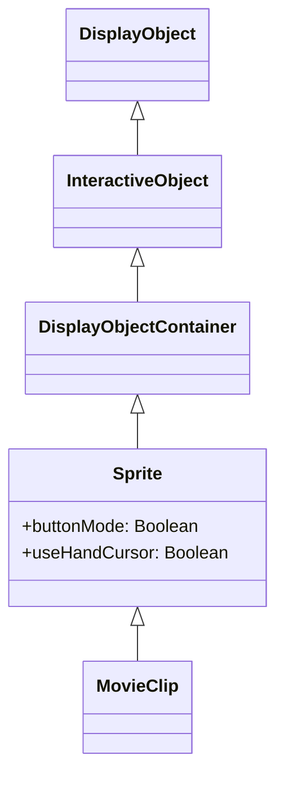

# Sprite

Sprite is a DisplayObjectContainer. It is the base class of MovieClip and is used for dynamic object management without a timeline.

## Inheritance



## Properties

### Sprite-specific Properties

| Property | Type | Read-only | Default | Description |
|----------|------|:---------:|---------|-------------|
| `isSprite` | boolean | Yes | true | Returns whether Sprite functions are possessed |
| `buttonMode` | boolean | No | false | Specifies the button mode of this sprite |
| `useHandCursor` | boolean | No | true | Whether to display hand cursor when buttonMode is true |
| `hitArea` | Sprite \| null | No | null | Designates another sprite to serve as the hit area for this sprite |
| `soundTransform` | SoundTransform \| null | No | null | Controls sound within this sprite |

### Properties Inherited from DisplayObjectContainer

| Property | Type | Read-only | Default | Description |
|----------|------|:---------:|---------|-------------|
| `isContainerEnabled` | boolean | Yes | true | Returns whether the display object has container functionality |
| `mouseChildren` | boolean | No | true | Determines whether the object's children are compatible with mouse or user input devices |
| `numChildren` | number | Yes | - | Returns the number of children of this object |
| `mask` | DisplayObject \| null | No | null | Masks the display object |

### Properties Inherited from InteractiveObject

| Property | Type | Read-only | Default | Description |
|----------|------|:---------:|---------|-------------|
| `isInteractive` | boolean | Yes | true | Returns whether InteractiveObject functions are possessed |
| `mouseEnabled` | boolean | No | true | Specifies whether this object receives mouse or other user input messages |

### Properties Inherited from DisplayObject

| Property | Type | Read-only | Default | Description |
|----------|------|:---------:|---------|-------------|
| `instanceId` | number | Yes | - | Unique instance ID of DisplayObject |
| `name` | string | No | "" | Returns the name. Used by getChildByName() |
| `parent` | Sprite \| MovieClip \| null | No | null | Returns the DisplayObjectContainer of this DisplayObject's parent |
| `x` | number | No | 0 | x coordinate relative to the local coordinates of the parent DisplayObjectContainer |
| `y` | number | No | 0 | y coordinate relative to the local coordinates of the parent DisplayObjectContainer |
| `width` | number | No | - | Width of the display object in pixels |
| `height` | number | No | - | Height of the display object in pixels |
| `scaleX` | number | No | 1 | Horizontal scale value of the object applied from the reference point |
| `scaleY` | number | No | 1 | Vertical scale value of the object applied from the reference point |
| `rotation` | number | No | 0 | Rotation of the DisplayObject instance in degrees from its original orientation |
| `alpha` | number | No | 1 | Alpha transparency value of the object (0.0 to 1.0) |
| `visible` | boolean | No | true | Whether the display object is visible |
| `blendMode` | string | No | "normal" | A value from the BlendMode class that specifies which blend mode to use |
| `filters` | array \| null | No | null | An array of filter objects currently associated with the display object |
| `matrix` | Matrix | No | - | Returns the Matrix of the display object |
| `colorTransform` | ColorTransform | No | - | Returns the ColorTransform of the display object |
| `concatenatedMatrix` | Matrix | Yes | - | Combined Matrix of this display object and all parent objects |
| `scale9Grid` | Rectangle \| null | No | null | The current scaling grid that is in effect |
| `loaderInfo` | LoaderInfo \| null | Yes | null | Loading information for the file to which this display object belongs |
| `root` | MovieClip \| Sprite \| null | Yes | null | The DisplayObjectContainer that is the root of the DisplayObject |
| `mouseX` | number | Yes | - | x-axis position in pixels relative to the reference point of the DisplayObject |
| `mouseY` | number | Yes | - | y-axis position in pixels relative to the reference point of the DisplayObject |
| `dropTarget` | Sprite \| null | Yes | null | The display object over which the sprite is being dragged or dropped |
| `isMask` | boolean | No | false | Indicates whether the DisplayObject is set as a mask |

## Methods

### Sprite-specific Methods

| Method | Return Type | Description |
|--------|-------------|-------------|
| `startDrag(lockCenter?: boolean, bounds?: Rectangle)` | void | Lets the user drag the specified sprite |
| `stopDrag()` | void | Ends the startDrag() method |

### Methods Inherited from DisplayObjectContainer

| Method | Return Type | Description |
|--------|-------------|-------------|
| `addChild(child: DisplayObject)` | DisplayObject | Adds a child DisplayObject instance |
| `addChildAt(child: DisplayObject, index: number)` | DisplayObject | Adds a child DisplayObject instance at the specified index position |
| `removeChild(child: DisplayObject)` | void | Removes the specified child DisplayObject instance |
| `removeChildAt(index: number)` | void | Removes a child DisplayObject from the specified index position |
| `removeChildren(...indexes: number[])` | void | Removes children at the indexes specified in the array from the container |
| `getChildAt(index: number)` | DisplayObject \| null | Returns the child display object instance at the specified index position |
| `getChildByName(name: string)` | DisplayObject \| null | Returns the child display object that exists with the specified name |
| `getChildIndex(child: DisplayObject)` | number | Returns the index position of a child DisplayObject instance |
| `setChildIndex(child: DisplayObject, index: number)` | void | Changes the position of an existing child in the display object container |
| `contains(child: DisplayObject)` | boolean | Whether the specified DisplayObject is a descendant of the instance |
| `swapChildren(child1: DisplayObject, child2: DisplayObject)` | void | Swaps the z-order of the two specified child objects |
| `swapChildrenAt(index1: number, index2: number)` | void | Swaps the z-order of the child objects at the two specified index positions |

### Methods Inherited from DisplayObject

| Method | Return Type | Description |
|--------|-------------|-------------|
| `getBounds(targetDisplayObject?: DisplayObject)` | Rectangle | Returns a rectangle that defines the area of the display object relative to the coordinate system of the targetDisplayObject |
| `globalToLocal(point: Point)` | Point | Converts the point object from Stage (global) coordinates to the display object's (local) coordinates |
| `localToGlobal(point: Point)` | Point | Converts the point object from the display object's (local) coordinates to Stage (global) coordinates |
| `hitTestObject(target: DisplayObject)` | boolean | Evaluates the DisplayObject's drawing range to see if it overlaps or intersects |
| `hitTestPoint(x: number, y: number, shapeFlag?: boolean)` | boolean | Evaluates the display object to see if it overlaps or intersects with the point specified by x and y parameters |
| `remove()` | void | Removes the parent-child relationship |
| `getLocalVariable(key: any)` | any | Gets a value from the local variable space of the class |
| `setLocalVariable(key: any, value: any)` | void | Stores a value in the local variable space of the class |
| `hasLocalVariable(key: any)` | boolean | Determines if there is a value in the local variable space of the class |
| `deleteLocalVariable(key: any)` | void | Removes a value from the local variable space of the class |
| `getGlobalVariable(key: any)` | any | Gets a value from the global variable space |
| `setGlobalVariable(key: any, value: any)` | void | Stores a value in the global variable space |
| `hasGlobalVariable(key: any)` | boolean | Determines if there is a value in the global variable space |
| `deleteGlobalVariable(key: any)` | void | Removes a value from the global variable space |
| `clearGlobalVariable()` | void | Clears all values in the global variable space |

## Usage Examples

### Use as Button

```typescript
const { Sprite, Shape } = next2d.display;
const { PointerEvent } = next2d.events;

const button = new Sprite();

// Enable button mode
button.buttonMode = true;
button.useHandCursor = true;

// Create background Shape
const bg = new Shape();
bg.graphics.beginFill(0x3498db);
bg.graphics.drawRoundRect(0, 0, 120, 40, 8, 8);
bg.graphics.endFill();
button.addChild(bg);

// Click event
button.addEventListener(PointerEvent.POINTER_DOWN, () => {
    console.log("Button clicked");
});

stage.addChild(button);
```

### Use as Mask

```javascript
const { Sprite, Shape } = next2d.display;

const container = new Sprite();

// Content Shape
const content = new Shape();
content.graphics.beginFill(0xFF0000);
content.graphics.drawRect(0, 0, 200, 200);
content.graphics.endFill();
container.addChild(content);

// Mask Shape
const maskShape = new Shape();
maskShape.graphics.beginFill(0xFFFFFF);
maskShape.graphics.drawCircle(100, 100, 50);
maskShape.graphics.endFill();

// Apply mask
container.mask = maskShape;

stage.addChild(container);
stage.addChild(maskShape);
```

### Drag and Drop

```typescript
const { Sprite, Shape } = next2d.display;
const { PointerEvent } = next2d.events;
const { Rectangle } = next2d.geom;

const draggable = new Sprite();

// Create background Shape
const bg = new Shape();
bg.graphics.beginFill(0x3498db);
bg.graphics.drawRect(0, 0, 100, 100);
bg.graphics.endFill();
draggable.addChild(bg);

// Start drag
draggable.addEventListener(PointerEvent.POINTER_DOWN, () => {
    // Start dragging (lock center, specify bounds)
    draggable.startDrag(true, new Rectangle(0, 0, 400, 300));
});

// Stop drag
draggable.addEventListener(PointerEvent.POINTER_UP, () => {
    draggable.stopDrag();
});

stage.addChild(draggable);
```

### Managing Child Objects

```javascript
const { Sprite, Shape } = next2d.display;

const container = new Sprite();

// Add multiple Shapes as children
for (let i = 0; i < 5; i++) {
    const shape = new Shape();
    shape.graphics.beginFill(0xFF0000 + i * 0x003300);
    shape.graphics.drawCircle(0, 0, 20);
    shape.graphics.endFill();
    shape.x = i * 50;
    shape.name = "circle" + i;
    container.addChild(shape);
}

// Get child object by name
const circle2 = container.getChildByName("circle2");

// Get number of children
console.log(container.numChildren); // 5

stage.addChild(container);
```

## Related

- [DisplayObject](/en/reference/player/display-object)
- [MovieClip](/en/reference/player/movie-clip)
- [Shape](/en/reference/player/shape)
