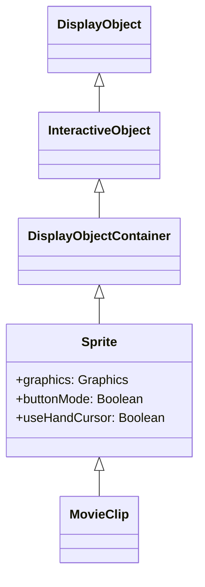

# Sprite

Sprite is a DisplayObjectContainer with graphics drawing capabilities. It is the base class of MovieClip and is used for dynamic graphics drawing without a timeline.

## Inheritance



## Properties

| Property | Type | Description |
|----------|------|-------------|
| `graphics` | Graphics | Graphics drawing object |
| `buttonMode` | Boolean | Button mode (shows hand cursor when true) |
| `useHandCursor` | Boolean | Use hand cursor (default: true) |

## graphics Property

Use the Sprite's graphics property for dynamic vector drawing.

### Line and Fill Settings

```typescript
import { Sprite } from "@next2d/player";

const sprite: Sprite = new Sprite();

// Set line style
sprite.graphics.lineStyle(2, 0xFF0000, 1.0);  // thickness, color, alpha

// Set fill
sprite.graphics.beginFill(0x00FF00, 0.8);  // color, alpha
```

### Drawing Methods

| Method | Description |
|--------|-------------|
| `moveTo(x, y)` | Move drawing position |
| `lineTo(x, y)` | Draw line from current position |
| `curveTo(cx, cy, ax, ay)` | Draw quadratic bezier curve |
| `drawRect(x, y, w, h)` | Draw rectangle |
| `drawRoundRect(x, y, w, h, rx, ry)` | Draw rounded rectangle |
| `drawCircle(x, y, r)` | Draw circle |
| `drawEllipse(x, y, w, h)` | Draw ellipse |
| `endFill()` | End fill |
| `clear()` | Clear drawing content |

## Usage Examples

### Basic Drawing

```typescript
import { Sprite } from "@next2d/player";

const sprite: Sprite = new Sprite();

// Draw red rectangle
sprite.graphics.beginFill(0xFF0000);
sprite.graphics.drawRect(0, 0, 100, 100);
sprite.graphics.endFill();

// Draw blue circle
sprite.graphics.beginFill(0x0000FF);
sprite.graphics.drawCircle(200, 50, 40);
sprite.graphics.endFill();

stage.addChild(sprite);
```

### Line Drawing

```typescript
import { Sprite } from "@next2d/player";

const sprite: Sprite = new Sprite();

// Set line style
sprite.graphics.lineStyle(3, 0x000000, 1.0);

// Draw lines
sprite.graphics.moveTo(0, 0);
sprite.graphics.lineTo(100, 100);
sprite.graphics.lineTo(200, 50);

stage.addChild(sprite);
```

### Gradient Fill

```typescript
import { Sprite, Matrix } from "@next2d/player";

const sprite: Sprite = new Sprite();

// Create gradient matrix
const matrix: Matrix = new Matrix();
matrix.createGradientBox(200, 200, 0, 0, 0);

// Linear gradient
sprite.graphics.beginGradientFill(
  "linear",                    // type
  [0xFF0000, 0x0000FF],       // colors
  [1, 1],                      // alphas
  [0, 255],                    // ratios
  matrix                       // matrix
);
sprite.graphics.drawRect(0, 0, 200, 200);
sprite.graphics.endFill();

stage.addChild(sprite);
```

### Use as Button

```typescript
import { Sprite } from "@next2d/player";

const button: Sprite = new Sprite();

// Enable button mode
button.buttonMode = true;
button.useHandCursor = true;

// Draw background
button.graphics.beginFill(0x3498db);
button.graphics.drawRoundRect(0, 0, 120, 40, 8, 8);
button.graphics.endFill();

// Click event
button.addEventListener("click", (): void => {
  console.log("Button clicked");
});

stage.addChild(button);
```

### Use as Mask

```typescript
import { Sprite } from "@next2d/player";

const content: Sprite = new Sprite();
content.graphics.beginFill(0xFF0000);
content.graphics.drawRect(0, 0, 200, 200);
content.graphics.endFill();

// Mask sprite
const maskSprite: Sprite = new Sprite();
maskSprite.graphics.beginFill(0xFFFFFF);
maskSprite.graphics.drawCircle(100, 100, 50);
maskSprite.graphics.endFill();

// Apply mask
content.mask = maskSprite;

stage.addChild(content);
stage.addChild(maskSprite);
```

## Related

- [DisplayObject](./display-object.md)
- [MovieClip](./movie-clip.md)
- [Shape](./shape.md)
