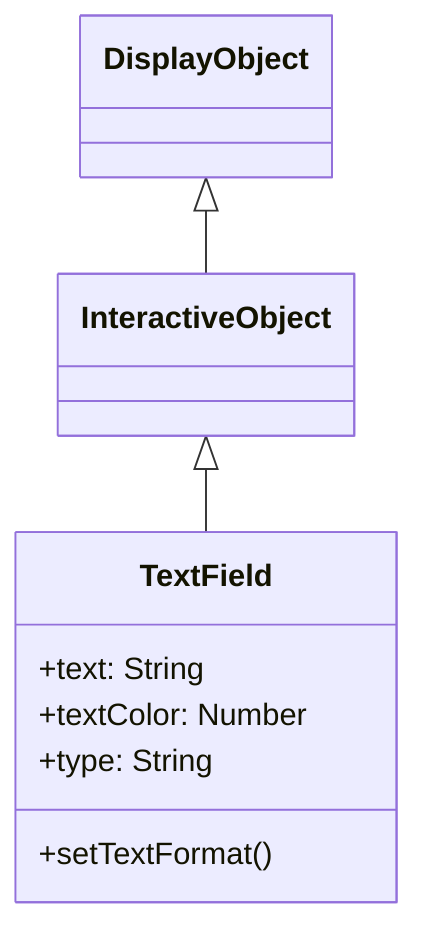

# TextField

TextField is a DisplayObject for displaying and editing text. It provides text-related functionality from label display to input forms.

## Inheritance



## Properties

### Text Related

| Property | Type | Description |
|----------|------|-------------|
| `text` | String | Text to display |
| `htmlText` | String | HTML formatted text |
| `length` | Number | Character count (read-only) |
| `maxChars` | Number | Maximum characters (0 for unlimited) |

### Display Related

| Property | Type | Description |
|----------|------|-------------|
| `textColor` | Number | Text color (0xRRGGBB) |
| `textWidth` | Number | Text width (read-only) |
| `textHeight` | Number | Text height (read-only) |
| `autoSize` | String | Auto size ("none", "left", "center", "right") |
| `wordWrap` | Boolean | Enable word wrap |
| `multiline` | Boolean | Allow multiline text |

### Input Related

| Property | Type | Description |
|----------|------|-------------|
| `type` | String | "dynamic" (display only) or "input" (editable) |
| `selectable` | Boolean | Whether text is selectable |
| `displayAsPassword` | Boolean | Password display (shows as *) |

### Scroll Related

| Property | Type | Description |
|----------|------|-------------|
| `scrollV` | Number | Vertical scroll position (line number) |
| `maxScrollV` | Number | Maximum vertical scroll position (read-only) |
| `scrollH` | Number | Horizontal scroll position (pixels) |
| `maxScrollH` | Number | Maximum horizontal scroll position (read-only) |
| `numLines` | Number | Number of text lines (read-only) |

## TextFormat

A class for setting text styles.

### Properties

| Property | Type | Description |
|----------|------|-------------|
| `font` | String | Font name |
| `size` | Number | Font size |
| `color` | Number | Text color |
| `bold` | Boolean | Bold |
| `italic` | Boolean | Italic |
| `align` | String | Alignment ("left", "center", "right") |
| `leading` | Number | Line spacing (pixels) |
| `letterSpacing` | Number | Letter spacing (pixels) |

## Usage Examples

### Basic Text Display

```javascript
const { TextField } = next2d.text;

const textField = new TextField();
textField.text = "Hello, Next2D!";
textField.x = 100;
textField.y = 100;

stage.addChild(textField);
```

### Applying TextFormat

```javascript
const { TextField, TextFormat } = next2d.text;

const textField = new TextField();
textField.text = "Styled Text";

// Create TextFormat
const format = new TextFormat();
format.font = "Arial";
format.size = 24;
format.color = 0x3498db;
format.bold = true;

// Apply format
textField.setTextFormat(format);

// Set as default format
textField.defaultTextFormat = format;

stage.addChild(textField);
```

### Auto Size

```javascript
const { TextField } = next2d.text;

const textField = new TextField();
textField.autoSize = "left";  // Auto expand to fit text
textField.text = "This text will auto-size the field";

stage.addChild(textField);
```

### Multiline Text

```javascript
const { TextField } = next2d.text;

const textField = new TextField();
textField.width = 200;
textField.multiline = true;
textField.wordWrap = true;
textField.text = "This is multiline text. It will wrap automatically.";

stage.addChild(textField);
```

### Input Field

```javascript
const { TextField } = next2d.text;

const inputField = new TextField();
inputField.type = "input";
inputField.width = 200;
inputField.height = 30;
inputField.border = true;
inputField.borderColor = 0xcccccc;
inputField.background = true;
inputField.backgroundColor = 0xffffff;

// Placeholder alternative
inputField.text = "";

// Input restriction (numbers only)
inputField.restrict = "0-9";

// Input event
inputField.addEventListener("change", function(event) {
    console.log("Input value:", event.target.text);
});

stage.addChild(inputField);
```

### Password Field

```javascript
const { TextField } = next2d.text;

const passwordField = new TextField();
passwordField.type = "input";
passwordField.displayAsPassword = true;
passwordField.width = 200;
passwordField.height = 30;
passwordField.border = true;
passwordField.borderColor = 0xcccccc;

stage.addChild(passwordField);
```

### HTML Text

```javascript
const { TextField } = next2d.text;

const textField = new TextField();
textField.width = 300;
textField.multiline = true;
textField.htmlText = '<font face="Arial" size="20" color="#3498db">' +
    '<b>Bold Text</b><br/>' +
    '<i>Italic Text</i><br/>' +
    '<font color="#e74c3c">Red Text</font>' +
    '</font>';

stage.addChild(textField);
```

### Scrollable Text

```javascript
const { TextField } = next2d.text;

const textField = new TextField();
textField.width = 200;
textField.height = 100;
textField.multiline = true;
textField.wordWrap = true;
textField.border = true;
textField.text = "Long text...\n".repeat(20);

// Scroll operations
function scrollUp() {
    if (textField.scrollV > 1) {
        textField.scrollV--;
    }
}

function scrollDown() {
    if (textField.scrollV < textField.maxScrollV) {
        textField.scrollV++;
    }
}

stage.addChild(textField);
```

### Dynamic Text Update

```javascript
const { TextField, TextFormat } = next2d.text;

const scoreField = new TextField();
scoreField.autoSize = "left";

const format = new TextFormat();
format.font = "Arial";
format.size = 32;
format.color = 0xffffff;
scoreField.defaultTextFormat = format;

let score = 0;

function updateScore(points) {
    score += points;
    scoreField.text = "Score: " + score;
}

updateScore(0);
stage.addChild(scoreField);
```

## Events

| Event | Description |
|-------|-------------|
| `change` | When text is changed |
| `focus` | When focus is gained |
| `blur` | When focus is lost |
| `keyDown` | When key is pressed |
| `keyUp` | When key is released |

```javascript
const { TextField } = next2d.text;

const inputField = new TextField();
inputField.type = "input";

// Submit form on Enter key
inputField.addEventListener("keyDown", function(event) {
    if (event.keyCode === 13) {  // Enter
        submitForm(inputField.text);
    }
});

stage.addChild(inputField);
```

## Related

- [DisplayObject](./display-object.md)
- [Event System](./events.md)
