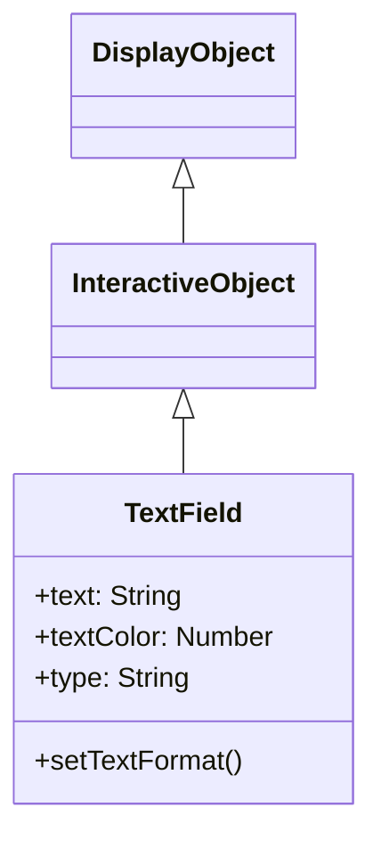

# TextField

TextField is a DisplayObject for displaying and editing text. It provides text-related functionality from label display to input forms.

## Inheritance



## Properties

### Text Related

| Property | Type | Description |
|----------|------|-------------|
| `text` | string | A string that is the current text in the text field |
| `htmlText` | string | Contains the HTML representation of the text field contents |
| `length` | number | The number of characters in a text field (read-only) |
| `maxChars` | number | The maximum number of characters that the text field can contain (0 for unlimited) |
| `restrict` | string | Indicates the set of characters that a user can enter into the text field |
| `defaultTextFormat` | TextFormat | Specifies the formatting to be applied to the text |
| `stopIndex` | number | Setting an arbitrary display end position for text (default: -1) |

### Display Related

| Property | Type | Description |
|----------|------|-------------|
| `width` | number | Indicates the width of the display object, in pixels |
| `height` | number | Indicates the height of the display object, in pixels |
| `textWidth` | number | The width of the text in pixels (read-only) |
| `textHeight` | number | The height of the text in pixels (read-only) |
| `autoSize` | string | Controls automatic sizing and alignment of text fields ("none", "left", "center", "right") |
| `autoFontSize` | boolean | Controls automatic sizing and alignment of text size (default: false) |
| `wordWrap` | boolean | A Boolean value that indicates whether the text field has word wrap (default: false) |
| `multiline` | boolean | Indicates whether field is a multiline text field (default: false) |
| `numLines` | number | Number of text lines (read-only) |

### Border and Background Related

| Property | Type | Description |
|----------|------|-------------|
| `background` | boolean | Specifies whether the text field has a background fill (default: false) |
| `backgroundColor` | number | The color of the text field background (default: 0xffffff) |
| `border` | boolean | Specifies whether the text field has a border (default: false) |
| `borderColor` | number | The color of the text field border (default: 0x000000) |

### Outline Related

| Property | Type | Description |
|----------|------|-------------|
| `thickness` | number | The text width of the outline, which can be disabled with 0 (default: 0) |
| `thicknessColor` | number | The color of the outline text in hexadecimal format (default: 0) |

### Input Related

| Property | Type | Description |
|----------|------|-------------|
| `type` | string | The type of the text field ("static", "dynamic", "input") (default: "static") |
| `focus` | boolean | Whether the text field has focus (default: false) |
| `focusVisible` | boolean | Controls the visibility of the text field's blinking line (default: false) |
| `focusIndex` | number | Index of the focus position of the text field (default: -1) |
| `selectIndex` | number | Index of the selected position of the text field (default: -1) |
| `compositionStartIndex` | number | Composition start index of the text field (default: -1) |
| `compositionEndIndex` | number | Composition end index of the text field (default: -1) |

### Scroll Related

| Property | Type | Description |
|----------|------|-------------|
| `scrollX` | number | Scroll position on the x-axis (default: 0) |
| `scrollY` | number | Scroll position on the y-axis (default: 0) |
| `scrollEnabled` | boolean | Control ON/OFF of the scroll function (default: true) |
| `xScrollShape` | Shape | Shape object for x scroll bar display (read-only) |
| `yScrollShape` | Shape | Shape object for y scroll bar display (read-only) |

## Methods

| Method | Return | Description |
|--------|--------|-------------|
| `appendText(newText: string)` | void | Appends the string specified by the newText parameter to the end of the text of the text field |
| `insertText(newText: string)` | void | Adds text to the focus position of the text field |
| `deleteText()` | void | Deletes the selection range of the text field |
| `getLineText(lineIndex: number)` | string | Returns the text of the line specified by the lineIndex parameter |
| `replaceText(newText: string, beginIndex: number, endIndex: number)` | void | Replaces the range of characters that the beginIndex and endIndex parameters specify with the contents of the newText parameter |
| `selectAll()` | void | Selects all text in the text field |
| `copy()` | void | Copy a selection of text fields |
| `paste()` | void | Paste the copied text into the selected range |
| `setFocusIndex(stageX: number, stageY: number, selected?: boolean)` | void | Sets the focus position of the text field |
| `keyDown(event: KeyboardEvent)` | void | Processes the key down event |

## TextFormat

A class for setting text styles.

### Properties

| Property | Type | Description |
|----------|------|-------------|
| `font` | String | Font name |
| `size` | Number | Font size |
| `color` | Number | Text color |
| `bold` | Boolean | Bold |
| `italic` | Boolean | Italic |
| `align` | String | Alignment ("left", "center", "right") |
| `leading` | Number | Line spacing (pixels) |
| `letterSpacing` | Number | Letter spacing (pixels) |

## Usage Examples

### Basic Text Display

```javascript
const { TextField } = next2d.text;

const textField = new TextField();
textField.text = "Hello, Next2D!";
textField.x = 100;
textField.y = 100;

stage.addChild(textField);
```

### Applying TextFormat

```javascript
const { TextField, TextFormat } = next2d.text;

const textField = new TextField();
textField.text = "Styled Text";

// Create TextFormat
const format = new TextFormat();
format.font = "Arial";
format.size = 24;
format.color = 0x3498db;
format.bold = true;

// Apply format
textField.setTextFormat(format);

// Set as default format
textField.defaultTextFormat = format;

stage.addChild(textField);
```

### Auto Size

```javascript
const { TextField } = next2d.text;

const textField = new TextField();
textField.autoSize = "left";  // Auto expand to fit text
textField.text = "This text will auto-size the field";

stage.addChild(textField);
```

### Multiline Text

```javascript
const { TextField } = next2d.text;

const textField = new TextField();
textField.width = 200;
textField.multiline = true;
textField.wordWrap = true;
textField.text = "This is multiline text. It will wrap automatically.";

stage.addChild(textField);
```

### Input Field

```javascript
const { TextField } = next2d.text;

const inputField = new TextField();
inputField.type = "input";
inputField.width = 200;
inputField.height = 30;
inputField.border = true;
inputField.borderColor = 0xcccccc;
inputField.background = true;
inputField.backgroundColor = 0xffffff;

// Placeholder alternative
inputField.text = "";

// Input restriction (numbers only)
inputField.restrict = "0-9";

// Input event
inputField.addEventListener("change", function(event) {
    console.log("Input value:", event.target.text);
});

stage.addChild(inputField);
```

### Password Field

```javascript
const { TextField } = next2d.text;

const passwordField = new TextField();
passwordField.type = "input";
passwordField.displayAsPassword = true;
passwordField.width = 200;
passwordField.height = 30;
passwordField.border = true;
passwordField.borderColor = 0xcccccc;

stage.addChild(passwordField);
```

### HTML Text

```javascript
const { TextField } = next2d.text;

const textField = new TextField();
textField.width = 300;
textField.multiline = true;
textField.htmlText = '<font face="Arial" size="20" color="#3498db">' +
    '<b>Bold Text</b><br/>' +
    '<i>Italic Text</i><br/>' +
    '<font color="#e74c3c">Red Text</font>' +
    '</font>';

stage.addChild(textField);
```

### Scrollable Text

```javascript
const { TextField } = next2d.text;

const textField = new TextField();
textField.width = 200;
textField.height = 100;
textField.multiline = true;
textField.wordWrap = true;
textField.border = true;
textField.text = "Long text...\n".repeat(20);

// Scroll operations
function scrollUp() {
    if (textField.scrollY > 0) {
        textField.scrollY -= 10;
    }
}

function scrollDown() {
    textField.scrollY += 10;
}

stage.addChild(textField);
```

### Dynamic Text Update

```javascript
const { TextField, TextFormat } = next2d.text;

const scoreField = new TextField();
scoreField.autoSize = "left";

const format = new TextFormat();
format.font = "Arial";
format.size = 32;
format.color = 0xffffff;
scoreField.defaultTextFormat = format;

let score = 0;

function updateScore(points) {
    score += points;
    scoreField.text = "Score: " + score;
}

updateScore(0);
stage.addChild(scoreField);
```

### Text Outline Effect

```javascript
const { TextField, TextFormat } = next2d.text;

const textField = new TextField();
textField.autoSize = "left";

const format = new TextFormat();
format.font = "Arial";
format.size = 48;
format.color = 0xffffff;
textField.defaultTextFormat = format;

textField.text = "Outlined Text";
textField.thickness = 2;
textField.thicknessColor = 0x000000;

stage.addChild(textField);
```

### Replace Part of Text

```javascript
const { TextField } = next2d.text;

const textField = new TextField();
textField.autoSize = "left";
textField.text = "Hello World!";

// Replace "World" with "Next2D"
textField.replaceText("Next2D", 6, 11);
// Result: "Hello Next2D!"

stage.addChild(textField);
```

## Events

| Event | Description |
|-------|-------------|
| `change` | When text is changed |
| `focus` | When focus is gained |
| `blur` | When focus is lost |
| `keyDown` | When key is pressed |
| `keyUp` | When key is released |

```javascript
const { TextField } = next2d.text;

const inputField = new TextField();
inputField.type = "input";

// Submit form on Enter key
inputField.addEventListener("keyDown", function(event) {
    if (event.keyCode === 13) {  // Enter
        submitForm(inputField.text);
    }
});

stage.addChild(inputField);
```

## Related

- [DisplayObject](/en/reference/player/display-object)
- [Event System](/en/reference/player/events)
