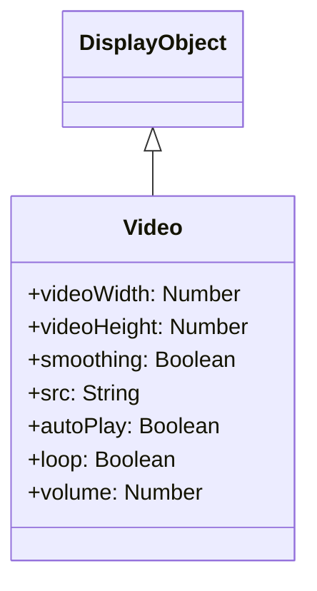

# Video

Video is a DisplayObject for playing video content. It supports video formats such as WebM and MP4.

## Inheritance



## Properties

| Property | Type | Description |
|----------|------|-------------|
| `videoWidth` | Number | Original video width (read-only) |
| `videoHeight` | Number | Original video height (read-only) |
| `smoothing` | Boolean | Enable smoothing |
| `src` | String | Video source URL |
| `autoPlay` | Boolean | Auto play on load |
| `loop` | Boolean | Loop playback |
| `volume` | Number | Volume (0.0 - 1.0) |
| `currentTime` | Number | Current playback position (seconds) |
| `duration` | Number | Video duration (seconds, read-only) |

## Methods

| Method | Description |
|--------|-------------|
| `play()` | Start video playback (returns Promise) |
| `pause()` | Pause playback |
| `seek(seconds)` | Seek to specified position |

## Usage Examples

### Basic Video Playback

```javascript
const { Video } = next2d.media;

// Create Video object
const video = new Video(640, 360);

// Set video source
video.src = "video.mp4";
video.autoPlay = true;
video.loop = false;
video.volume = 0.8;

// Add to stage
stage.addChild(video);
```

### Playback Control

```javascript
const { Video } = next2d.media;

const video = new Video(640, 360);
video.src = "video.mp4";
stage.addChild(video);

// Play button
playButton.addEventListener("click", async function() {
    await video.play();
});

// Pause button
pauseButton.addEventListener("click", function() {
    video.pause();
});

// Stop button (pause and return to start)
stopButton.addEventListener("click", function() {
    video.pause();
    video.seek(0);
});

// Forward 10 seconds
forwardButton.addEventListener("click", function() {
    video.seek(video.currentTime + 10);
});

// Back 10 seconds
backButton.addEventListener("click", function() {
    video.seek(Math.max(0, video.currentTime - 10));
});
```

### Displaying Playback Progress

```javascript
const { Video } = next2d.media;

const video = new Video(640, 360);
video.src = "video.mp4";
stage.addChild(video);

// Update progress each frame
stage.addEventListener("enterFrame", function() {
    if (video.duration > 0) {
        const progress = video.currentTime / video.duration;
        progressBar.scaleX = progress;
        timeLabel.text = formatTime(video.currentTime) + " / " + formatTime(video.duration);
    }
});

function formatTime(seconds) {
    const min = Math.floor(seconds / 60);
    const sec = Math.floor(seconds % 60);
    return min + ":" + sec.toString().padStart(2, '0');
}
```

### Volume Control

```javascript
const { Video } = next2d.media;

const video = new Video(640, 360);
video.src = "video.mp4";
video.volume = 0.5;  // 50%
stage.addChild(video);

// Volume slider
volumeSlider.addEventListener("change", function(event) {
    video.volume = event.target.value;  // 0.0 ~ 1.0
});

// Mute toggle
let isMuted = false;
let previousVolume = 0.5;

muteButton.addEventListener("click", function() {
    isMuted = !isMuted;
    if (isMuted) {
        previousVolume = video.volume;
        video.volume = 0;
    } else {
        video.volume = previousVolume;
    }
});
```

### Fullscreen Support

```javascript
const { Video } = next2d.media;

const video = new Video(640, 360);
video.src = "video.mp4";
stage.addChild(video);

// Fullscreen toggle
fullscreenButton.addEventListener("click", function() {
    if (stage.displayState === "normal") {
        // Switch to fullscreen
        stage.displayState = "fullScreen";
        video.width = stage.stageWidth;
        video.height = stage.stageHeight;
    } else {
        // Return to normal display
        stage.displayState = "normal";
        video.width = 640;
        video.height = 360;
    }
});
```

### Video Player Component

```javascript
const { Sprite } = next2d.display;
const { Video } = next2d.media;

class VideoPlayer extends Sprite {
    constructor(width, height) {
        super();

        this._width = width;
        this._height = height;

        this._video = new Video(width, height);
        this.addChild(this._video);
    }

    load(url) {
        this._video.src = url;
    }

    async play() {
        await this._video.play();
    }

    pause() {
        this._video.pause();
    }

    seek(time) {
        this._video.seek(time);
    }

    get currentTime() {
        return this._video.currentTime;
    }

    get duration() {
        return this._video.duration || 0;
    }

    set volume(value) {
        this._video.volume = value;
    }

    get volume() {
        return this._video.volume;
    }
}

// Usage
const player = new VideoPlayer(640, 360);
stage.addChild(player);
player.load("video.mp4");
player.play();
```

### Loop Playback and Auto Play

```javascript
const { Video } = next2d.media;

const video = new Video(640, 360);
video.src = "background-video.mp4";
video.autoPlay = true;
video.loop = true;
video.volume = 0;  // Muted background video

stage.addChild(video);
```

## Supported Formats

| Format | Extension | Support |
|--------|-----------|---------|
| MP4 (H.264) | .mp4 | Recommended |
| WebM (VP8/VP9) | .webm | Supported |
| Ogg Theora | .ogv | Browser dependent |

## Related

- [DisplayObject](./display-object.md)
- [Event System](./events.md)
