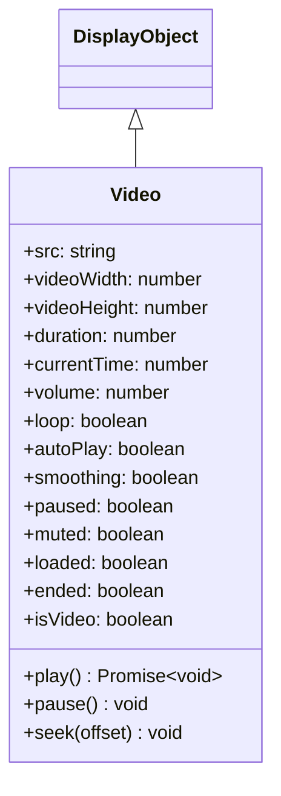

# Video

Video is a DisplayObject for playing video content. It supports video formats such as WebM and MP4.

## Inheritance



## Properties

| Property | Type | Default | Description |
|----------|------|---------|-------------|
| `src` | string | "" | Specifies the URL of the video content |
| `videoWidth` | number | 0 | An integer specifying the width of the video, in pixels |
| `videoHeight` | number | 0 | An integer specifying the height of the video, in pixels |
| `duration` | number | 0 | Total number of keyframes (video duration) |
| `currentTime` | number | 0 | Current keyframe (playback position) |
| `volume` | number | 1 | The volume, ranging from 0 (silent) to 1 (full volume) |
| `loop` | boolean | false | Specifies whether to loop the video |
| `autoPlay` | boolean | true | Setting up automatic video playback |
| `smoothing` | boolean | true | Specifies whether the video should be smoothed (interpolated) when it is scaled |
| `paused` | boolean | true | Returns whether the video is paused |
| `muted` | boolean | false | Returns whether the video is muted |
| `loaded` | boolean | false | Returns whether the video has been loaded |
| `ended` | boolean | false | Returns whether the video has ended |
| `isVideo` | boolean | true | Returns whether the display object has Video functionality (read-only) |

## Methods

| Method | Return | Description |
|--------|--------|-------------|
| `play()` | Promise\<void\> | Plays the video file |
| `pause()` | void | Pauses the video playback |
| `seek(offset: number)` | void | Seeks the keyframe closest to the specified location |

## Usage Examples

### Basic Video Playback

```typescript
const { Video } = next2d.media;

// Create Video object (specify width, height)
const video = new Video(640, 360);

// Set video source (loading starts automatically)
video.src = "video.mp4";

// Property settings
video.autoPlay = true;   // Auto play
video.loop = false;      // No loop
video.smoothing = true;  // Enable smoothing

// Add to stage
stage.addChild(video);
```

### Playback Control

```typescript
const { Video } = next2d.media;
const { PointerEvent } = next2d.events;

const video = new Video(640, 360);
video.autoPlay = false;  // Disable auto play
video.src = "video.mp4";

stage.addChild(video);

// Play button
playButton.addEventListener(PointerEvent.POINTER_DOWN, async () => {
    await video.play();
});

// Pause button
pauseButton.addEventListener(PointerEvent.POINTER_DOWN, () => {
    video.pause();
});

// Stop button (pause and return to start)
stopButton.addEventListener(PointerEvent.POINTER_DOWN, () => {
    video.pause();
    video.seek(0);
});

// Forward 10 seconds
forwardButton.addEventListener(PointerEvent.POINTER_DOWN, () => {
    video.seek(video.currentTime + 10);
});

// Back 10 seconds
backButton.addEventListener(PointerEvent.POINTER_DOWN, () => {
    video.seek(Math.max(0, video.currentTime - 10));
});
```

### Event Listening

```typescript
const { Video } = next2d.media;
const { VideoEvent } = next2d.events;

const video = new Video(640, 360);

// Play event
video.addEventListener(VideoEvent.PLAY, () => {
    console.log("Play requested");
});

// Playing event
video.addEventListener(VideoEvent.PLAYING, () => {
    console.log("Playback started");
});

// Pause event
video.addEventListener(VideoEvent.PAUSE, () => {
    console.log("Paused");
});

// Seek event
video.addEventListener(VideoEvent.SEEK, () => {
    console.log("Seek:", video.currentTime);
});

video.src = "video.mp4";
stage.addChild(video);
```

### Displaying Playback Progress

```typescript
const { Video } = next2d.media;

const video = new Video(640, 360);
video.src = "video.mp4";
stage.addChild(video);

// Update progress each frame
stage.addEventListener("enterFrame", () => {
    if (video.duration > 0) {
        const progress = video.currentTime / video.duration;
        progressBar.scaleX = progress;
        timeLabel.text = formatTime(video.currentTime) + " / " + formatTime(video.duration);
    }
});

function formatTime(seconds) {
    const min = Math.floor(seconds / 60);
    const sec = Math.floor(seconds % 60);
    return min + ":" + sec.toString().padStart(2, '0');
}
```

### Volume Control

```typescript
const { Video } = next2d.media;

const video = new Video(640, 360);
video.src = "video.mp4";
video.volume = 0.5;  // 50%

stage.addChild(video);

// Mute toggle
muteButton.addEventListener(PointerEvent.POINTER_DOWN, () => {
    video.muted = !video.muted;
});
```

### Loop Playback

```typescript
const { Video } = next2d.media;

const video = new Video(640, 360);
video.loop = true;  // Enable loop
video.src = "video.mp4";

stage.addChild(video);
```

## VideoEvent

| Event | Description |
|-------|-------------|
| `VideoEvent.PLAY` | When play is requested |
| `VideoEvent.PLAYING` | When playback starts |
| `VideoEvent.PAUSE` | When paused |
| `VideoEvent.SEEK` | When seeking |

## Supported Formats

| Format | Extension | Support |
|--------|-----------|---------|
| MP4 (H.264) | .mp4 | Recommended |
| WebM (VP8/VP9) | .webm | Supported |
| Ogg Theora | .ogv | Browser dependent |

## Related

- [DisplayObject](/en/reference/player/display-object)
- [Event System](/en/reference/player/events)
