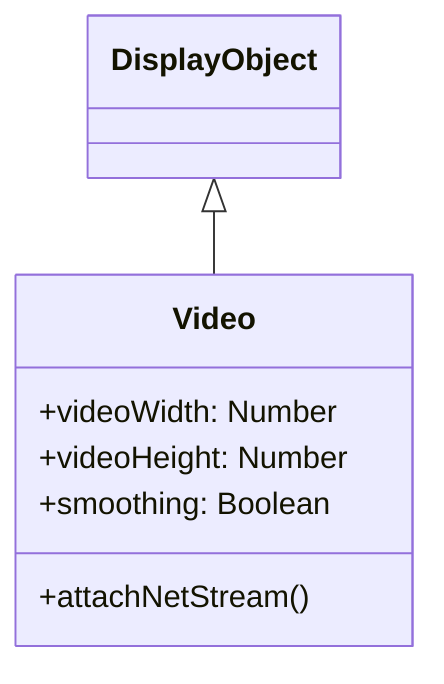

# Video

Video is a DisplayObject for playing video content. It supports video formats such as WebM and MP4.

## Inheritance



## Properties

| Property | Type | Description |
|----------|------|-------------|
| `videoWidth` | Number | Original video width (read-only) |
| `videoHeight` | Number | Original video height (read-only) |
| `smoothing` | Boolean | Enable smoothing |

## NetStream Integration

The Video class works with NetStream to play videos.

### NetStream Properties

| Property | Type | Description |
|----------|------|-------------|
| `time` | Number | Current playback position (seconds) |
| `bytesLoaded` | Number | Bytes loaded |
| `bytesTotal` | Number | Total bytes |

### NetStream Methods

| Method | Description |
|--------|-------------|
| `play(url)` | Start video playback |
| `pause()` | Pause playback |
| `resume()` | Resume playback |
| `close()` | Close stream |
| `seek(seconds)` | Seek to specified position |

## Usage Examples

### Basic Video Playback

```typescript
import { Video, NetConnection, NetStream } from "@next2d/player";

// Create Video object
const video: Video = new Video(640, 360);

// Create NetConnection
const nc: NetConnection = new NetConnection();
nc.connect(null);

// Create NetStream
const ns: NetStream = new NetStream(nc);

// Attach NetStream to Video
video.attachNetStream(ns);

// Add to stage
stage.addChild(video);

// Play video
ns.play("video.mp4");
```

### Playback Control

```typescript
import { Video, NetConnection, NetStream } from "@next2d/player";

const video: Video = new Video(640, 360);
const nc: NetConnection = new NetConnection();
nc.connect(null);
const ns: NetStream = new NetStream(nc);

video.attachNetStream(ns);
stage.addChild(video);

// Play button
playButton.addEventListener("click", (): void => {
  ns.resume();
});

// Pause button
pauseButton.addEventListener("click", (): void => {
  ns.pause();
});

// Stop button
stopButton.addEventListener("click", (): void => {
  ns.pause();
  ns.seek(0);
});

// Forward 10 seconds
forwardButton.addEventListener("click", (): void => {
  ns.seek(ns.time + 10);
});

// Back 10 seconds
backButton.addEventListener("click", (): void => {
  ns.seek(Math.max(0, ns.time - 10));
});

ns.play("video.mp4");
```

### Getting Metadata

```typescript
import { NetConnection, NetStream } from "@next2d/player";

interface MetaData {
  duration: number;
  width: number;
  height: number;
  framerate: number;
}

const nc: NetConnection = new NetConnection();
nc.connect(null);
const ns: NetStream = new NetStream(nc);

// Metadata event handler
ns.client = {
  onMetaData: (info: MetaData): void => {
    console.log("Duration:", info.duration);
    console.log("Width:", info.width);
    console.log("Height:", info.height);
    console.log("Framerate:", info.framerate);

    // Resize Video to match video size
    video.width = info.width;
    video.height = info.height;
  }
};

video.attachNetStream(ns);
ns.play("video.mp4");
```

### Displaying Playback Progress

```typescript
import { Video, NetConnection, NetStream } from "@next2d/player";

interface MetaData {
  duration: number;
}

const video: Video = new Video(640, 360);
const nc: NetConnection = new NetConnection();
nc.connect(null);
const ns: NetStream = new NetStream(nc);

let duration: number = 0;

ns.client = {
  onMetaData: (info: MetaData): void => {
    duration = info.duration;
  }
};

video.attachNetStream(ns);
stage.addChild(video);

// Update progress each frame
stage.addEventListener("enterFrame", (): void => {
  if (duration > 0) {
    const progress: number = ns.time / duration;
    progressBar.scaleX = progress;
    timeLabel.text = formatTime(ns.time) + " / " + formatTime(duration);
  }
});

function formatTime(seconds: number): string {
  const min: number = Math.floor(seconds / 60);
  const sec: number = Math.floor(seconds % 60);
  return `${min}:${sec.toString().padStart(2, '0')}`;
}

ns.play("video.mp4");
```

### Volume Control

```typescript
import { NetConnection, NetStream, SoundTransform } from "@next2d/player";
import type { Event } from "@next2d/player";

const nc: NetConnection = new NetConnection();
nc.connect(null);
const ns: NetStream = new NetStream(nc);

// Control volume with SoundTransform
const soundTransform: SoundTransform = new SoundTransform();
soundTransform.volume = 0.5;  // 50%
ns.soundTransform = soundTransform;

// Volume slider
volumeSlider.addEventListener("change", (event: Event): void => {
  const st: SoundTransform = new SoundTransform();
  st.volume = (event.target as any).value;  // 0.0 ~ 1.0
  ns.soundTransform = st;
});

// Mute toggle
let isMuted: boolean = false;
muteButton.addEventListener("click", (): void => {
  const st: SoundTransform = new SoundTransform();
  isMuted = !isMuted;
  st.volume = isMuted ? 0 : 1;
  ns.soundTransform = st;
});
```

### Fullscreen Support

```typescript
import { Video } from "@next2d/player";

const video: Video = new Video(640, 360);

// Fullscreen toggle
fullscreenButton.addEventListener("click", (): void => {
  if (stage.displayState === "normal") {
    // Switch to fullscreen
    stage.displayState = "fullScreen";
    video.width = stage.stageWidth;
    video.height = stage.stageHeight;
  } else {
    // Return to normal display
    stage.displayState = "normal";
    video.width = 640;
    video.height = 360;
  }
});
```

### Detecting Video Completion

```typescript
import { NetConnection, NetStream } from "@next2d/player";

interface MetaData {
  duration: number;
}

interface PlayStatus {
  code: string;
}

const nc: NetConnection = new NetConnection();
nc.connect(null);
const ns: NetStream = new NetStream(nc);

ns.client = {
  onMetaData: (info: MetaData): void => {
    duration = info.duration;
  },
  onPlayStatus: (info: PlayStatus): void => {
    if (info.code === "NetStream.Play.Complete") {
      console.log("Video playback completed");
      // Loop playback
      ns.seek(0);
      ns.resume();
    }
  }
};
```

### Video Player Component

```typescript
import { Sprite, Video, NetConnection, NetStream, SoundTransform } from "@next2d/player";

interface MetaData {
  duration: number;
}

class VideoPlayer extends Sprite {
  private _width: number;
  private _height: number;
  private _video: Video;
  private _nc: NetConnection;
  private _ns: NetStream;
  private _duration: number = 0;

  constructor(width: number, height: number) {
    super();

    this._width = width;
    this._height = height;

    this._video = new Video(width, height);
    this._nc = new NetConnection();
    this._nc.connect(null);
    this._ns = new NetStream(this._nc);

    this._video.attachNetStream(this._ns);
    this.addChild(this._video);

    this._ns.client = {
      onMetaData: this._onMetaData.bind(this)
    };
  }

  private _onMetaData(info: MetaData): void {
    this._duration = info.duration;
  }

  load(url: string): void {
    this._ns.play(url);
    this._ns.pause();
  }

  play(): void {
    this._ns.resume();
  }

  pause(): void {
    this._ns.pause();
  }

  seek(time: number): void {
    this._ns.seek(time);
  }

  get currentTime(): number {
    return this._ns.time;
  }

  get duration(): number {
    return this._duration || 0;
  }

  set volume(value: number) {
    const st: SoundTransform = new SoundTransform();
    st.volume = value;
    this._ns.soundTransform = st;
  }
}

// Usage
const player: VideoPlayer = new VideoPlayer(640, 360);
stage.addChild(player);
player.load("video.mp4");
player.play();
```

## Supported Formats

| Format | Extension | Support |
|--------|-----------|---------|
| MP4 (H.264) | .mp4 | Recommended |
| WebM (VP8/VP9) | .webm | Supported |
| Ogg Theora | .ogv | Browser dependent |

## Related

- [DisplayObject](./display-object.md)
- [Event System](./events.md)
