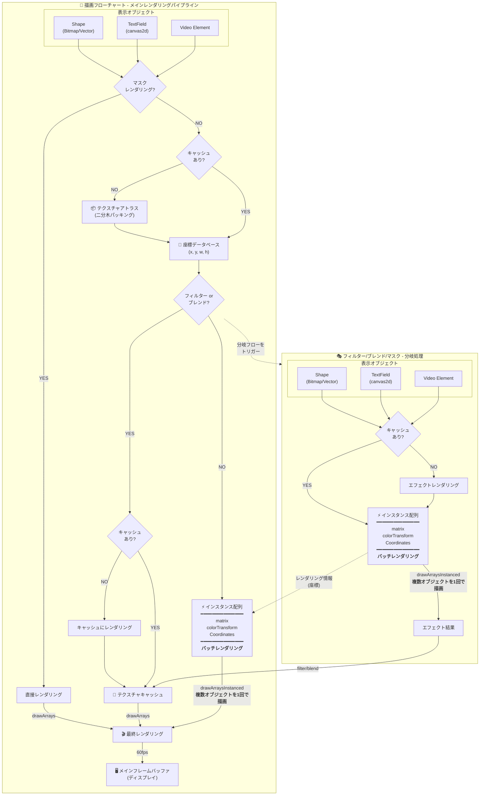

# Next2D Player

Next2D Playerは、WebGL/WebGPUを用いた高速2Dレンダリングエンジンです。Flash Playerのような機能をWeb上で実現し、ベクター描画、Tweenアニメーション、テキスト、音声、動画など、さまざまな要素をサポートしています。

## 主な特徴

- **高速レンダリング**: WebGL/WebGPUを活用した高速2D描画
- **マルチプラットフォーム**: デスクトップからモバイルまで対応
- **Flash互換API**: swf2jsから派生した馴染みやすいAPI設計
- **豊富なフィルター**: Blur、DropShadow、Glow、Bevelなど多数のフィルターをサポート

## レンダリングパイプライン

Next2D Playerの高速レンダリングを実現するパイプラインの全体像です。



### パイプラインの特徴

- **バッチレンダリング**: 複数のオブジェクトを1回のGPUコールで描画
- **テクスチャキャッシュ**: フィルターやブレンド効果を効率的に処理
- **二分木パッキング**: テクスチャアトラスで最適なメモリ使用
- **60fps描画**: 高フレームレートでのスムーズなアニメーション

## DisplayListアーキテクチャ

Next2D Playerは、Flash Playerと同様のDisplayListアーキテクチャを採用しています。

### 主要クラス階層

```
DisplayObject (基底クラス)
├── InteractiveObject
│   ├── DisplayObjectContainer
│   │   ├── Sprite
│   │   ├── MovieClip
│   │   └── Stage
│   └── TextField
├── Shape
├── Video
└── Bitmap
```

### DisplayObjectContainer

子オブジェクトを持つことができるコンテナクラス：

- `addChild(child)`: 子要素を最前面に追加
- `addChildAt(child, index)`: 指定インデックスに子要素を追加
- `removeChild(child)`: 子要素を削除
- `getChildAt(index)`: インデックスから子要素を取得
- `getChildByName(name)`: 名前から子要素を取得

### MovieClip

タイムラインアニメーションを持つDisplayObject：

- `play()`: タイムラインを再生
- `stop()`: タイムラインを停止
- `gotoAndPlay(frame)`: 指定フレームに移動して再生
- `gotoAndStop(frame)`: 指定フレームに移動して停止
- `currentFrame`: 現在のフレーム番号
- `totalFrames`: 総フレーム数

## 基本的な使い方

```typescript
import { next2d, MovieClip, DropShadowFilter } from "@next2d/player";

// ステージの初期化
const root: MovieClip = next2d.createRootMovieClip();

// MovieClipの作成
const mc: MovieClip = new MovieClip();
root.addChild(mc);

// 位置とサイズの設定
mc.x = 100;
mc.y = 100;
mc.scaleX = 2;
mc.scaleY = 2;
mc.rotation = 45;

// フィルターの適用
mc.filters = [
  new DropShadowFilter(4, 45, 0x000000, 0.5)
];
```

## JSONデータの読み込み

Open Animation Toolで作成したJSONファイルを読み込んで描画：

```typescript
import { Loader, URLRequest } from "@next2d/player";
import type { LoaderInfo, Event, MovieClip, Stage } from "@next2d/player";

const loader: Loader = new Loader();
loader.contentLoaderInfo.addEventListener("complete", (event: Event): void => {
  const loaderInfo: LoaderInfo = event.currentTarget as LoaderInfo;
  const mc: MovieClip = loaderInfo.content as MovieClip;
  stage.addChild(mc);
});
loader.load(new URLRequest("animation.json"));
```

## 関連ドキュメント

### 表示オブジェクト
- [DisplayObject](./display-object.md) - 全ての表示オブジェクトの基底クラス
- [MovieClip](./movie-clip.md) - タイムラインアニメーション
- [Sprite](./sprite.md) - グラフィックス描画とインタラクション
- [Shape](./shape.md) - 軽量なベクター描画
- [TextField](./text-field.md) - テキスト表示と入力
- [Video](./video.md) - 動画再生

### システム
- [イベントシステム](./events.md) - マウス、キーボード、タッチイベント
- [フィルター](./filters/index.md) - Blur、DropShadow、Glowなど
- [サウンド](./sound.md) - 音声再生とサウンドエフェクト
- [Tweenアニメーション](./tween.md) - プログラムによるアニメーション

### ゲーム開発
- [ゲームループ](./game-loop.md) - enterFrameを使ったゲームループパターン
- [衝突判定](./collision.md) - hitTestを使った当たり判定
- [パフォーマンス最適化](./performance.md) - 60fps維持のためのテクニック
