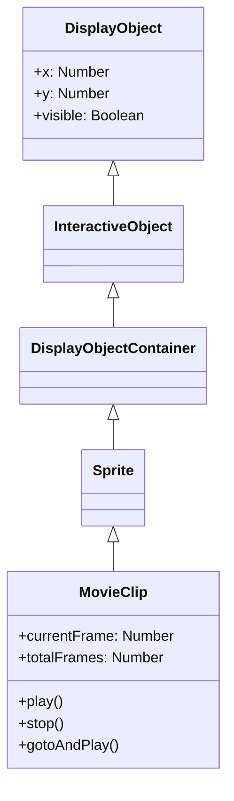

# MovieClip

MovieClipは、タイムラインアニメーションを持つDisplayObjectContainerです。Open Animation Toolで作成したアニメーションはMovieClipとして再生されます。

## 継承関係



## プロパティ

### タイムライン関連

| プロパティ | 型 | 説明 |
|-----------|------|------|
| `currentFrame` | Number | 現在のフレーム番号（1から開始） |
| `currentFrameLabel` | String | 現在のフレームのラベル |
| `currentLabels` | Array | 現在のシーンのFrameLabelオブジェクト配列 |
| `totalFrames` | Number | 総フレーム数 |
| `framesLoaded` | Number | ロード済みフレーム数 |
| `isPlaying` | Boolean | 再生中かどうか |

## メソッド

### play()

タイムラインの再生を開始します。

```typescript
movieClip.play();
```

### stop()

タイムラインの再生を停止します。

```typescript
movieClip.stop();
```

### gotoAndPlay(frame)

指定したフレームに移動して再生を開始します。

```typescript
// フレーム番号で指定
movieClip.gotoAndPlay(10);

// フレームラベルで指定
movieClip.gotoAndPlay("start");
```

### gotoAndStop(frame)

指定したフレームに移動して停止します。

```typescript
// フレーム番号で指定
movieClip.gotoAndStop(1);

// フレームラベルで指定
movieClip.gotoAndStop("end");
```

### nextFrame()

次のフレームに進んで停止します。

```typescript
movieClip.nextFrame();
```

### prevFrame()

前のフレームに戻って停止します。

```typescript
movieClip.prevFrame();
```

## イベント

### enterFrame

各フレームで発生するイベント：

```typescript
movieClip.addEventListener("enterFrame", (event) => {
    console.log("フレーム:", movieClip.currentFrame);
});
```

### frameConstructed

フレームの構築が完了したときに発生：

```typescript
movieClip.addEventListener("frameConstructed", (event) => {
    // フレームスクリプトの実行前
});
```

### exitFrame

フレームを離れるときに発生：

```typescript
movieClip.addEventListener("exitFrame", (event) => {
    // 次のフレームへ移動する前
});
```

## 使用例

### 基本的なアニメーション制御

```typescript
const { Loader, Sprite } = next2d.display;
const { URLRequest } = next2d.net;

// JSONからMovieClipを読み込み
const loader = new Loader();
await loader.load(new URLRequest("animation.json"));

const mc = loader.content;
stage.addChild(mc);

// 最初は停止
mc.stop();

// ボタンクリックで再生
button.addEventListener("click", () => {
    if (mc.isPlaying) {
        mc.stop();
    } else {
        mc.play();
    }
});
```

### フレームラベルを使った制御

```typescript
// ラベル位置に移動
mc.gotoAndStop("idle");

// 状態変更
function changeState(state) {
    switch (state) {
        case "idle":
            mc.gotoAndPlay("idle");
            break;
        case "walk":
            mc.gotoAndPlay("walk_start");
            break;
        case "attack":
            mc.gotoAndPlay("attack");
            break;
    }
}
```

### ネストしたMovieClipの制御

```typescript
// 子MovieClipへのアクセス
const childMc = mc.getChildByName("character");
childMc.gotoAndPlay("run");

// 孫MovieClipへのアクセス
const grandChild = mc.character.arm;
grandChild.play();
```

### フレームレートの変更

```typescript
// ステージ全体のフレームレートを変更
stage.frameRate = 30;
```

## FrameLabel

フレームラベルの情報を持つクラス：

```typescript
// 現在のシーンのすべてのラベルを取得
const labels = mc.currentLabels;
labels.forEach((label) => {
    console.log(`${label.name}: フレーム ${label.frame}`);
});
```

## 関連項目

- [DisplayObjectContainer](./display-object-container.md)
- [Sprite](./sprite.md)
- [イベントシステム](./events.md)
