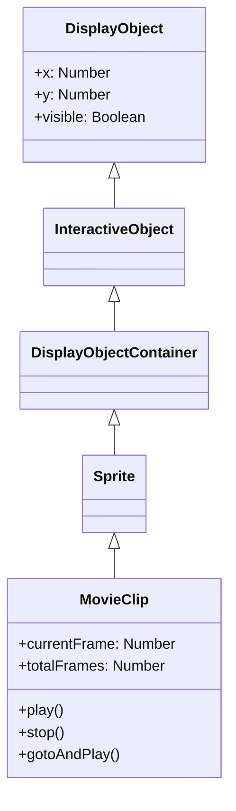

# MovieClip

MovieClipは、タイムラインアニメーションを持つDisplayObjectContainerです。Open Animation Toolで作成したアニメーションはMovieClipとして再生されます。

## 継承関係



## プロパティ

### MovieClip固有のプロパティ

| プロパティ | 型 | 説明 |
|-----------|------|------|
| `currentFrame` | `number` | MovieClipのタイムライン内の再生ヘッドが置かれているフレームの番号（1から開始、読み取り専用） |
| `totalFrames` | `number` | MovieClipインスタンス内のフレーム総数（読み取り専用） |
| `currentFrameLabel` | `FrameLabel \| null` | MovieClipインスタンスのタイムライン内の現在のフレームにあるラベル（読み取り専用） |
| `currentLabels` | `FrameLabel[] \| null` | 現在のシーンのFrameLabelオブジェクトの配列を返す（読み取り専用） |
| `isPlaying` | `boolean` | ムービークリップが現在再生されているかどうかを示すブール値（読み取り専用） |
| `isTimelineEnabled` | `boolean` | MovieClipの機能を所持しているかを返却（読み取り専用） |

### DisplayObjectContainerから継承したプロパティ

| プロパティ | 型 | 説明 |
|-----------|------|------|
| `numChildren` | `number` | このオブジェクトの子の数を返す（読み取り専用） |
| `mouseChildren` | `boolean` | オブジェクトの子がマウスまたはユーザー入力デバイスに対応しているかどうかを判断する |
| `mask` | `DisplayObject \| null` | 呼び出し元の表示オブジェクトをマスクする指定されたマスクオブジェクト |
| `isContainerEnabled` | `boolean` | コンテナの機能を所持しているかを返却（読み取り専用） |

## メソッド

### MovieClip固有のメソッド

| メソッド | 戻り値 | 説明 |
|---------|--------|------|
| `play()` | `void` | ムービークリップのタイムライン内で再生ヘッドを移動する |
| `stop()` | `void` | ムービークリップ内の再生ヘッドを停止する |
| `gotoAndPlay(frame: string \| number)` | `void` | 指定されたフレームで再生を開始する |
| `gotoAndStop(frame: string \| number)` | `void` | 指定されたフレームに再生ヘッドを送り、そこで停止させる |
| `nextFrame()` | `void` | 次のフレームに再生ヘッドを送り、停止する |
| `prevFrame()` | `void` | 直前のフレームに再生ヘッドを戻し、停止する |
| `addFrameLabel(frame_label: FrameLabel)` | `void` | タイムラインに対して動的にLabelを追加する |

### DisplayObjectContainerから継承したメソッド

| メソッド | 戻り値 | 説明 |
|---------|--------|------|
| `addChild(display_object: DisplayObject)` | `DisplayObject` | このDisplayObjectContainerインスタンスに子DisplayObjectインスタンスを追加する |
| `addChildAt(display_object: DisplayObject, index: number)` | `DisplayObject` | 指定したインデックス位置に子DisplayObjectインスタンスを追加する |
| `removeChild(display_object: DisplayObject)` | `void` | 子リストから指定のDisplayObjectインスタンスを削除する |
| `removeChildAt(index: number)` | `void` | 子リストの指定されたインデックス位置から子DisplayObjectを削除する |
| `removeChildren(...indexes: number[])` | `void` | 配列で指定されたインデックスの子をコンテナから削除する |
| `getChildAt(index: number)` | `DisplayObject \| null` | 指定のインデックス位置にある子表示オブジェクトインスタンスを返す |
| `getChildByName(name: string)` | `DisplayObject \| null` | 指定された名前に一致する子表示オブジェクトを返す |
| `getChildIndex(display_object: DisplayObject)` | `number` | 子DisplayObjectインスタンスのインデックス位置を返す |
| `contains(display_object: DisplayObject)` | `boolean` | 指定されたDisplayObjectがインスタンスの子孫か、インスタンス自体かを指定する |
| `setChildIndex(display_object: DisplayObject, index: number)` | `void` | 表示オブジェクトコンテナの既存の子の位置を変更する |
| `swapChildren(display_object1: DisplayObject, display_object2: DisplayObject)` | `void` | 指定された2つの子オブジェクトのz順序（重ね順）を入れ替える |
| `swapChildrenAt(index1: number, index2: number)` | `void` | 指定されたインデックス位置に該当する2つの子オブジェクトのz順序を入れ替える |

## イベント

### enterFrame

各フレームで発生するイベント：

```typescript
movieClip.addEventListener("enterFrame", (event) => {
    console.log("フレーム:", movieClip.currentFrame);
});
```

### frameConstructed

フレームの構築が完了したときに発生：

```typescript
movieClip.addEventListener("frameConstructed", (event) => {
    // フレームスクリプトの実行前
});
```

### exitFrame

フレームを離れるときに発生：

```typescript
movieClip.addEventListener("exitFrame", (event) => {
    // 次のフレームへ移動する前
});
```

## 使用例

### 基本的なアニメーション制御

```typescript
const { Loader, Sprite } = next2d.display;
const { URLRequest } = next2d.net;

// JSONからMovieClipを読み込み
const loader = new Loader();
await loader.load(new URLRequest("animation.json"));

const mc = loader.content;
stage.addChild(mc);

// 最初は停止
mc.stop();

// ボタンクリックで再生
button.addEventListener("click", () => {
    if (mc.isPlaying) {
        mc.stop();
    } else {
        mc.play();
    }
});
```

### フレームラベルを使った制御

```typescript
// ラベル位置に移動
mc.gotoAndStop("idle");

// 状態変更
function changeState(state) {
    switch (state) {
        case "idle":
            mc.gotoAndPlay("idle");
            break;
        case "walk":
            mc.gotoAndPlay("walk_start");
            break;
        case "attack":
            mc.gotoAndPlay("attack");
            break;
    }
}
```

### ネストしたMovieClipの制御

```typescript
// 子MovieClipへのアクセス
const childMc = mc.getChildByName("character");
childMc.gotoAndPlay("run");

// 孫MovieClipへのアクセス
const grandChild = mc.character.arm;
grandChild.play();
```

### 子オブジェクトの操作

```typescript
// 子オブジェクトを追加
const sprite = new Sprite();
mc.addChild(sprite);

// 特定のインデックスに追加
mc.addChildAt(sprite, 0);

// 子オブジェクトを削除
mc.removeChild(sprite);

// インデックスで削除
mc.removeChildAt(0);

// 複数の子を削除
mc.removeChildren(0, 1, 2);

// 子オブジェクトの取得
const child = mc.getChildAt(0);
const namedChild = mc.getChildByName("myChild");

// 子のインデックスを取得
const index = mc.getChildIndex(sprite);

// 子のインデックスを変更
mc.setChildIndex(sprite, 2);

// 子の順序を入れ替え
mc.swapChildren(sprite1, sprite2);
mc.swapChildrenAt(0, 1);
```

### フレームラベルの動的追加

```typescript
const { FrameLabel } = next2d.display;

// 新しいラベルを作成して追加
const label = new FrameLabel("myLabel", 10);
mc.addFrameLabel(label);

// ラベルを使って移動
mc.gotoAndPlay("myLabel");
```

### フレームレートの変更

```typescript
// ステージ全体のフレームレートを変更
stage.frameRate = 30;
```

## FrameLabel

フレームラベルの情報を持つクラス：

```typescript
// 現在のシーンのすべてのラベルを取得
const labels = mc.currentLabels;
labels.forEach((label) => {
    console.log(`${label.name}: フレーム ${label.frame}`);
});
```

## 関連項目

- [Sprite](./sprite.md)
- [イベントシステム](./events.md)
