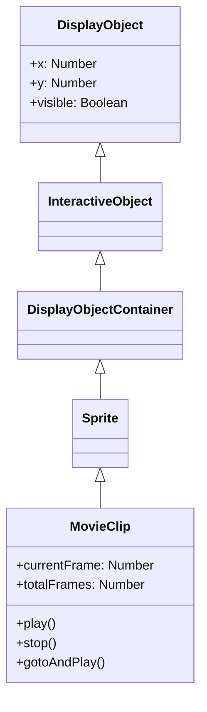

# MovieClip

MovieClipは、タイムラインアニメーションを持つDisplayObjectContainerです。Open Animation Toolで作成したアニメーションはMovieClipとして再生されます。

## 継承関係



## プロパティ

### タイムライン関連

| プロパティ | 型 | 説明 |
|-----------|------|------|
| `currentFrame` | Number | 現在のフレーム番号（1から開始） |
| `currentFrameLabel` | String | 現在のフレームのラベル |
| `currentLabels` | Array | 現在のシーンのFrameLabelオブジェクト配列 |
| `totalFrames` | Number | 総フレーム数 |
| `framesLoaded` | Number | ロード済みフレーム数 |
| `isPlaying` | Boolean | 再生中かどうか |

## メソッド

### play()

タイムラインの再生を開始します。

```typescript
movieClip.play();
```

### stop()

タイムラインの再生を停止します。

```typescript
movieClip.stop();
```

### gotoAndPlay(frame)

指定したフレームに移動して再生を開始します。

```typescript
// フレーム番号で指定
movieClip.gotoAndPlay(10);

// フレームラベルで指定
movieClip.gotoAndPlay("start");
```

### gotoAndStop(frame)

指定したフレームに移動して停止します。

```typescript
// フレーム番号で指定
movieClip.gotoAndStop(1);

// フレームラベルで指定
movieClip.gotoAndStop("end");
```

### nextFrame()

次のフレームに進んで停止します。

```typescript
movieClip.nextFrame();
```

### prevFrame()

前のフレームに戻って停止します。

```typescript
movieClip.prevFrame();
```

## イベント

### enterFrame

各フレームで発生するイベント：

```typescript
import type { Event, MovieClip } from "@next2d/player";

movieClip.addEventListener("enterFrame", (event: Event): void => {
  const target: MovieClip = event.target as MovieClip;
  console.log("フレーム:", target.currentFrame);
});
```

### frameConstructed

フレームの構築が完了したときに発生：

```typescript
import type { Event } from "@next2d/player";

movieClip.addEventListener("frameConstructed", (event: Event): void => {
  // フレームスクリプトの実行前
});
```

### exitFrame

フレームを離れるときに発生：

```typescript
import type { Event } from "@next2d/player";

movieClip.addEventListener("exitFrame", (event: Event): void => {
  // 次のフレームへ移動する前
});
```

## 使用例

### 基本的なアニメーション制御

```typescript
import { Loader, URLRequest } from "@next2d/player";
import type { LoaderInfo, Event, MovieClip, Sprite } from "@next2d/player";

// JSONからMovieClipを読み込み
const loader: Loader = new Loader();
loader.contentLoaderInfo.addEventListener("complete", (event: Event): void => {
  const loaderInfo: LoaderInfo = event.currentTarget as LoaderInfo;
  const mc: MovieClip = loaderInfo.content as MovieClip;
  stage.addChild(mc);

  // 最初は停止
  mc.stop();

  // ボタンクリックで再生
  button.addEventListener("click", (): void => {
    if (mc.isPlaying) {
      mc.stop();
    } else {
      mc.play();
    }
  });
});
loader.load(new URLRequest("animation.json"));
```

### フレームラベルを使った制御

```typescript
// ラベル位置に移動
mc.gotoAndStop("idle");

// 状態変更
function changeState(state: string): void {
  switch (state) {
    case "idle":
      mc.gotoAndPlay("idle");
      break;
    case "walk":
      mc.gotoAndPlay("walk_start");
      break;
    case "attack":
      mc.gotoAndPlay("attack");
      break;
  }
}
```

### ネストしたMovieClipの制御

```typescript
import type { MovieClip } from "@next2d/player";

// 子MovieClipへのアクセス
const childMc: MovieClip = mc.getChildByName("character") as MovieClip;
childMc.gotoAndPlay("run");

// 孫MovieClipへのアクセス
const grandChild: MovieClip = (mc as any).character.arm as MovieClip;
grandChild.play();
```

### フレームレートの変更

```typescript
// ステージ全体のフレームレートを変更
stage.frameRate = 30;
```

## FrameLabel

フレームラベルの情報を持つクラス：

```typescript
import type { FrameLabel } from "@next2d/player";

// 現在のシーンのすべてのラベルを取得
const labels: FrameLabel[] = mc.currentLabels;
labels.forEach((label: FrameLabel): void => {
  console.log(`${label.name}: フレーム ${label.frame}`);
});
```

## 関連項目

- [DisplayObjectContainer](./display-object-container.md)
- [Sprite](./sprite.md)
- [イベントシステム](./events.md)
