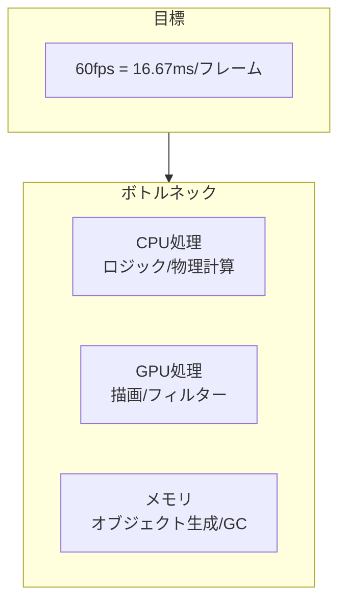

# パフォーマンス最適化

60fpsを維持するためのパフォーマンス最適化テクニックを紹介します。

## パフォーマンス指標



## オブジェクトプーリング

頻繁に生成・破棄されるオブジェクトはプールして再利用します。

```typescript
import type { Sprite } from "@next2d/player";

class ObjectPool<T> {
  private _pool: T[] = [];
  private _factory: () => T;

  constructor(factory: () => T, initialSize: number = 10) {
    this._factory = factory;

    // 事前に生成
    for (let i = 0; i < initialSize; i++) {
      this._pool.push(factory());
    }
  }

  acquire(): T {
    if (this._pool.length > 0) {
      return this._pool.pop()!;
    }
    return this._factory();
  }

  release(obj: T): void {
    this._pool.push(obj);
  }

  get size(): number {
    return this._pool.length;
  }
}

// 弾のプール
const bulletPool = new ObjectPool<Bullet>(() => {
  const sprite: Sprite = new next2d.display.Sprite();
  sprite.graphics.beginFill(0xFFFF00);
  sprite.graphics.drawCircle(0, 0, 5);
  sprite.graphics.endFill();
  sprite.visible = false;
  stage.addChild(sprite);
  return { sprite, x: 0, y: 0, vx: 0, vy: 0, isActive: false };
}, 50);

// 使用
function fireBullet(x: number, y: number): void {
  const bullet = bulletPool.acquire();
  bullet.x = x;
  bullet.y = y;
  bullet.isActive = true;
  bullet.sprite.visible = true;
}

// 返却
function deactivateBullet(bullet: Bullet): void {
  bullet.isActive = false;
  bullet.sprite.visible = false;
  bulletPool.release(bullet);
}
```

## cacheAsBitmap

複雑なベクター描画をビットマップとしてキャッシュします。

```typescript
import type { Sprite, Shape } from "@next2d/player";

// 複雑な背景
const background: Shape = new next2d.display.Shape();
// 多数の描画コマンド...
background.graphics.beginFill(0x001122);
for (let i = 0; i < 100; i++) {
  background.graphics.drawCircle(
    Math.random() * 800,
    Math.random() * 600,
    Math.random() * 20 + 5
  );
}
background.graphics.endFill();

// キャッシュを有効化（毎フレームの再描画を防ぐ）
background.cacheAsBitmap = true;

stage.addChild(background);
```

### キャッシュの注意点

```typescript
// キャッシュが有効な場合
// - 静的なオブジェクト
// - 複雑なベクター描画
// - フィルター適用時

// キャッシュが無効な場合（無効にすべき）
sprite.cacheAsBitmap = false;
// - 頻繁に変形するオブジェクト
// - サイズが大きく変わるオブジェクト
// - 描画内容が毎フレーム変わるオブジェクト
```

## 表示リストの最適化

### 不要なオブジェクトの非表示

```typescript
// visibleを使用（軽量）
sprite.visible = false;  // 描画をスキップ

// removeChildで完全に除去
parent.removeChild(sprite);  // 表示リストから削除
```

### 画面外判定

```typescript
function updateEntities(): void {
  for (const entity of entities) {
    // 画面外のオブジェクトは更新・描画をスキップ
    if (isOffScreen(entity)) {
      entity.sprite.visible = false;
      continue;
    }

    entity.sprite.visible = true;
    entity.update();
  }
}

function isOffScreen(entity: Entity): boolean {
  const margin: number = 50;  // バッファ
  return entity.x < -margin ||
         entity.x > stage.stageWidth + margin ||
         entity.y < -margin ||
         entity.y > stage.stageHeight + margin;
}
```

### 表示順序の最適化

```typescript
// 同じテクスチャのオブジェクトをまとめる
// バッチレンダリングが効率的に行われる

// 悪い例：テクスチャが交互
container.addChild(spriteA1);  // テクスチャA
container.addChild(spriteB1);  // テクスチャB
container.addChild(spriteA2);  // テクスチャA
container.addChild(spriteB2);  // テクスチャB

// 良い例：同じテクスチャをまとめる
container.addChild(spriteA1);  // テクスチャA
container.addChild(spriteA2);  // テクスチャA
container.addChild(spriteB1);  // テクスチャB
container.addChild(spriteB2);  // テクスチャB
```

## フィルターの最適化

```typescript
// フィルターは負荷が高い
// 必要な時だけ適用

// 動的にフィルターを切り替え
function setDamageEffect(sprite: Sprite, enabled: boolean): void {
  if (enabled) {
    sprite.filters = [
      new next2d.filters.GlowFilter(0xFF0000, 1, 10, 10)
    ];
  } else {
    sprite.filters = null;  // フィルターを解除
  }
}

// 複数のフィルターは避ける
// 悪い例
sprite.filters = [
  new next2d.filters.BlurFilter(4, 4),
  new next2d.filters.DropShadowFilter(4, 45),
  new next2d.filters.GlowFilter(0xFF0000)
];

// 良い例：最小限のフィルター
sprite.filters = [
  new next2d.filters.DropShadowFilter(4, 45)
];
```

## メモリ管理

### オブジェクト生成の削減

```typescript
// 悪い例：毎フレーム新しいオブジェクトを生成
function update(): void {
  const position = { x: player.x, y: player.y };  // 毎回生成
  const velocity = new Point(vx, vy);  // 毎回生成
}

// 良い例：事前に生成して再利用
const position = { x: 0, y: 0 };
const velocity = new next2d.geom.Point(0, 0);

function update(): void {
  position.x = player.x;
  position.y = player.y;
  velocity.x = vx;
  velocity.y = vy;
}
```

### 配列の再利用

```typescript
// 悪い例：毎回新しい配列
function getActiveEnemies(): Enemy[] {
  return enemies.filter(e => e.isActive);  // 新しい配列を生成
}

// 良い例：事前確保した配列を再利用
const activeEnemies: Enemy[] = [];

function getActiveEnemies(): Enemy[] {
  activeEnemies.length = 0;  // クリア
  for (const enemy of enemies) {
    if (enemy.isActive) {
      activeEnemies.push(enemy);
    }
  }
  return activeEnemies;
}
```

## 計算の最適化

### Math関数の最適化

```typescript
// Math.sqrtを避ける
// 距離の比較では二乗のまま比較
function isInRange(e1: Entity, e2: Entity, range: number): boolean {
  const dx: number = e1.x - e2.x;
  const dy: number = e1.y - e2.y;
  // return Math.sqrt(dx * dx + dy * dy) < range;  // 遅い
  return dx * dx + dy * dy < range * range;  // 速い
}

// 三角関数のキャッシュ
const SIN_TABLE: number[] = [];
const COS_TABLE: number[] = [];
for (let i = 0; i < 360; i++) {
  SIN_TABLE[i] = Math.sin(i * Math.PI / 180);
  COS_TABLE[i] = Math.cos(i * Math.PI / 180);
}

function fastSin(degrees: number): number {
  return SIN_TABLE[Math.floor(degrees) % 360];
}
```

### ループの最適化

```typescript
// 悪い例：毎回lengthを参照
for (let i = 0; i < enemies.length; i++) {
  // ...
}

// 良い例：lengthをキャッシュ
const len: number = enemies.length;
for (let i = 0; i < len; i++) {
  // ...
}

// さらに良い例：for-of（読みやすさ優先の場合）
for (const enemy of enemies) {
  // ...
}
```

## フレームスキップ

処理が間に合わない場合のフォールバック：

```typescript
let lastTime: number = 0;
const TARGET_FPS: number = 60;
const FRAME_TIME: number = 1000 / TARGET_FPS;
const MAX_SKIP: number = 5;

function gameLoop(): void {
  const now: number = Date.now();
  let delta: number = now - lastTime;
  let skipCount: number = 0;

  // 遅延が大きい場合は複数回更新
  while (delta >= FRAME_TIME && skipCount < MAX_SKIP) {
    update();  // ロジック更新
    delta -= FRAME_TIME;
    skipCount++;
  }

  // 描画は1回だけ
  render();

  lastTime = now - delta;  // 余りを保持
}
```

## プロファイリング

```typescript
// パフォーマンス計測
class Profiler {
  private _times: Map<string, number[]> = new Map();

  start(label: string): void {
    if (!this._times.has(label)) {
      this._times.set(label, []);
    }
    (this._times.get(label) as any).startTime = performance.now();
  }

  end(label: string): void {
    const times = this._times.get(label);
    if (times && (times as any).startTime) {
      const elapsed: number = performance.now() - (times as any).startTime;
      times.push(elapsed);

      // 最新100件を保持
      if (times.length > 100) {
        times.shift();
      }
    }
  }

  getAverage(label: string): number {
    const times = this._times.get(label);
    if (!times || times.length === 0) return 0;
    return times.reduce((a, b) => a + b, 0) / times.length;
  }

  report(): void {
    console.log("=== Performance Report ===");
    for (const [label, times] of this._times) {
      console.log(`${label}: ${this.getAverage(label).toFixed(2)}ms`);
    }
  }
}

const profiler = new Profiler();

function gameLoop(): void {
  profiler.start("total");

  profiler.start("input");
  processInput();
  profiler.end("input");

  profiler.start("update");
  update();
  profiler.end("update");

  profiler.start("collision");
  checkCollisions();
  profiler.end("collision");

  profiler.end("total");
}

// 定期的にレポート
setInterval(() => profiler.report(), 5000);
```

## チェックリスト

- [ ] オブジェクトプーリングを使用しているか
- [ ] 静的なオブジェクトにcacheAsBitmapを設定しているか
- [ ] 画面外のオブジェクトを非表示にしているか
- [ ] 不要なフィルターを削除しているか
- [ ] 毎フレームのオブジェクト生成を避けているか
- [ ] 空間分割を使用しているか（大量のオブジェクト時）
- [ ] Math.sqrtを避けているか
- [ ] 配列のlengthをキャッシュしているか

## 関連項目

- [ゲームループ](./game-loop.md)
- [衝突判定](./collision.md)
- [レンダリングパイプライン](./index.md#レンダリングパイプライン)
