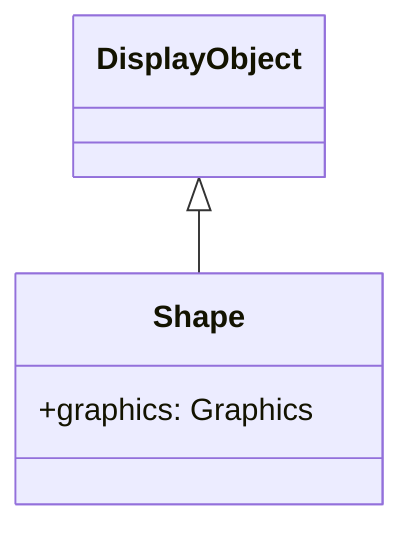

# Shape

Shapeは、ベクターグラフィックスの描画専用クラスです。Spriteと異なり子オブジェクトを持てませんが、軽量でパフォーマンスに優れています。

## 継承関係



## プロパティ

| プロパティ | 型 | 説明 |
|-----------|------|------|
| `graphics` | Graphics | この Shape オブジェクトに描画されるベクターの描画コマンドを保持する Graphics オブジェクト（読み取り専用） |
| `isShape` | boolean | Shapeの機能を所持しているかを返却（読み取り専用） |
| `cacheKey` | number | ビルドされたキャッシュキー |
| `cacheParams` | number[] | キャッシュのビルドに利用されるパラメータ（読み取り専用） |
| `isBitmap` | boolean | ビットマップ描画の判定フラグ |
| `src` | string | 指定されたパスから画像を読み込み、Graphicsを生成する |
| `bitmapData` | BitmapData | ビットマップデータを返却（読み取り専用） |
| `namespace` | string | 指定されたオブジェクトの空間名を返却（読み取り専用） |

## メソッド

| メソッド | 戻り値 | 説明 |
|---------|--------|------|
| `load(url: string)` | Promise\<void\> | 指定されたURLから画像を非同期で読み込み、Graphicsを生成する |
| `clearBitmapBuffer()` | void | ビットマップデータを解放する |
| `setBitmapBuffer(width: number, height: number, buffer: Uint8Array)` | void | RGBAの画像データを設定する |

## SpriteとShapeの違い

| 特徴 | Shape | Sprite |
|------|-------|--------|
| 子オブジェクト | 持てない | 持てる |
| インタラクション | なし | クリック等可能 |
| パフォーマンス | 軽量 | やや重い |
| 用途 | 静的な背景、装飾 | ボタン、コンテナ |

## 使用例

### 基本的な描画

```typescript
const { Shape } = next2d.display;

const shape = new Shape();

// 塗りつぶし矩形
shape.graphics.beginFill(0x3498db);
shape.graphics.drawRect(0, 0, 150, 100);
shape.graphics.endFill();

stage.addChild(shape);
```

### 複合図形の描画

```typescript
const { Shape } = next2d.display;

const shape = new Shape();
const g = shape.graphics;

// 背景
g.beginFill(0xecf0f1);
g.drawRoundRect(0, 0, 200, 150, 10, 10);
g.endFill();

// 枠線
g.lineStyle(2, 0x2c3e50);
g.drawRoundRect(0, 0, 200, 150, 10, 10);

// 内側の装飾
g.beginFill(0xe74c3c);
g.drawCircle(100, 75, 30);
g.endFill();

stage.addChild(shape);
```

### パスの描画

```typescript
const { Shape } = next2d.display;

const shape = new Shape();
const g = shape.graphics;

g.beginFill(0x9b59b6);

// 星形を描画
g.moveTo(50, 0);
g.lineTo(61, 35);
g.lineTo(98, 35);
g.lineTo(68, 57);
g.lineTo(79, 91);
g.lineTo(50, 70);
g.lineTo(21, 91);
g.lineTo(32, 57);
g.lineTo(2, 35);
g.lineTo(39, 35);
g.lineTo(50, 0);

g.endFill();

stage.addChild(shape);
```

### ベジェ曲線

```typescript
const { Shape } = next2d.display;

const shape = new Shape();
const g = shape.graphics;

g.lineStyle(3, 0x1abc9c);

// 二次ベジェ曲線
g.moveTo(0, 100);
g.curveTo(50, 0, 100, 100);  // 制御点, 終点

g.curveTo(150, 200, 200, 100);

stage.addChild(shape);
```

### グラデーション背景

```typescript
const { Shape } = next2d.display;
const { Matrix } = next2d.geom;

const shape = new Shape();
const g = shape.graphics;

// グラデーション用マトリックス
const matrix = new Matrix();
matrix.createGradientBox(
    stage.stageWidth,
    stage.stageHeight,
    Math.PI / 2,  // 90度（縦方向）
    0, 0
);

// 放射状グラデーション
g.beginGradientFill(
    "radial",
    [0x667eea, 0x764ba2],
    [1, 1],
    [0, 255],
    matrix
);
g.drawRect(0, 0, stage.stageWidth, stage.stageHeight);
g.endFill();

// 最背面に配置
stage.addChildAt(shape, 0);
```

### 動的な再描画

```typescript
const { Shape } = next2d.display;

const shape = new Shape();
stage.addChild(shape);

let angle = 0;

// フレームごとに再描画
stage.addEventListener("enterFrame", () => {
    const g = shape.graphics;

    // 前の描画をクリア
    g.clear();

    // 新しい位置に描画
    const x = 200 + Math.cos(angle) * 100;
    const y = 150 + Math.sin(angle) * 100;

    g.beginFill(0xe74c3c);
    g.drawCircle(x, y, 20);
    g.endFill();

    angle += 0.05;
});
```

### 複数のShapeで構成

```typescript
const { Shape } = next2d.display;

// 背景レイヤー
const bgShape = new Shape();
bgShape.graphics.beginFill(0x2c3e50);
bgShape.graphics.drawRect(0, 0, 400, 300);
bgShape.graphics.endFill();

// 装飾レイヤー
const decorShape = new Shape();
decorShape.graphics.beginFill(0x3498db, 0.5);
decorShape.graphics.drawCircle(100, 100, 80);
decorShape.graphics.drawCircle(300, 200, 60);
decorShape.graphics.endFill();

// 前面レイヤー
const frontShape = new Shape();
frontShape.graphics.lineStyle(2, 0xecf0f1);
frontShape.graphics.drawRect(50, 50, 300, 200);

stage.addChild(bgShape);
stage.addChild(decorShape);
stage.addChild(frontShape);
```

## パフォーマンスのヒント

1. **静的な描画にはShapeを使用**: インタラクションが不要な背景や装飾にはShapeが最適
2. **描画の最小化**: 頻繁に変更されない場合は一度だけ描画
3. **clear()の使用**: 動的な再描画時は必ずclear()を呼ぶ
4. **複雑な図形はキャッシュ**: cacheAsBitmapプロパティで描画をキャッシュ

```typescript
// 複雑な図形をビットマップとしてキャッシュ
const { Matrix } = next2d.geom;
shape.cacheAsBitmap = new Matrix(1, 0, 0, 1, 0, 0);
```

## Graphics クラス

Graphicsクラスは、ベクターグラフィックスを描画するための描画APIを提供します。Shape.graphicsプロパティを通じてアクセスします。

### 塗りつぶしメソッド

| メソッド | 説明 |
|---------|------|
| `beginFill(color: number, alpha?: number)` | 単色の塗りつぶしを開始。alphaのデフォルトは1 |
| `beginGradientFill(type, colors, alphas, ratios, matrix?, spreadMethod?, interpolationMethod?, focalPointRatio?)` | グラデーション塗りつぶしを開始 |
| `beginBitmapFill(bitmapData, matrix?, repeat?, smooth?)` | ビットマップ塗りつぶしを開始 |
| `endFill()` | 塗りつぶしを終了 |

#### beginGradientFill パラメータ

| パラメータ | 型 | 説明 |
|-----------|------|------|
| `type` | string | "linear" または "radial" |
| `colors` | number[] | 色の配列（16進数） |
| `alphas` | number[] | 各色の透明度（0-1） |
| `ratios` | number[] | 各色の位置（0-255） |
| `matrix` | Matrix | グラデーションの変形マトリックス |
| `spreadMethod` | string | "pad", "reflect", "repeat"（デフォルト: "pad"） |
| `interpolationMethod` | string | "rgb" または "linearRGB"（デフォルト: "rgb"） |
| `focalPointRatio` | number | 放射状グラデーションの焦点位置（-1 to 1） |

### 線スタイルメソッド

| メソッド | 説明 |
|---------|------|
| `lineStyle(thickness?, color?, alpha?, pixelHinting?, scaleMode?, caps?, joints?, miterLimit?)` | 線のスタイルを設定 |
| `lineGradientStyle(type, colors, alphas, ratios, matrix?, spreadMethod?, interpolationMethod?, focalPointRatio?)` | グラデーション線スタイルを設定 |
| `lineBitmapStyle(bitmapData, matrix?, repeat?, smooth?)` | ビットマップ線スタイルを設定 |
| `endLine()` | 線スタイルを終了 |

#### lineStyle パラメータ

| パラメータ | 型 | デフォルト | 説明 |
|-----------|------|---------|------|
| `thickness` | number | 0 | 線の太さ（ピクセル） |
| `color` | number | 0 | 線の色（16進数） |
| `alpha` | number | 1 | 透明度（0-1） |
| `pixelHinting` | boolean | false | ピクセルスナップ |
| `scaleMode` | string | "normal" | "normal", "none", "vertical", "horizontal" |
| `caps` | string | null | "none", "round", "square" |
| `joints` | string | null | "bevel", "miter", "round" |
| `miterLimit` | number | 3 | マイター結合の限界値 |

### パスメソッド

| メソッド | 説明 |
|---------|------|
| `moveTo(x: number, y: number)` | 描画位置を移動 |
| `lineTo(x: number, y: number)` | 現在位置から指定座標まで直線を描画 |
| `curveTo(controlX, controlY, anchorX, anchorY)` | 二次ベジェ曲線を描画 |
| `cubicCurveTo(controlX1, controlY1, controlX2, controlY2, anchorX, anchorY)` | 三次ベジェ曲線を描画 |

### 図形メソッド

| メソッド | 説明 |
|---------|------|
| `drawRect(x, y, width, height)` | 矩形を描画 |
| `drawRoundRect(x, y, width, height, ellipseWidth, ellipseHeight?)` | 角丸矩形を描画 |
| `drawCircle(x, y, radius)` | 円を描画 |
| `drawEllipse(x, y, width, height)` | 楕円を描画 |

### ユーティリティメソッド

| メソッド | 説明 |
|---------|------|
| `clear()` | すべての描画コマンドをクリア |
| `clone()` | Graphicsオブジェクトを複製 |
| `copyFrom(source: Graphics)` | 別のGraphicsから描画コマンドをコピー |

### 詳細な使用例

#### 線形グラデーション

```typescript
const { Shape } = next2d.display;
const { Matrix } = next2d.geom;

const shape = new Shape();
const g = shape.graphics;

const matrix = new Matrix();
matrix.createGradientBox(200, 100, 0, 0, 0);  // 幅, 高さ, 回転, x, y

g.beginGradientFill(
    "linear",                    // タイプ
    [0xff0000, 0x00ff00, 0x0000ff],  // 色
    [1, 1, 1],                   // 透明度
    [0, 127, 255],               // 比率
    matrix
);
g.drawRect(0, 0, 200, 100);
g.endFill();

stage.addChild(shape);
```

#### 三次ベジェ曲線

```typescript
const { Shape } = next2d.display;

const shape = new Shape();
const g = shape.graphics;

g.lineStyle(2, 0x3498db);

// 滑らかなS字曲線
g.moveTo(0, 100);
g.cubicCurveTo(
    50, 0,     // 制御点1
    150, 200,  // 制御点2
    200, 100   // 終点
);

stage.addChild(shape);
```

#### ビットマップ塗りつぶし

```typescript
const { Shape } = next2d.display;

// Shapeのload()メソッドで画像を読み込み
const textureShape = new Shape();
await textureShape.load("texture.png");

// 読み込んだbitmapDataを使ってビットマップ塗りつぶし
const shape = new Shape();
const g = shape.graphics;

g.beginBitmapFill(textureShape.bitmapData, null, true, true);
g.drawRect(0, 0, 400, 300);
g.endFill();

stage.addChild(shape);
```

#### グラデーション線

```typescript
const { Shape } = next2d.display;
const { Matrix } = next2d.geom;

const shape = new Shape();
const g = shape.graphics;

const matrix = new Matrix();
matrix.createGradientBox(200, 200, 0, 0, 0);

g.lineGradientStyle(
    "linear",
    [0xff0000, 0x0000ff],
    [1, 1],
    [0, 255],
    matrix
);
g.lineStyle(5);

g.moveTo(10, 10);
g.lineTo(190, 10);
g.lineTo(190, 190);
g.lineTo(10, 190);
g.lineTo(10, 10);

stage.addChild(shape);
```

#### 複雑な図形の組み合わせ

```typescript
const { Shape } = next2d.display;

const shape = new Shape();
const g = shape.graphics;

// 外側の矩形（塗りつぶし）
g.beginFill(0x2c3e50);
g.drawRoundRect(0, 0, 200, 150, 15, 15);
g.endFill();

// 内側の円（別の色で塗りつぶし）
g.beginFill(0xe74c3c);
g.drawCircle(100, 75, 40);
g.endFill();

// 装飾線
g.lineStyle(2, 0xecf0f1);
g.moveTo(20, 20);
g.lineTo(180, 20);
g.moveTo(20, 130);
g.lineTo(180, 130);

stage.addChild(shape);
```

## 関連項目

- [DisplayObject](/ja/reference/player/display-object)
- [Sprite](/ja/reference/player/sprite)
- [フィルター](/ja/reference/player/filters)
