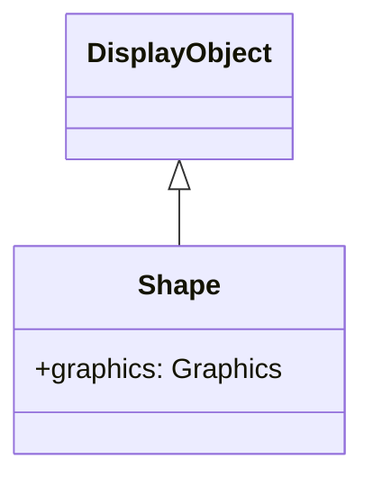

# Shape

Shapeは、ベクターグラフィックスの描画専用クラスです。Spriteと異なり子オブジェクトを持てませんが、軽量でパフォーマンスに優れています。

## 継承関係



## プロパティ

| プロパティ | 型 | 説明 |
|-----------|------|------|
| `graphics` | Graphics | グラフィックス描画用オブジェクト |

## SpriteとShapeの違い

| 特徴 | Shape | Sprite |
|------|-------|--------|
| 子オブジェクト | 持てない | 持てる |
| インタラクション | なし | クリック等可能 |
| パフォーマンス | 軽量 | やや重い |
| 用途 | 静的な背景、装飾 | ボタン、コンテナ |

## 使用例

### 基本的な描画

```typescript
const { Shape } = next2d.display;

const shape = new Shape();

// 塗りつぶし矩形
shape.graphics.beginFill(0x3498db);
shape.graphics.drawRect(0, 0, 150, 100);
shape.graphics.endFill();

stage.addChild(shape);
```

### 複合図形の描画

```typescript
const { Shape } = next2d.display;

const shape = new Shape();
const g = shape.graphics;

// 背景
g.beginFill(0xecf0f1);
g.drawRoundRect(0, 0, 200, 150, 10, 10);
g.endFill();

// 枠線
g.lineStyle(2, 0x2c3e50);
g.drawRoundRect(0, 0, 200, 150, 10, 10);

// 内側の装飾
g.beginFill(0xe74c3c);
g.drawCircle(100, 75, 30);
g.endFill();

stage.addChild(shape);
```

### パスの描画

```typescript
const { Shape } = next2d.display;

const shape = new Shape();
const g = shape.graphics;

g.beginFill(0x9b59b6);

// 星形を描画
g.moveTo(50, 0);
g.lineTo(61, 35);
g.lineTo(98, 35);
g.lineTo(68, 57);
g.lineTo(79, 91);
g.lineTo(50, 70);
g.lineTo(21, 91);
g.lineTo(32, 57);
g.lineTo(2, 35);
g.lineTo(39, 35);
g.lineTo(50, 0);

g.endFill();

stage.addChild(shape);
```

### ベジェ曲線

```typescript
const { Shape } = next2d.display;

const shape = new Shape();
const g = shape.graphics;

g.lineStyle(3, 0x1abc9c);

// 二次ベジェ曲線
g.moveTo(0, 100);
g.curveTo(50, 0, 100, 100);  // 制御点, 終点

g.curveTo(150, 200, 200, 100);

stage.addChild(shape);
```

### グラデーション背景

```typescript
const { Shape } = next2d.display;
const { Matrix } = next2d.geom;

const shape = new Shape();
const g = shape.graphics;

// グラデーション用マトリックス
const matrix = new Matrix();
matrix.createGradientBox(
    stage.stageWidth,
    stage.stageHeight,
    Math.PI / 2,  // 90度（縦方向）
    0, 0
);

// 放射状グラデーション
g.beginGradientFill(
    "radial",
    [0x667eea, 0x764ba2],
    [1, 1],
    [0, 255],
    matrix
);
g.drawRect(0, 0, stage.stageWidth, stage.stageHeight);
g.endFill();

// 最背面に配置
stage.addChildAt(shape, 0);
```

### 動的な再描画

```typescript
const { Shape } = next2d.display;

const shape = new Shape();
stage.addChild(shape);

let angle = 0;

// フレームごとに再描画
stage.addEventListener("enterFrame", () => {
    const g = shape.graphics;

    // 前の描画をクリア
    g.clear();

    // 新しい位置に描画
    const x = 200 + Math.cos(angle) * 100;
    const y = 150 + Math.sin(angle) * 100;

    g.beginFill(0xe74c3c);
    g.drawCircle(x, y, 20);
    g.endFill();

    angle += 0.05;
});
```

### 複数のShapeで構成

```typescript
const { Shape } = next2d.display;

// 背景レイヤー
const bgShape = new Shape();
bgShape.graphics.beginFill(0x2c3e50);
bgShape.graphics.drawRect(0, 0, 400, 300);
bgShape.graphics.endFill();

// 装飾レイヤー
const decorShape = new Shape();
decorShape.graphics.beginFill(0x3498db, 0.5);
decorShape.graphics.drawCircle(100, 100, 80);
decorShape.graphics.drawCircle(300, 200, 60);
decorShape.graphics.endFill();

// 前面レイヤー
const frontShape = new Shape();
frontShape.graphics.lineStyle(2, 0xecf0f1);
frontShape.graphics.drawRect(50, 50, 300, 200);

stage.addChild(bgShape);
stage.addChild(decorShape);
stage.addChild(frontShape);
```

## パフォーマンスのヒント

1. **静的な描画にはShapeを使用**: インタラクションが不要な背景や装飾にはShapeが最適
2. **描画の最小化**: 頻繁に変更されない場合は一度だけ描画
3. **clear()の使用**: 動的な再描画時は必ずclear()を呼ぶ
4. **複雑な図形はキャッシュ**: cacheAsBitmapプロパティで描画をキャッシュ

```typescript
// 複雑な図形をビットマップとしてキャッシュ
shape.cacheAsBitmap = true;
```

## 関連項目

- [DisplayObject](./display-object.md)
- [Sprite](./sprite.md)
- [フィルター](./filters/index.md)
