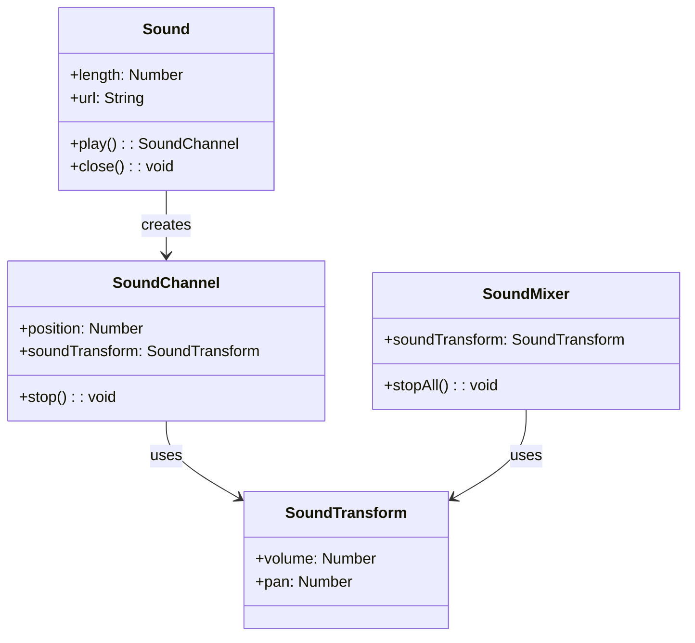

# サウンド

Next2D Playerは、ゲームやアプリケーションで必要な音声機能を提供します。BGM、効果音、ボイスなど様々な用途に対応しています。

## クラス構成



## Sound

音声ファイルを読み込み再生するクラスです。

### プロパティ

| プロパティ | 型 | 説明 |
|-----------|------|------|
| `length` | Number | サウンドの長さ（ミリ秒） |
| `url` | String | 読み込んだURL |
| `bytesLoaded` | Number | 読み込み済みバイト数 |
| `bytesTotal` | Number | 総バイト数 |

### メソッド

| メソッド | 説明 |
|---------|------|
| `play(startTime, loops, soundTransform)` | 再生を開始、SoundChannelを返す |
| `close()` | ストリームを閉じる |

## 使用例

### 基本的な音声再生

```typescript
import { Sound, URLRequest } from "@next2d/player";
import type { SoundChannel, Event } from "@next2d/player";

// Soundオブジェクトを作成
const sound: Sound = new Sound();

// 読み込み完了イベント
sound.addEventListener("complete", (event: Event): void => {
  // 再生開始
  const channel: SoundChannel = sound.play();
});

// 音声ファイルを読み込み
sound.load(new URLRequest("bgm.mp3"));
```

### 効果音の再生

```typescript
import { Sound, URLRequest } from "@next2d/player";
import type { SoundChannel } from "@next2d/player";

// 効果音をプリロード
const seJump: Sound = new Sound();
const seHit: Sound = new Sound();
const seCoin: Sound = new Sound();

// 読み込み
seJump.load(new URLRequest("se/jump.mp3"));
seHit.load(new URLRequest("se/hit.mp3"));
seCoin.load(new URLRequest("se/coin.mp3"));

// 再生関数
function playSE(sound: Sound): SoundChannel {
  return sound.play();
}

// ゲーム中で使用
player.addEventListener("jump", (): void => {
  playSE(seJump);
});
```

### BGMのループ再生

```typescript
import { Sound, SoundTransform, URLRequest } from "@next2d/player";
import type { SoundChannel } from "@next2d/player";

const bgm: Sound = new Sound();
let bgmChannel: SoundChannel | null = null;

bgm.addEventListener("complete", (): void => {
  // 音量を設定してループ再生
  const transform: SoundTransform = new SoundTransform();
  transform.volume = 0.7;  // 70%

  // 第2引数: ループ回数（9999で実質無限ループ）
  bgmChannel = bgm.play(0, 9999, transform);
});

bgm.load(new URLRequest("bgm/stage1.mp3"));

// BGM停止
function stopBGM(): void {
  if (bgmChannel) {
    bgmChannel.stop();
    bgmChannel = null;
  }
}
```

### 音量コントロール

```typescript
import { SoundTransform } from "@next2d/player";
import type { SoundChannel } from "@next2d/player";

let bgmChannel: SoundChannel;
let currentVolume: number = 1.0;

// 音量を変更
function setVolume(volume: number): void {
  currentVolume = Math.max(0, Math.min(1, volume));

  const transform: SoundTransform = new SoundTransform();
  transform.volume = currentVolume;
  bgmChannel.soundTransform = transform;
}

// フェードアウト
function fadeOut(duration: number = 1000): void {
  const startVolume: number = currentVolume;
  const startTime: number = Date.now();

  stage.addEventListener("enterFrame", function fade(): void {
    const elapsed: number = Date.now() - startTime;
    const progress: number = Math.min(1, elapsed / duration);

    setVolume(startVolume * (1 - progress));

    if (progress >= 1) {
      stage.removeEventListener("enterFrame", fade);
      bgmChannel.stop();
    }
  });
}
```

### パン（左右バランス）の設定

```typescript
import { SoundTransform } from "@next2d/player";
import type { SoundChannel } from "@next2d/player";

// パンを設定（-1: 左, 0: 中央, 1: 右）
function setPan(channel: SoundChannel, pan: number): void {
  const transform: SoundTransform = new SoundTransform();
  transform.volume = channel.soundTransform.volume;
  transform.pan = Math.max(-1, Math.min(1, pan));
  channel.soundTransform = transform;
}

// 敵の位置に応じてパンを調整
function playEnemySound(enemyX: number): void {
  const channel: SoundChannel = seEnemy.play();

  // 画面中央を基準にパンを計算
  const centerX: number = stage.stageWidth / 2;
  const pan: number = (enemyX - centerX) / centerX;
  setPan(channel, pan);
}
```

### サウンドマネージャー

```typescript
import { Sound, SoundTransform, URLRequest } from "@next2d/player";
import type { SoundChannel } from "@next2d/player";

class SoundManager {
  private _sounds: Map<string, Sound> = new Map();
  private _bgmChannel: SoundChannel | null = null;
  private _seChannels: SoundChannel[] = [];
  private _bgmVolume: number = 0.7;
  private _seVolume: number = 1.0;
  private _isMuted: boolean = false;

  // サウンドをプリロード
  async preload(id: string, url: string): Promise<void> {
    return new Promise((resolve) => {
      const sound: Sound = new Sound();
      sound.addEventListener("complete", (): void => {
        this._sounds.set(id, sound);
        resolve();
      });
      sound.load(new URLRequest(url));
    });
  }

  // BGM再生
  playBGM(id: string, loops: number = 9999): void {
    this.stopBGM();

    const sound: Sound | undefined = this._sounds.get(id);
    if (sound) {
      const transform: SoundTransform = new SoundTransform();
      transform.volume = this._isMuted ? 0 : this._bgmVolume;
      this._bgmChannel = sound.play(0, loops, transform);
    }
  }

  // BGM停止
  stopBGM(): void {
    if (this._bgmChannel) {
      this._bgmChannel.stop();
      this._bgmChannel = null;
    }
  }

  // SE再生
  playSE(id: string): SoundChannel | null {
    const sound: Sound | undefined = this._sounds.get(id);
    if (sound) {
      const transform: SoundTransform = new SoundTransform();
      transform.volume = this._isMuted ? 0 : this._seVolume;
      const channel: SoundChannel = sound.play(0, 0, transform);
      this._seChannels.push(channel);
      return channel;
    }
    return null;
  }

  // ミュート切り替え
  toggleMute(): boolean {
    this._isMuted = !this._isMuted;
    this._updateVolumes();
    return this._isMuted;
  }

  // BGM音量設定
  setBGMVolume(volume: number): void {
    this._bgmVolume = Math.max(0, Math.min(1, volume));
    this._updateVolumes();
  }

  // SE音量設定
  setSEVolume(volume: number): void {
    this._seVolume = Math.max(0, Math.min(1, volume));
  }

  private _updateVolumes(): void {
    if (this._bgmChannel) {
      const transform: SoundTransform = new SoundTransform();
      transform.volume = this._isMuted ? 0 : this._bgmVolume;
      this._bgmChannel.soundTransform = transform;
    }
  }
}

// 使用例
const soundManager: SoundManager = new SoundManager();

// 起動時にプリロード
async function initSounds(): Promise<void> {
  await soundManager.preload("bgm_title", "bgm/title.mp3");
  await soundManager.preload("bgm_stage1", "bgm/stage1.mp3");
  await soundManager.preload("se_jump", "se/jump.mp3");
  await soundManager.preload("se_coin", "se/coin.mp3");
  await soundManager.preload("se_damage", "se/damage.mp3");
}

// ゲーム中
soundManager.playBGM("bgm_stage1");
soundManager.playSE("se_jump");
```

## SoundMixer

全体のサウンドを制御するクラスです。

```typescript
import { SoundMixer, SoundTransform } from "@next2d/player";

// 全ての音声を停止
SoundMixer.stopAll();

// 全体の音量を変更
const globalTransform: SoundTransform = new SoundTransform();
globalTransform.volume = 0.5;
SoundMixer.soundTransform = globalTransform;
```

## サポートフォーマット

| フォーマット | 拡張子 | 対応状況 |
|--------------|--------|----------|
| MP3 | .mp3 | 推奨 |
| AAC | .m4a, .aac | 対応 |
| Ogg Vorbis | .ogg | ブラウザ依存 |
| WAV | .wav | 対応（ファイルサイズ大） |

## ベストプラクティス

1. **プリロード**: ゲーム開始前に全ての音声をプリロード
2. **フォーマット**: MP3を推奨（互換性と圧縮率のバランス）
3. **効果音**: 短い音声はWAVでも可（レイテンシが低い）
4. **音量管理**: BGMとSEの音量を別々に管理
5. **モバイル対応**: ユーザーインタラクション後に再生開始

## 関連項目

- [イベントシステム](./events.md)
- [ゲームループ](./game-loop.md)
