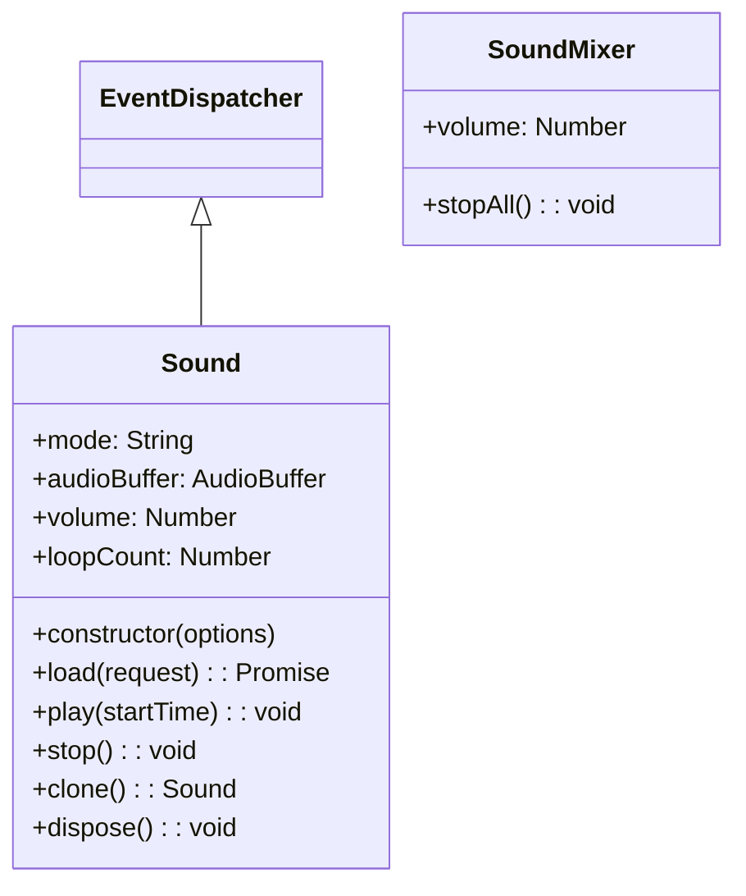

# サウンド

Next2D Playerは、ゲームやアプリケーションで必要な音声機能を提供します。BGM、効果音、ボイスなど様々な用途に対応しています。

## クラス構成


```mermaid
classDiagram
    EventDispatcher <|-- Sound
    class Sound {
        +constructor(options)
        +mode: String
        +audioBuffer: AudioBuffer
        +volume: Number
        +loopCount: Number
        +load(request): Promise
        +play(startTime): void
        +stop(): void
        +clone(): Sound
        +dispose(): void
    }
    class SoundMixer {
        +volume: Number
        +stopAll(): void
    }
```

## Sound

音声ファイルを読み込み再生するクラスです。EventDispatcherを継承しています。

### コンストラクタ

```typescript
new Sound(options?: ISoundOptions)
```

| オプション | 型 | デフォルト | 説明 |
|-----------|------|----------|------|
| `mode` | "buffer" \| "stream" | "buffer" | 再生バックエンドの指定。省略時は従来のAudioBuffer方式（`"buffer"`）。長いBGM向けに`"stream"`を指定するとストリーミング再生になります。生成後に変更することはできません |

### プロパティ

| プロパティ | 型 | デフォルト | 読み取り専用 | 説明 |
|-----------|------|----------|:------------:|------|
| `audioBuffer` | AudioBuffer \| null | null | - | オーディオバッファ。load()で読み込んだ音声データが格納されます |
| `loopCount` | number | 0 | - | ループ回数の設定。0でループなし、9999で実質無限ループ |
| `volume` | number | 1 | - | ボリューム。範囲は0（無音）〜1（フルボリューム）。SoundMixer.volumeの値を超えることはできません |
| `canLoop` | boolean | - | ○ | サウンドがループするかどうかを示します |
| `mode` | "buffer" \| "stream" | "buffer" | ○ | 生成時に指定した再生バックエンド |

### メソッド

| メソッド | 戻り値 | 説明 |
|---------|--------|------|
| `clone()` | Sound | Soundクラスを複製します。volume、loopCount、audioBufferがコピーされます |
| `load(request: URLRequest)` | Promise\<void\> | 指定したURLから外部MP3ファイルのロードを開始します |
| `play(startTime: number = 0)` | void | サウンドを再生します。startTimeは再生開始時間（秒単位）です。既に再生中の場合は何もしません |
| `stop()` | void | チャンネルで再生しているサウンドを停止します |
| `dispose()` | void | 保持しているリソースを解放し、`audioBuffer`をクリアします。再利用する場合は再度`load()`を呼び出してください（modeは変わりません） |

## ストリーミングBGM（stream モード）

`new Sound({ mode: "stream" })` を指定した場合のみ、`HTMLAudioElement → MediaElementAudioSourceNode → GainNode` 経由のストリーミング再生になります。`decodeAudioData()` による全曲デコードや、ファイル全体をArrayBuffer/Blobに読み込む処理を行わないため、長いBGMのメモリ使用量を抑えられます。

`new Sound()` / `new Sound({ mode: "buffer" })` は従来の動作（イベント、`play(startTime)`、`audioBuffer`、音量ルール、MovieClip連携、clone）をそのまま維持します。ファイルの長さやループ回数によって自動でモードが切り替わることはありません。

### 基本的な使い方

```typescript
const { Sound, SoundMixer } = next2d.media;
const { URLRequest } = next2d.net;

const bgm = new Sound({ mode: "stream" });
await bgm.load(new URLRequest("bgm/stage1.mp3"));
bgm.loopCount = Infinity;
bgm.volume = 0.5;
bgm.play();

bgm.volume = 0.2;     // 再生中もGainNodeに即時反映
bgm.stop();           // メディアデータを解放。同じSoundでplay()による再生も可能
bgm.play();
SoundMixer.stopAll(); // streamのSoundも停止対象
bgm.dispose();        // リソースを解放。再利用時は再度load()が必要

const se = new Sound(); // SEは従来のbufferモードで利用
await se.load(new URLRequest("se/button.mp3"));
se.play();
```

### stream モードの仕様

| 項目 | 仕様 |
|------|------|
| 音量 | `Sound.volume` と `SoundMixer.volume` は従来と同じルール（小さい方を適用、乗算しない）。停止中のstreamは再生開始時に現在のSoundMixer.volumeが適用されます。HTMLAudioElementのvolumeは常に1 |
| AudioContext | 既存のSoundと共有 |
| `load()` | **メタデータ取得完了時**にresolveし、`Event.COMPLETE`を発行します（全ファイルのダウンロード完了ではありません）。読み込み開始時に`Event.OPEN`を発行します。バイト単位の`ProgressEvent.PROGRESS`は発行されません |
| リクエスト制限 | `request.data`やカスタム`requestHeaders`を持たないGETのURLのみ対応。非対応の場合は`TypeError`でrejectします。`withCredentials`がtrueなら`crossOrigin="use-credentials"`、それ以外は`"anonymous"`。クロスオリジンの場合はサーバー側でCORSを許可する必要があります |
| 読み込みエラー | rejectし、`IOErrorEvent.IO_ERROR`を発行します。全体デコード方式への自動フォールバックはありません |
| `play()` | 常に先頭から再生します。`play(startTime)`に0以外を指定すると`RangeError`をthrowします（開始位置指定はbufferモード専用）。`load()`完了前の`play()`は無視されます |
| `loopCount` | 再生前に設定してください。0で1回再生、Nで追加N回再生、`Infinity`でネイティブのメディアループを使用。有限回再生の場合は最後の終了時に1回だけ`Event.COMPLETE`を発行します。stop/disposeや途中のループでは発行されません。サンプル単位のギャップレスループは保証されません |
| 自動再生ブロック | 自動再生がブロックされた場合、pointerdown / touchend / keydown のユーザー操作時に再試行します。中断されたAudioContextも再開を試みます。停止・破棄済みのSoundは再試行しません。自動再生以外の再生失敗時は停止して`IO_ERROR`を発行します |
| `stop()` | 読み込み中の場合は`AbortError`でキャンセルし、オーディオグラフを切断、メディアソースをクリアして非アクティブなデータを解放します。読み込み済みのstreamはURLを保持し、再生時に要素/ソースノードを再利用します。未完了の読み込みをキャンセルした場合は、再生前に再度`load()`が必要です |
| `clone()` | 読み込み済みのURL、認証モード、volume、loopCountをコピーします。複製は個別のメディア要素/グラフを持ち、再生時に確保されます。グローバルなURLキャッシュは持たないため、BGMインスタンスは使い回すか、不要になったら`dispose()`してください |
| `audioBuffer` / `$build()` | bufferモード専用です。streamでは`audioBuffer`は使用されず、`$build()`は`TypeError`になります。MovieClipに埋め込まれたサウンドは従来通りbufferモードを使用します |
| `dispose()` | 自身が保持するリソースを切断・解放し、`audioBuffer`をクリアします。他のcloneと共有しているAudioBufferには影響しません |

> **Note:** ブラウザ側のバッファリングによるメモリ消費は発生します。長い曲はJavaScriptやdata URLに埋め込まず、個別の音声ファイルのURLとして配信してください。`preload="metadata"`はブラウザへのヒントであり、ダウンロード量を厳密に制限するものではありません。

> **Note:** 音量の永続化やBGM/SEの設定値の管理は、アプリケーション側で行ってください。iOS向けアプリでは、長い曲の再生やシーン遷移の繰り返し時に、対象端末でWebContentプロセスのメモリを計測することを推奨します（JavaScriptのヒープサイズにはネイティブのオーディオバッファが含まれません）。

## 使用例

### 基本的な音声再生

```typescript
const { Sound } = next2d.media;
const { URLRequest } = next2d.net;

// Soundオブジェクトを作成
const sound = new Sound();

// 音声ファイルを非同期で読み込み
const request = new URLRequest("bgm.mp3");
await sound.load(request);

// 再生開始
sound.play();
```

### 効果音の再生

```typescript
const { Sound } = next2d.media;
const { URLRequest } = next2d.net;

// 効果音をプリロード
const seJump = new Sound();
const seHit = new Sound();
const seCoin = new Sound();

// 読み込み
await seJump.load(new URLRequest("se/jump.mp3"));
await seHit.load(new URLRequest("se/hit.mp3"));
await seCoin.load(new URLRequest("se/coin.mp3"));

// 再生関数
function playSE(sound) {
    // 複製して再生（同時に複数回鳴らす場合）
    const clone = sound.clone();
    clone.play();
}

// ゲーム中で使用
player.addEventListener("jump", () => {
    playSE(seJump);
});
```

### BGMのループ再生

```typescript
const { Sound } = next2d.media;
const { URLRequest } = next2d.net;

// 長いBGMは stream モードの利用を推奨（new Sound() でも再生可能）
const bgm = new Sound({ mode: "stream" });

// 読み込み
await bgm.load(new URLRequest("bgm/stage1.mp3"));

// 音量を設定
bgm.volume = 0.7;  // 70%

// ループ回数を設定（9999で実質無限ループ）
bgm.loopCount = 9999;

// 再生
bgm.play();

// BGM停止
function stopBGM() {
    bgm.stop();
}
```

### 音量コントロール

```typescript
const { Sound } = next2d.media;
const { URLRequest } = next2d.net;

const bgm = new Sound();
await bgm.load(new URLRequest("bgm.mp3"));

// 音量を設定
bgm.volume = 1.0;
bgm.play();

// 音量を変更
function setVolume(volume) {
    bgm.volume = Math.max(0, Math.min(1, volume));
}

// フェードアウト
async function fadeOut(duration = 1000) {
    const startVolume = bgm.volume;
    const startTime = Date.now();

    return new Promise((resolve) => {
        const fade = () => {
            const elapsed = Date.now() - startTime;
            const progress = Math.min(1, elapsed / duration);

            bgm.volume = startVolume * (1 - progress);

            if (progress >= 1) {
                bgm.stop();
                resolve();
            } else {
                requestAnimationFrame(fade);
            }
        };
        fade();
    });
}
```

### サウンドマネージャー

```typescript
const { Sound, SoundMixer } = next2d.media;
const { URLRequest } = next2d.net;

class SoundManager {
    constructor() {
        this._sounds = new Map();
        this._bgm = null;
        this._bgmVolume = 0.7;
        this._seVolume = 1.0;
        this._isMuted = false;
    }

    // サウンドをプリロード
    async preload(id, url) {
        const sound = new Sound();
        await sound.load(new URLRequest(url));
        this._sounds.set(id, sound);
    }

    // BGM再生
    playBGM(id, loops = 9999) {
        this.stopBGM();

        const sound = this._sounds.get(id);
        if (sound) {
            this._bgm = sound.clone();
            this._bgm.volume = this._isMuted ? 0 : this._bgmVolume;
            this._bgm.loopCount = loops;
            this._bgm.play();
        }
    }

    // BGM停止
    stopBGM() {
        if (this._bgm) {
            this._bgm.stop();
            this._bgm = null;
        }
    }

    // SE再生
    playSE(id) {
        const sound = this._sounds.get(id);
        if (sound) {
            const clone = sound.clone();
            clone.volume = this._isMuted ? 0 : this._seVolume;
            clone.play();
        }
    }

    // ミュート切り替え
    toggleMute() {
        this._isMuted = !this._isMuted;
        if (this._bgm) {
            this._bgm.volume = this._isMuted ? 0 : this._bgmVolume;
        }
        return this._isMuted;
    }

    // BGM音量設定
    setBGMVolume(volume) {
        this._bgmVolume = Math.max(0, Math.min(1, volume));
        if (this._bgm && !this._isMuted) {
            this._bgm.volume = this._bgmVolume;
        }
    }

    // SE音量設定
    setSEVolume(volume) {
        this._seVolume = Math.max(0, Math.min(1, volume));
    }
}

// 使用例
const soundManager = new SoundManager();

// 起動時にプリロード
async function initSounds() {
    await soundManager.preload("bgm_title", "bgm/title.mp3");
    await soundManager.preload("bgm_stage1", "bgm/stage1.mp3");
    await soundManager.preload("se_jump", "se/jump.mp3");
    await soundManager.preload("se_coin", "se/coin.mp3");
    await soundManager.preload("se_damage", "se/damage.mp3");
}

// ゲーム中
soundManager.playBGM("bgm_stage1");
soundManager.playSE("se_jump");
```

## SoundMixer

全体のサウンドを制御するクラスです。

```typescript
const { SoundMixer } = next2d.media;

// 全ての音声を停止
SoundMixer.stopAll();

// 全体の音量を変更
SoundMixer.volume = 0.5;  // 50%
```

## サポートフォーマット

| フォーマット | 拡張子 | 対応状況 |
|--------------|--------|----------|
| MP3 | .mp3 | 推奨 |
| AAC | .m4a, .aac | 対応 |
| Ogg Vorbis | .ogg | ブラウザ依存 |
| WAV | .wav | 対応（ファイルサイズ大） |

## ベストプラクティス

1. **プリロード**: ゲーム開始前に全ての音声をプリロード
2. **フォーマット**: MP3を推奨（互換性と圧縮率のバランス）
3. **効果音**: 短い音声はWAVでも可（レイテンシが低い）
4. **音量管理**: BGMとSEの音量を別々に管理
5. **モバイル対応**: ユーザーインタラクション後に再生開始
6. **clone使用**: 同じ音を同時に複数回再生する場合はclone()を使用
7. **BGMはstreamモード**: 長いBGMは`new Sound({ mode: "stream" })`で全曲デコードを避け、SEは従来のbufferモードを使用
8. **リソース解放**: 不要になったSoundは`dispose()`でリソースを解放

## 関連項目

- [イベントシステム](/ja/reference/player/events)
