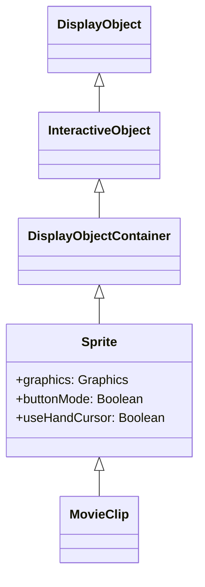

# Sprite

Spriteは、グラフィックスの描画機能を持つDisplayObjectContainerです。MovieClipの基底クラスであり、タイムラインを持たない動的なグラフィックス描画に使用します。

## 継承関係



## プロパティ

| プロパティ | 型 | 説明 |
|-----------|------|------|
| `graphics` | Graphics | グラフィックス描画用オブジェクト |
| `buttonMode` | Boolean | ボタンモード（trueでハンドカーソル表示） |
| `useHandCursor` | Boolean | ハンドカーソルの使用（デフォルト: true） |

## graphicsプロパティ

Spriteのgraphicsプロパティを使用して、動的にベクター描画を行えます。

### 線と塗りの設定

```javascript
const sprite = new next2d.display.Sprite();

// 線のスタイル設定
sprite.graphics.lineStyle(2, 0xFF0000, 1.0);  // 太さ, 色, 透明度

// 塗りの設定
sprite.graphics.beginFill(0x00FF00, 0.8);  // 色, 透明度
```

### 描画メソッド

| メソッド | 説明 |
|---------|------|
| `moveTo(x, y)` | 描画位置を移動 |
| `lineTo(x, y)` | 現在位置から線を描画 |
| `curveTo(cx, cy, ax, ay)` | 二次ベジェ曲線を描画 |
| `drawRect(x, y, w, h)` | 矩形を描画 |
| `drawRoundRect(x, y, w, h, rx, ry)` | 角丸矩形を描画 |
| `drawCircle(x, y, r)` | 円を描画 |
| `drawEllipse(x, y, w, h)` | 楕円を描画 |
| `endFill()` | 塗りを終了 |
| `clear()` | 描画内容をクリア |

## 使用例

### 基本的な描画

```javascript
import { next2d } from "@next2d/player";

const sprite = new next2d.display.Sprite();

// 赤い矩形を描画
sprite.graphics.beginFill(0xFF0000);
sprite.graphics.drawRect(0, 0, 100, 100);
sprite.graphics.endFill();

// 青い円を描画
sprite.graphics.beginFill(0x0000FF);
sprite.graphics.drawCircle(200, 50, 40);
sprite.graphics.endFill();

stage.addChild(sprite);
```

### 線の描画

```javascript
const sprite = new next2d.display.Sprite();

// 線のスタイルを設定
sprite.graphics.lineStyle(3, 0x000000, 1.0);

// 線を描画
sprite.graphics.moveTo(0, 0);
sprite.graphics.lineTo(100, 100);
sprite.graphics.lineTo(200, 50);

stage.addChild(sprite);
```

### グラデーション塗り

```javascript
const sprite = new next2d.display.Sprite();

// グラデーションマトリックスを作成
const matrix = new next2d.geom.Matrix();
matrix.createGradientBox(200, 200, 0, 0, 0);

// 線形グラデーション
sprite.graphics.beginGradientFill(
  "linear",                    // タイプ
  [0xFF0000, 0x0000FF],       // 色
  [1, 1],                      // 透明度
  [0, 255],                    // 比率
  matrix                       // マトリックス
);
sprite.graphics.drawRect(0, 0, 200, 200);
sprite.graphics.endFill();

stage.addChild(sprite);
```

### ボタンとして使用

```javascript
const button = new next2d.display.Sprite();

// ボタンモードを有効化
button.buttonMode = true;
button.useHandCursor = true;

// 背景を描画
button.graphics.beginFill(0x3498db);
button.graphics.drawRoundRect(0, 0, 120, 40, 8, 8);
button.graphics.endFill();

// クリックイベント
button.addEventListener("click", () => {
  console.log("ボタンがクリックされました");
});

stage.addChild(button);
```

### マスクとして使用

```javascript
const content = new next2d.display.Sprite();
content.graphics.beginFill(0xFF0000);
content.graphics.drawRect(0, 0, 200, 200);
content.graphics.endFill();

// マスク用のSprite
const maskSprite = new next2d.display.Sprite();
maskSprite.graphics.beginFill(0xFFFFFF);
maskSprite.graphics.drawCircle(100, 100, 50);
maskSprite.graphics.endFill();

// マスクを適用
content.mask = maskSprite;

stage.addChild(content);
stage.addChild(maskSprite);
```

## 関連項目

- [DisplayObject](./display-object.md)
- [MovieClip](./movie-clip.md)
- [Shape](./shape.md)
