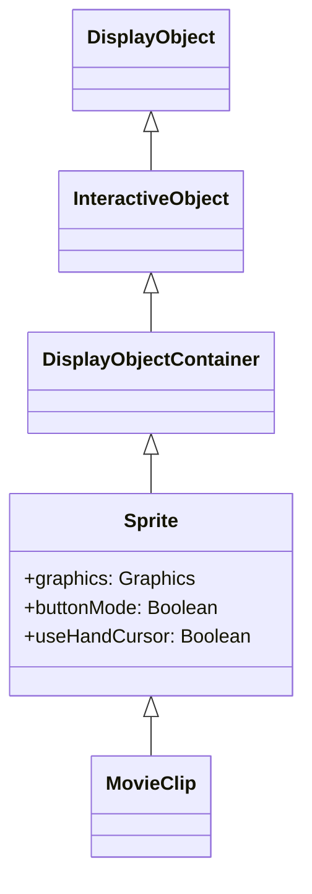

# Sprite

Spriteは、グラフィックスの描画機能を持つDisplayObjectContainerです。MovieClipの基底クラスであり、タイムラインを持たない動的なグラフィックス描画に使用します。

## 継承関係



## プロパティ

### Sprite固有のプロパティ

| プロパティ | 型 | 読取専用 | デフォルト | 説明 |
|-----------|------|:--------:|------------|------|
| `isSprite` | boolean | Yes | true | Spriteの機能を所持しているかを返却 |
| `buttonMode` | boolean | No | false | このスプライトのボタンモードを指定します |
| `useHandCursor` | boolean | No | true | buttonModeがtrueの場合にハンドカーソルを表示するかどうか |
| `hitArea` | Sprite \| null | No | null | スプライトのヒット領域となる別のスプライトを指定します |
| `soundTransform` | SoundTransform \| null | No | null | このスプライト内のサウンドを制御します |

### DisplayObjectContainerから継承されるプロパティ

| プロパティ | 型 | 読取専用 | デフォルト | 説明 |
|-----------|------|:--------:|------------|------|
| `isContainerEnabled` | boolean | Yes | true | コンテナの機能を所持しているかを返却 |
| `mouseChildren` | boolean | No | true | オブジェクトの子がマウスまたはユーザー入力デバイスに対応しているかどうか |
| `numChildren` | number | Yes | - | このオブジェクトの子の数を返します |
| `mask` | DisplayObject \| null | No | null | 表示オブジェクトをマスクします |

### InteractiveObjectから継承されるプロパティ

| プロパティ | 型 | 読取専用 | デフォルト | 説明 |
|-----------|------|:--------:|------------|------|
| `isInteractive` | boolean | Yes | true | InteractiveObjectの機能を所持しているかを返却 |
| `mouseEnabled` | boolean | No | true | このオブジェクトでマウスまたはその他のユーザー入力メッセージを受け取るかどうか |

### DisplayObjectから継承されるプロパティ

| プロパティ | 型 | 読取専用 | デフォルト | 説明 |
|-----------|------|:--------:|------------|------|
| `instanceId` | number | Yes | - | DisplayObjectのユニークなインスタンスID |
| `name` | string | No | "" | 名前を返却します。getChildByName()で使用されます |
| `parent` | Sprite \| MovieClip \| null | No | null | このDisplayObjectの親のDisplayObjectContainerを返却 |
| `x` | number | No | 0 | 親DisplayObjectContainerのローカル座標を基準にしたx座標 |
| `y` | number | No | 0 | 親DisplayObjectContainerのローカル座標を基準にしたy座標 |
| `width` | number | No | - | 表示オブジェクトの幅（ピクセル単位） |
| `height` | number | No | - | 表示オブジェクトの高さ（ピクセル単位） |
| `scaleX` | number | No | 1 | 基準点から適用されるオブジェクトの水平スケール値 |
| `scaleY` | number | No | 1 | 基準点から適用されるオブジェクトの垂直スケール値 |
| `rotation` | number | No | 0 | DisplayObjectインスタンスの元の位置からの回転角（度単位） |
| `alpha` | number | No | 1 | 指定されたオブジェクトのアルファ透明度値（0.0〜1.0） |
| `visible` | boolean | No | true | 表示オブジェクトが可視かどうか |
| `blendMode` | string | No | "normal" | 使用するブレンドモードを指定するBlendModeクラスの値 |
| `filters` | array \| null | No | null | 表示オブジェクトに関連付けられた各フィルターオブジェクトの配列 |
| `matrix` | Matrix | No | - | 表示オブジェクトのMatrixを返します |
| `colorTransform` | ColorTransform | No | - | 表示オブジェクトのColorTransformを返します |
| `concatenatedMatrix` | Matrix | Yes | - | この表示オブジェクトとすべての親オブジェクトの結合されたMatrix |
| `scale9Grid` | Rectangle \| null | No | null | 現在有効な拡大/縮小グリッド |
| `loaderInfo` | LoaderInfo \| null | Yes | null | この表示オブジェクトが属するファイルの読み込み情報 |
| `root` | MovieClip \| Sprite \| null | Yes | null | DisplayObjectのルートであるDisplayObjectContainer |
| `mouseX` | number | Yes | - | 対象のDisplayObjectの基準点からのx軸の位置（ピクセル） |
| `mouseY` | number | Yes | - | 対象のDisplayObjectの基準点からのy軸の位置（ピクセル） |
| `dropTarget` | Sprite \| null | Yes | null | スプライトのドラッグ先またはドロップされた先の表示オブジェクト |
| `isMask` | boolean | No | false | マスクとしてDisplayObjectにセットされているかを示します |

## メソッド

### Sprite固有のメソッド

| メソッド | 戻り値 | 説明 |
|---------|--------|------|
| `startDrag(lockCenter?: boolean, bounds?: Rectangle)` | void | 指定されたスプライトをユーザーがドラッグできるようにします |
| `stopDrag()` | void | startDrag()メソッドを終了します |

### DisplayObjectContainerから継承されるメソッド

| メソッド | 戻り値 | 説明 |
|---------|--------|------|
| `addChild(child: DisplayObject)` | DisplayObject | 子DisplayObjectインスタンスを追加します |
| `addChildAt(child: DisplayObject, index: number)` | DisplayObject | 指定のインデックス位置に子DisplayObjectインスタンスを追加します |
| `removeChild(child: DisplayObject)` | void | 指定のchild DisplayObjectインスタンスを削除します |
| `removeChildAt(index: number)` | void | 指定のインデックス位置から子DisplayObjectを削除します |
| `removeChildren(...indexes: number[])` | void | 配列で指定されたインデックスの子をコンテナから削除します |
| `getChildAt(index: number)` | DisplayObject \| null | 指定のインデックス位置にある子表示オブジェクトインスタンスを返します |
| `getChildByName(name: string)` | DisplayObject \| null | 指定された名前に一致する子表示オブジェクトを返します |
| `getChildIndex(child: DisplayObject)` | number | 子DisplayObjectインスタンスのインデックス位置を返します |
| `setChildIndex(child: DisplayObject, index: number)` | void | 表示オブジェクトコンテナの既存の子の位置を変更します |
| `contains(child: DisplayObject)` | boolean | 指定されたDisplayObjectがインスタンスの子孫であるかどうか |
| `swapChildren(child1: DisplayObject, child2: DisplayObject)` | void | 指定された2つの子オブジェクトのz順序を入れ替えます |
| `swapChildrenAt(index1: number, index2: number)` | void | 指定されたインデックス位置の2つの子オブジェクトのz順序を入れ替えます |

### DisplayObjectから継承されるメソッド

| メソッド | 戻り値 | 説明 |
|---------|--------|------|
| `getBounds(targetDisplayObject?: DisplayObject)` | Rectangle | 指定したDisplayObjectの座標系を基準にして、表示オブジェクトの領域を定義する矩形を返します |
| `globalToLocal(point: Point)` | Point | pointオブジェクトをステージ（グローバル）座標から表示オブジェクトの（ローカル）座標に変換します |
| `localToGlobal(point: Point)` | Point | pointオブジェクトを表示オブジェクトの（ローカル）座標からステージ（グローバル）座標に変換します |
| `hitTestObject(target: DisplayObject)` | boolean | DisplayObjectの描画範囲を評価して、重複または交差するかどうかを調べます |
| `hitTestPoint(x: number, y: number, shapeFlag?: boolean)` | boolean | 表示オブジェクトを評価して、x、yパラメーターで指定されたポイントと重複または交差するかどうかを調べます |
| `remove()` | void | 親子関係を解除します |
| `getLocalVariable(key: any)` | any | クラスのローカル変数空間から値を取得 |
| `setLocalVariable(key: any, value: any)` | void | クラスのローカル変数空間へ値を保存 |
| `hasLocalVariable(key: any)` | boolean | クラスのローカル変数空間に値があるかどうかを判断します |
| `deleteLocalVariable(key: any)` | void | クラスのローカル変数空間の値を削除 |
| `getGlobalVariable(key: any)` | any | グローバル変数空間から値を取得 |
| `setGlobalVariable(key: any, value: any)` | void | グローバル変数空間へ値を保存 |
| `hasGlobalVariable(key: any)` | boolean | グローバル変数空間に値があるかどうかを判断します |
| `deleteGlobalVariable(key: any)` | void | グローバル変数空間の値を削除 |
| `clearGlobalVariable()` | void | グローバル変数空間に値を全てクリアします |

## graphicsプロパティ

Spriteのgraphicsプロパティを使用して、動的にベクター描画を行えます。

### 線と塗りの設定

```typescript
const { Sprite } = next2d.display;

const sprite = new Sprite();

// 線のスタイル設定
sprite.graphics.lineStyle(2, 0xFF0000, 1.0);  // 太さ, 色, 透明度

// 塗りの設定
sprite.graphics.beginFill(0x00FF00, 0.8);  // 色, 透明度
```

### 描画メソッド

| メソッド | 説明 |
|---------|------|
| `moveTo(x, y)` | 描画位置を移動 |
| `lineTo(x, y)` | 現在位置から線を描画 |
| `curveTo(cx, cy, ax, ay)` | 二次ベジェ曲線を描画 |
| `drawRect(x, y, w, h)` | 矩形を描画 |
| `drawRoundRect(x, y, w, h, rx, ry)` | 角丸矩形を描画 |
| `drawCircle(x, y, r)` | 円を描画 |
| `drawEllipse(x, y, w, h)` | 楕円を描画 |
| `endFill()` | 塗りを終了 |
| `clear()` | 描画内容をクリア |

## 使用例

### 基本的な描画

```typescript
const { Sprite } = next2d.display;

const sprite = new Sprite();

// 赤い矩形を描画
sprite.graphics.beginFill(0xFF0000);
sprite.graphics.drawRect(0, 0, 100, 100);
sprite.graphics.endFill();

// 青い円を描画
sprite.graphics.beginFill(0x0000FF);
sprite.graphics.drawCircle(200, 50, 40);
sprite.graphics.endFill();

stage.addChild(sprite);
```

### 線の描画

```typescript
const { Sprite } = next2d.display;

const sprite = new Sprite();

// 線のスタイルを設定
sprite.graphics.lineStyle(3, 0x000000, 1.0);

// 線を描画
sprite.graphics.moveTo(0, 0);
sprite.graphics.lineTo(100, 100);
sprite.graphics.lineTo(200, 50);

stage.addChild(sprite);
```

### グラデーション塗り

```typescript
const { Sprite } = next2d.display;
const { Matrix } = next2d.geom;

const sprite = new Sprite();

// グラデーションマトリックスを作成
const matrix = new Matrix();
matrix.createGradientBox(200, 200, 0, 0, 0);

// 線形グラデーション
sprite.graphics.beginGradientFill(
    "linear",                    // タイプ
    [0xFF0000, 0x0000FF],       // 色
    [1, 1],                      // 透明度
    [0, 255],                    // 比率
    matrix                       // マトリックス
);
sprite.graphics.drawRect(0, 0, 200, 200);
sprite.graphics.endFill();

stage.addChild(sprite);
```

### ボタンとして使用

```typescript
const { Sprite } = next2d.display;

const button = new Sprite();

// ボタンモードを有効化
button.buttonMode = true;
button.useHandCursor = true;

// 背景を描画
button.graphics.beginFill(0x3498db);
button.graphics.drawRoundRect(0, 0, 120, 40, 8, 8);
button.graphics.endFill();

// クリックイベント
button.addEventListener("click", () => {
    console.log("ボタンがクリックされました");
});

stage.addChild(button);
```

### マスクとして使用

```typescript
const { Sprite } = next2d.display;

const content = new Sprite();
content.graphics.beginFill(0xFF0000);
content.graphics.drawRect(0, 0, 200, 200);
content.graphics.endFill();

// マスク用のSprite
const maskSprite = new Sprite();
maskSprite.graphics.beginFill(0xFFFFFF);
maskSprite.graphics.drawCircle(100, 100, 50);
maskSprite.graphics.endFill();

// マスクを適用
content.mask = maskSprite;

stage.addChild(content);
stage.addChild(maskSprite);
```

### ドラッグ＆ドロップ

```typescript
const { Sprite } = next2d.display;
const { Rectangle } = next2d.geom;

const draggable = new Sprite();
draggable.graphics.beginFill(0x3498db);
draggable.graphics.drawRect(0, 0, 100, 100);
draggable.graphics.endFill();

// ドラッグ開始
draggable.addEventListener("mouseDown", () => {
    // ドラッグを開始（中心をロック、境界を指定）
    draggable.startDrag(true, new Rectangle(0, 0, 400, 300));
});

// ドラッグ終了
draggable.addEventListener("mouseUp", () => {
    draggable.stopDrag();
});

stage.addChild(draggable);
```

## 関連項目

- [DisplayObject](./display-object.md)
- [MovieClip](./movie-clip.md)
- [Shape](./shape.md)
