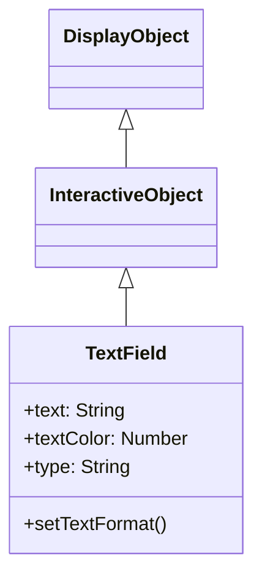

# TextField

TextFieldは、テキストの表示と編集を行うDisplayObjectです。ラベル表示から入力フォームまで、テキスト関連の機能を提供します。

## 継承関係



## プロパティ

### テキスト関連

| プロパティ | 型 | 説明 |
|-----------|------|------|
| `text` | String | 表示するテキスト |
| `htmlText` | String | HTMLフォーマットのテキスト |
| `length` | Number | テキストの文字数（読み取り専用） |
| `maxChars` | Number | 最大文字数（0で無制限） |

### 表示関連

| プロパティ | 型 | 説明 |
|-----------|------|------|
| `textColor` | Number | テキストの色（0xRRGGBB） |
| `textWidth` | Number | テキストの幅（読み取り専用） |
| `textHeight` | Number | テキストの高さ（読み取り専用） |
| `autoSize` | String | 自動サイズ調整（"none", "left", "center", "right"） |
| `wordWrap` | Boolean | ワードラップの有効化 |
| `multiline` | Boolean | 複数行テキストの許可 |

### 入力関連

| プロパティ | 型 | 説明 |
|-----------|------|------|
| `type` | String | "dynamic"（表示のみ）または "input"（入力可能） |
| `selectable` | Boolean | テキスト選択の可否 |
| `displayAsPassword` | Boolean | パスワード表示（*で表示） |

### スクロール関連

| プロパティ | 型 | 説明 |
|-----------|------|------|
| `scrollV` | Number | 縦スクロール位置（行番号） |
| `maxScrollV` | Number | 最大縦スクロール位置（読み取り専用） |
| `scrollH` | Number | 横スクロール位置（ピクセル） |
| `maxScrollH` | Number | 最大横スクロール位置（読み取り専用） |
| `numLines` | Number | テキストの行数（読み取り専用） |

## TextFormat

テキストのスタイルを設定するクラスです。

### プロパティ

| プロパティ | 型 | 説明 |
|-----------|------|------|
| `font` | String | フォント名 |
| `size` | Number | フォントサイズ |
| `color` | Number | テキスト色 |
| `bold` | Boolean | 太字 |
| `italic` | Boolean | 斜体 |
| `align` | String | 配置（"left", "center", "right"） |
| `leading` | Number | 行間（ピクセル） |
| `letterSpacing` | Number | 文字間隔（ピクセル） |

## 使用例

### 基本的なテキスト表示

```typescript
import { TextField } from "@next2d/player";

const textField: TextField = new TextField();
textField.text = "Hello, Next2D!";
textField.x = 100;
textField.y = 100;

stage.addChild(textField);
```

### TextFormatの適用

```typescript
import { TextField, TextFormat } from "@next2d/player";

const textField: TextField = new TextField();
textField.text = "スタイル付きテキスト";

// TextFormatを作成
const format: TextFormat = new TextFormat();
format.font = "Arial";
format.size = 24;
format.color = 0x3498db;
format.bold = true;

// フォーマットを適用
textField.setTextFormat(format);

// デフォルトフォーマットとして設定
textField.defaultTextFormat = format;

stage.addChild(textField);
```

### 自動サイズ調整

```typescript
import { TextField } from "@next2d/player";

const textField: TextField = new TextField();
textField.autoSize = "left";  // テキストに合わせて自動拡張
textField.text = "このテキストに合わせてサイズが調整されます";

stage.addChild(textField);
```

### 複数行テキスト

```typescript
import { TextField } from "@next2d/player";

const textField: TextField = new TextField();
textField.width = 200;
textField.multiline = true;
textField.wordWrap = true;
textField.text = "これは複数行のテキストです。自動的に折り返されます。";

stage.addChild(textField);
```

### 入力フィールド

```typescript
import { TextField } from "@next2d/player";
import type { Event } from "@next2d/player";

const inputField: TextField = new TextField();
inputField.type = "input";
inputField.width = 200;
inputField.height = 30;
inputField.border = true;
inputField.borderColor = 0xcccccc;
inputField.background = true;
inputField.backgroundColor = 0xffffff;

// プレースホルダーの代わり
inputField.text = "";

// 入力制限（数字のみ）
inputField.restrict = "0-9";

// 入力イベント
inputField.addEventListener("change", (event: Event): void => {
  const target: TextField = event.target as TextField;
  console.log("入力値:", target.text);
});

stage.addChild(inputField);
```

### パスワードフィールド

```typescript
import { TextField } from "@next2d/player";

const passwordField: TextField = new TextField();
passwordField.type = "input";
passwordField.displayAsPassword = true;
passwordField.width = 200;
passwordField.height = 30;
passwordField.border = true;
passwordField.borderColor = 0xcccccc;

stage.addChild(passwordField);
```

### HTMLテキスト

```typescript
import { TextField } from "@next2d/player";

const textField: TextField = new TextField();
textField.width = 300;
textField.multiline = true;
textField.htmlText = `
<font face="Arial" size="20" color="#3498db">
  <b>太字テキスト</b><br/>
  <i>斜体テキスト</i><br/>
  <font color="#e74c3c">赤いテキスト</font>
</font>
`;

stage.addChild(textField);
```

### スクロール可能なテキスト

```typescript
import { TextField } from "@next2d/player";

const textField: TextField = new TextField();
textField.width = 200;
textField.height = 100;
textField.multiline = true;
textField.wordWrap = true;
textField.border = true;
textField.text = "長いテキスト...\n".repeat(20);

// スクロール操作
function scrollUp(): void {
  if (textField.scrollV > 1) {
    textField.scrollV--;
  }
}

function scrollDown(): void {
  if (textField.scrollV < textField.maxScrollV) {
    textField.scrollV++;
  }
}

stage.addChild(textField);
```

### 動的なテキスト更新

```typescript
import { TextField, TextFormat } from "@next2d/player";

const scoreField: TextField = new TextField();
scoreField.autoSize = "left";

const format: TextFormat = new TextFormat();
format.font = "Arial";
format.size = 32;
format.color = 0xffffff;
scoreField.defaultTextFormat = format;

let score: number = 0;

function updateScore(points: number): void {
  score += points;
  scoreField.text = `Score: ${score}`;
}

updateScore(0);
stage.addChild(scoreField);
```

## イベント

| イベント | 説明 |
|----------|------|
| `change` | テキストが変更されたとき |
| `focus` | フォーカスを得たとき |
| `blur` | フォーカスを失ったとき |
| `keyDown` | キーが押されたとき |
| `keyUp` | キーが離されたとき |

```typescript
import { TextField } from "@next2d/player";
import type { KeyboardEvent } from "@next2d/player";

const inputField: TextField = new TextField();
inputField.type = "input";

// Enterキーでフォーム送信
inputField.addEventListener("keyDown", (event: KeyboardEvent): void => {
  if (event.keyCode === 13) {  // Enter
    submitForm(inputField.text);
  }
});

stage.addChild(inputField);
```

## 関連項目

- [DisplayObject](./display-object.md)
- [イベントシステム](./events.md)
