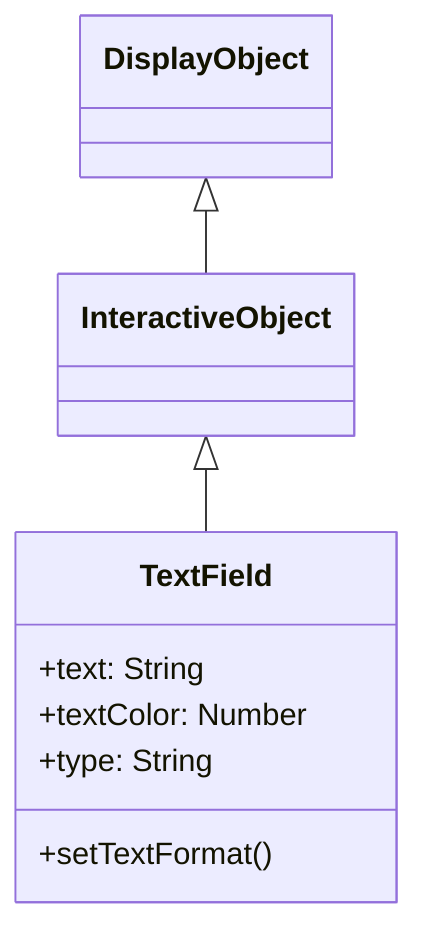

# TextField

TextFieldは、テキストの表示と編集を行うDisplayObjectです。ラベル表示から入力フォームまで、テキスト関連の機能を提供します。

## 継承関係



## プロパティ

### テキスト関連

| プロパティ | 型 | 説明 |
|-----------|------|------|
| `text` | string | テキストフィールド内の現在のテキストであるストリング |
| `htmlText` | string | テキストフィールドの内容をHTMLで表した文字列 |
| `length` | number | テキストフィールド内の文字数（読み取り専用） |
| `maxChars` | number | ユーザーが入力できる最大文字数（0で無制限） |
| `restrict` | string | ユーザーがテキストフィールドに入力できる文字のセットを指定 |
| `defaultTextFormat` | TextFormat | テキストに適用するデフォルトのフォーマット |
| `stopIndex` | number | テキストの任意の表示終了位置の設定（デフォルト: -1） |

### 表示関連

| プロパティ | 型 | 説明 |
|-----------|------|------|
| `width` | number | 表示オブジェクトの幅（ピクセル単位） |
| `height` | number | 表示オブジェクトの高さ（ピクセル単位） |
| `textWidth` | number | テキストの幅（ピクセル単位、読み取り専用） |
| `textHeight` | number | テキストの高さ（ピクセル単位、読み取り専用） |
| `autoSize` | string | テキストフィールドの自動的な拡大/縮小および整列を制御（"none", "left", "center", "right"） |
| `autoFontSize` | boolean | テキストサイズの自動的な拡大/縮小および整列を制御（デフォルト: false） |
| `wordWrap` | boolean | テキストフィールドのテキストを折り返すかどうか（デフォルト: false） |
| `multiline` | boolean | 複数行テキストフィールドであるかどうか（デフォルト: false） |
| `numLines` | number | テキストの行数（読み取り専用） |

### 境界線・背景関連

| プロパティ | 型 | 説明 |
|-----------|------|------|
| `background` | boolean | テキストフィールドに背景の塗りつぶしがあるかどうか（デフォルト: false） |
| `backgroundColor` | number | テキストフィールドの背景の色（デフォルト: 0xffffff） |
| `border` | boolean | テキストフィールドに境界線があるかどうか（デフォルト: false） |
| `borderColor` | number | テキストフィールドの境界線の色（デフォルト: 0x000000） |

### 輪郭関連

| プロパティ | 型 | 説明 |
|-----------|------|------|
| `thickness` | number | 輪郭のテキスト幅。0（デフォルト値）で無効 |
| `thicknessColor` | number | 輪郭のテキストの色（16進数形式、デフォルト: 0） |

### 入力関連

| プロパティ | 型 | 説明 |
|-----------|------|------|
| `type` | string | テキストフィールドのタイプ（"static", "dynamic", "input"）（デフォルト: "static"） |
| `focus` | boolean | テキストフィールドがフォーカスを持つかどうか（デフォルト: false） |
| `focusVisible` | boolean | テキストフィールドの点滅線の表示・非表示を制御（デフォルト: false） |
| `focusIndex` | number | テキストフィールドのフォーカス位置のインデックス（デフォルト: -1） |
| `selectIndex` | number | テキストフィールドの選択位置のインデックス（デフォルト: -1） |
| `compositionStartIndex` | number | テキストフィールドのコンポジション開始インデックス（デフォルト: -1） |
| `compositionEndIndex` | number | テキストフィールドのコンポジション終了インデックス（デフォルト: -1） |

### スクロール関連

| プロパティ | 型 | 説明 |
|-----------|------|------|
| `scrollX` | number | x軸のスクロール位置（デフォルト: 0） |
| `scrollY` | number | y軸のスクロール位置（デフォルト: 0） |
| `scrollEnabled` | boolean | スクロール機能のON/OFFの制御（デフォルト: true） |
| `xScrollShape` | Shape | xスクロールバーの表示用のShapeオブジェクト（読み取り専用） |
| `yScrollShape` | Shape | yスクロールバーの表示用のShapeオブジェクト（読み取り専用） |

### バウンディングボックス関連

| プロパティ | 型 | 説明 |
|-----------|------|------|
| `xMin` | number | バウンディングボックスのxMin座標 |
| `yMin` | number | バウンディングボックスのyMin座標 |
| `xMax` | number | バウンディングボックスのxMax座標 |
| `yMax` | number | バウンディングボックスのyMax座標 |
| `bounds` | IBounds | テキストフィールドの描画範囲のバウンディングボックス（読み取り専用） |

### その他

| プロパティ | 型 | 説明 |
|-----------|------|------|
| `namespace` | string | 指定されたオブジェクトの空間名（"next2d.display.TextField"）（読み取り専用） |
| `isText` | boolean | TextFieldの機能を所持しているかを返却（読み取り専用、常にtrue） |
| `cacheKey` | number | ビルドされたキャッシュキー（デフォルト: 0） |
| `cacheParams` | number[] | キャッシュのビルドに利用されるパラメータ（読み取り専用） |

## メソッド

| メソッド | 戻り値 | 説明 |
|---------|--------|------|
| `appendText(newText: string)` | void | 指定されたストリングをテキストフィールドのテキストの最後に付加します |
| `insertText(newText: string)` | void | テキストフィールドのフォーカス位置にテキストを追加します |
| `deleteText()` | void | テキストフィールドの選択範囲を削除します |
| `getLineText(lineIndex: number)` | string | 指定された行のテキストを返します |
| `replaceText(newText: string, beginIndex: number, endIndex: number)` | void | 指定された文字範囲を新しいテキストの内容に置き換えます |
| `selectAll()` | void | テキストフィールドのすべてのテキストを選択します |
| `copy()` | void | テキストフィールドの選択範囲をコピーします |
| `paste()` | void | コピーしたテキストを選択範囲に貼り付けます |
| `setFocusIndex(stageX: number, stageY: number, selected?: boolean)` | void | テキストフィールドのフォーカス位置を設定します |
| `keyDown(event: KeyboardEvent)` | void | キーダウンイベントを処理します |

## TextFormat

テキストのスタイルを設定するクラスです。

### プロパティ

| プロパティ | 型 | 説明 |
|-----------|------|------|
| `font` | String | フォント名 |
| `size` | Number | フォントサイズ |
| `color` | Number | テキスト色 |
| `bold` | Boolean | 太字 |
| `italic` | Boolean | 斜体 |
| `align` | String | 配置（"left", "center", "right"） |
| `leading` | Number | 行間（ピクセル） |
| `letterSpacing` | Number | 文字間隔（ピクセル） |

## 使用例

### 基本的なテキスト表示

```typescript
const { TextField } = next2d.text;

const textField = new TextField();
textField.text = "Hello, Next2D!";
textField.x = 100;
textField.y = 100;

stage.addChild(textField);
```

### TextFormatの適用

```typescript
const { TextField, TextFormat } = next2d.text;

const textField = new TextField();
textField.text = "スタイル付きテキスト";

// TextFormatを作成
const format = new TextFormat();
format.font = "Arial";
format.size = 24;
format.color = 0x3498db;
format.bold = true;

// フォーマットを適用
textField.setTextFormat(format);

// デフォルトフォーマットとして設定
textField.defaultTextFormat = format;

stage.addChild(textField);
```

### 自動サイズ調整

```typescript
const { TextField } = next2d.text;

const textField = new TextField();
textField.autoSize = "left";  // テキストに合わせて自動拡張
textField.text = "このテキストに合わせてサイズが調整されます";

stage.addChild(textField);
```

### 複数行テキスト

```typescript
const { TextField } = next2d.text;

const textField = new TextField();
textField.width = 200;
textField.multiline = true;
textField.wordWrap = true;
textField.text = "これは複数行のテキストです。自動的に折り返されます。";

stage.addChild(textField);
```

### 入力フィールド

```typescript
const { TextField } = next2d.text;

const inputField = new TextField();
inputField.type = "input";
inputField.width = 200;
inputField.height = 30;
inputField.border = true;
inputField.borderColor = 0xcccccc;
inputField.background = true;
inputField.backgroundColor = 0xffffff;

// プレースホルダーの代わり
inputField.text = "";

// 入力制限（数字のみ）
inputField.restrict = "0-9";

// 入力イベント
inputField.addEventListener("change", (event) => {
    console.log("入力値:", inputField.text);
});

stage.addChild(inputField);
```

### パスワードフィールド

```typescript
const { TextField } = next2d.text;

const passwordField = new TextField();
passwordField.type = "input";
passwordField.displayAsPassword = true;
passwordField.width = 200;
passwordField.height = 30;
passwordField.border = true;
passwordField.borderColor = 0xcccccc;

stage.addChild(passwordField);
```

### HTMLテキスト

```typescript
const { TextField } = next2d.text;

const textField = new TextField();
textField.width = 300;
textField.multiline = true;
textField.htmlText = `
<font face="Arial" size="20" color="#3498db">
  <b>太字テキスト</b><br/>
  <i>斜体テキスト</i><br/>
  <font color="#e74c3c">赤いテキスト</font>
</font>
`;

stage.addChild(textField);
```

### スクロール可能なテキスト

```typescript
const { TextField } = next2d.text;

const textField = new TextField();
textField.width = 200;
textField.height = 100;
textField.multiline = true;
textField.wordWrap = true;
textField.border = true;
textField.text = "長いテキスト...\n".repeat(20);

// スクロール操作
function scrollUp() {
    if (textField.scrollY > 0) {
        textField.scrollY -= 10;
    }
}

function scrollDown() {
    textField.scrollY += 10;
}

stage.addChild(textField);
```

### 動的なテキスト更新

```typescript
const { TextField, TextFormat } = next2d.text;

const scoreField = new TextField();
scoreField.autoSize = "left";

const format = new TextFormat();
format.font = "Arial";
format.size = 32;
format.color = 0xffffff;
scoreField.defaultTextFormat = format;

let score = 0;

function updateScore(points) {
    score += points;
    scoreField.text = `Score: ${score}`;
}

updateScore(0);
stage.addChild(scoreField);
```

### テキストの輪郭効果

```typescript
const { TextField, TextFormat } = next2d.text;

const textField = new TextField();
textField.autoSize = "left";

const format = new TextFormat();
format.font = "Arial";
format.size = 48;
format.color = 0xffffff;
textField.defaultTextFormat = format;

textField.text = "輪郭付きテキスト";
textField.thickness = 2;
textField.thicknessColor = 0x000000;

stage.addChild(textField);
```

### テキストの一部置換

```typescript
const { TextField } = next2d.text;

const textField = new TextField();
textField.autoSize = "left";
textField.text = "Hello World!";

// "World"を"Next2D"に置き換え
textField.replaceText("Next2D", 6, 11);
// 結果: "Hello Next2D!"

stage.addChild(textField);
```

## イベント

| イベント | 説明 |
|----------|------|
| `change` | テキストが変更されたとき |
| `focus` | フォーカスを得たとき |
| `blur` | フォーカスを失ったとき |
| `keyDown` | キーが押されたとき |
| `keyUp` | キーが離されたとき |

```typescript
const { TextField } = next2d.text;

const inputField = new TextField();
inputField.type = "input";

// Enterキーでフォーム送信
inputField.addEventListener("keyDown", (event) => {
    if (event.keyCode === 13) {  // Enter
        submitForm(inputField.text);
    }
});

stage.addChild(inputField);
```

## 関連項目

- [DisplayObject](./display-object.md)
- [イベントシステム](./events.md)
