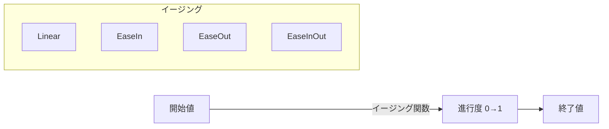

# Tweenアニメーション

Next2D Playerでは、プログラムによるアニメーション（Tween）を実装できます。位置、サイズ、透明度などのプロパティを滑らかに変化させることができます。

## Tweenの基本概念



## 基本的なTweenクラス

```typescript
class Tween {
    private _target;
    private _properties = {};
    private _duration;
    private _easing;
    private _startTime = 0;
    private _isPlaying = false;
    private _onUpdate;
    private _onComplete;

    constructor(target, options) {
        this._target = target;
        this._duration = options.duration;
        this._easing = options.easing || Easing.linear;
        this._onUpdate = options.onUpdate;
        this._onComplete = options.onComplete;
    }

    to(properties) {
        for (const key in properties) {
            this._properties[key] = {
                start: this._target[key],
                end: properties[key]
            };
        }
        return this;
    }

    play() {
        this._startTime = Date.now();
        this._isPlaying = true;
        this._update();
        return this;
    }

    private _update = () => {
        if (!this._isPlaying) return;

        const elapsed = Date.now() - this._startTime;
        let progress = Math.min(1, elapsed / this._duration);
        progress = this._easing(progress);

        // プロパティを更新
        for (const key in this._properties) {
            const prop = this._properties[key];
            this._target[key] = prop.start + (prop.end - prop.start) * progress;
        }

        if (this._onUpdate) {
            this._onUpdate();
        }

        if (elapsed < this._duration) {
            requestAnimationFrame(this._update);
        } else {
            this._isPlaying = false;
            if (this._onComplete) {
                this._onComplete();
            }
        }
    };

    stop() {
        this._isPlaying = false;
    }
}
```

## イージング関数

```typescript
const Easing = {
    // 線形
    linear: (t) => t,

    // 加速
    easeInQuad: (t) => t * t,
    easeInCubic: (t) => t * t * t,
    easeInQuart: (t) => t * t * t * t,

    // 減速
    easeOutQuad: (t) => t * (2 - t),
    easeOutCubic: (t) => (--t) * t * t + 1,
    easeOutQuart: (t) => 1 - (--t) * t * t * t,

    // 加速→減速
    easeInOutQuad: (t) =>
        t < 0.5 ? 2 * t * t : -1 + (4 - 2 * t) * t,
    easeInOutCubic: (t) =>
        t < 0.5 ? 4 * t * t * t : (t - 1) * (2 * t - 2) * (2 * t - 2) + 1,

    // バウンス
    easeOutBounce: (t) => {
        if (t < 1 / 2.75) {
            return 7.5625 * t * t;
        } else if (t < 2 / 2.75) {
            return 7.5625 * (t -= 1.5 / 2.75) * t + 0.75;
        } else if (t < 2.5 / 2.75) {
            return 7.5625 * (t -= 2.25 / 2.75) * t + 0.9375;
        } else {
            return 7.5625 * (t -= 2.625 / 2.75) * t + 0.984375;
        }
    },

    // バック（行き過ぎて戻る）
    easeOutBack: (t) => {
        const c1 = 1.70158;
        const c3 = c1 + 1;
        return 1 + c3 * Math.pow(t - 1, 3) + c1 * Math.pow(t - 1, 2);
    },

    // エラスティック（ゴムのような動き）
    easeOutElastic: (t) => {
        if (t === 0 || t === 1) return t;
        return Math.pow(2, -10 * t) * Math.sin((t * 10 - 0.75) * (2 * Math.PI) / 3) + 1;
    }
};
```

## 使用例

### 基本的な移動アニメーション

```typescript
const { Sprite } = next2d.display;

const sprite = new Sprite();
sprite.x = 0;
sprite.y = 100;
stage.addChild(sprite);

// 右に移動
new Tween(sprite, { duration: 1000, easing: Easing.easeOutQuad })
    .to({ x: 400 })
    .play();
```

### 複数プロパティの同時アニメーション

```typescript
// 移動 + 拡大 + フェードイン
new Tween(sprite, {
    duration: 500,
    easing: Easing.easeOutCubic
})
    .to({
        x: 200,
        y: 150,
        scaleX: 2,
        scaleY: 2,
        alpha: 1
    })
    .play();
```

### シーケンシャルアニメーション

```typescript
// 連続したアニメーション
function sequentialAnimation(sprite) {
    new Tween(sprite, {
        duration: 500,
        onComplete: () => {
            new Tween(sprite, {
                duration: 300,
                onComplete: () => {
                    new Tween(sprite, { duration: 500 })
                        .to({ alpha: 0 })
                        .play();
                }
            })
                .to({ scaleX: 1.5, scaleY: 1.5 })
                .play();
        }
    })
        .to({ y: 100 })
        .play();
}
```

### ゲームでの活用例

#### キャラクタージャンプ

```typescript
function jump(character) {
    const startY = character.y;
    const jumpHeight = 100;

    // 上昇
    new Tween(character, {
        duration: 300,
        easing: Easing.easeOutQuad,
        onComplete: () => {
            // 下降
            new Tween(character, {
                duration: 300,
                easing: Easing.easeInQuad
            })
                .to({ y: startY })
                .play();
        }
    })
        .to({ y: startY - jumpHeight })
        .play();
}
```

#### ダメージエフェクト

```typescript
function damageEffect(target) {
    const originalX = target.x;
    let shakeCount = 0;

    // 点滅 + 揺れ
    const shake = () => {
        if (shakeCount >= 6) {
            target.x = originalX;
            target.alpha = 1;
            return;
        }

        const offset = shakeCount % 2 === 0 ? 5 : -5;
        target.x = originalX + offset;
        target.alpha = shakeCount % 2 === 0 ? 0.5 : 1;
        shakeCount++;

        setTimeout(shake, 50);
    };

    shake();
}
```

#### コイン取得エフェクト

```typescript
function coinCollectEffect(coin, targetY) {
    // 上に飛んでフェードアウト
    new Tween(coin, {
        duration: 500,
        easing: Easing.easeOutQuad,
        onUpdate: () => {
            // 回転
            coin.rotation += 15;
        },
        onComplete: () => {
            coin.parent?.removeChild(coin);
        }
    })
        .to({
            y: targetY,
            alpha: 0,
            scaleX: 0.5,
            scaleY: 0.5
        })
        .play();
}
```

#### UI表示アニメーション

```typescript
function showPopup(popup) {
    popup.scaleX = 0;
    popup.scaleY = 0;
    popup.alpha = 0;

    new Tween(popup, {
        duration: 400,
        easing: Easing.easeOutBack
    })
        .to({ scaleX: 1, scaleY: 1, alpha: 1 })
        .play();
}

function hidePopup(popup, onComplete) {
    new Tween(popup, {
        duration: 200,
        easing: Easing.easeInQuad,
        onComplete
    })
        .to({ scaleX: 0, scaleY: 0, alpha: 0 })
        .play();
}
```

## enterFrameを使った軽量Tween

```typescript
// シンプルなenterFrameベースのTween
function tweenTo(target, property, endValue, speed = 0.1) {
    const handler = (event) => {
        const current = target[property];
        const diff = endValue - current;

        if (Math.abs(diff) < 0.1) {
            target[property] = endValue;
            stage.removeEventListener("enterFrame", handler);
        } else {
            target[property] = current + diff * speed;
        }
    };

    stage.addEventListener("enterFrame", handler);
}

// 使用例
tweenTo(sprite, "x", 300, 0.15);  // xを300に向かって移動
tweenTo(sprite, "alpha", 0, 0.05);  // フェードアウト
```

## カスタムイージング

```typescript
// ベジェ曲線ベースのイージング
function bezierEasing(x1, y1, x2, y2) {
    return (t) => {
        // 簡易的な3次ベジェ補間
        const cx = 3 * x1;
        const bx = 3 * (x2 - x1) - cx;
        const ax = 1 - cx - bx;

        const cy = 3 * y1;
        const by = 3 * (y2 - y1) - cy;
        const ay = 1 - cy - by;

        const sampleCurveY = (t) =>
            ((ay * t + by) * t + cy) * t;

        return sampleCurveY(t);
    };
}

// CSS cubic-bezier相当
const customEase = bezierEasing(0.25, 0.1, 0.25, 1.0);
```

## パフォーマンスのヒント

1. **requestAnimationFrame使用**: setTimeoutよりもスムーズ
2. **プロパティ変更の最小化**: 必要なプロパティのみ更新
3. **オブジェクトプール**: 大量のTweenはプールして再利用
4. **完了後のクリーンアップ**: 不要なリスナーは削除

## 関連項目

- [DisplayObject](/ja/reference/player/display-object)
- [イベントシステム](/ja/reference/player/events)
