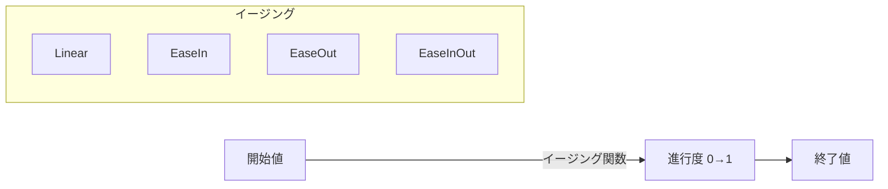

# Tweenアニメーション

Next2D Playerでは、プログラムによるアニメーション（Tween）を実装できます。位置、サイズ、透明度などのプロパティを滑らかに変化させることができます。

## Tweenの基本概念



## 基本的なTweenクラス

```typescript
import type { DisplayObject } from "@next2d/player";

type EasingFunction = (t: number) => number;

interface TweenOptions {
  duration: number;        // ミリ秒
  easing?: EasingFunction;
  onUpdate?: () => void;
  onComplete?: () => void;
}

class Tween {
  private _target: DisplayObject;
  private _properties: Record<string, { start: number; end: number }> = {};
  private _duration: number;
  private _easing: EasingFunction;
  private _startTime: number = 0;
  private _isPlaying: boolean = false;
  private _onUpdate?: () => void;
  private _onComplete?: () => void;

  constructor(target: DisplayObject, options: TweenOptions) {
    this._target = target;
    this._duration = options.duration;
    this._easing = options.easing || Easing.linear;
    this._onUpdate = options.onUpdate;
    this._onComplete = options.onComplete;
  }

  to(properties: Record<string, number>): Tween {
    for (const key in properties) {
      this._properties[key] = {
        start: (this._target as any)[key],
        end: properties[key]
      };
    }
    return this;
  }

  play(): Tween {
    this._startTime = Date.now();
    this._isPlaying = true;
    this._update();
    return this;
  }

  private _update = (): void => {
    if (!this._isPlaying) return;

    const elapsed: number = Date.now() - this._startTime;
    let progress: number = Math.min(1, elapsed / this._duration);
    progress = this._easing(progress);

    // プロパティを更新
    for (const key in this._properties) {
      const prop = this._properties[key];
      (this._target as any)[key] = prop.start + (prop.end - prop.start) * progress;
    }

    if (this._onUpdate) {
      this._onUpdate();
    }

    if (elapsed < this._duration) {
      requestAnimationFrame(this._update);
    } else {
      this._isPlaying = false;
      if (this._onComplete) {
        this._onComplete();
      }
    }
  };

  stop(): void {
    this._isPlaying = false;
  }
}
```

## イージング関数

```typescript
const Easing = {
  // 線形
  linear: (t: number): number => t,

  // 加速
  easeInQuad: (t: number): number => t * t,
  easeInCubic: (t: number): number => t * t * t,
  easeInQuart: (t: number): number => t * t * t * t,

  // 減速
  easeOutQuad: (t: number): number => t * (2 - t),
  easeOutCubic: (t: number): number => (--t) * t * t + 1,
  easeOutQuart: (t: number): number => 1 - (--t) * t * t * t,

  // 加速→減速
  easeInOutQuad: (t: number): number =>
    t < 0.5 ? 2 * t * t : -1 + (4 - 2 * t) * t,
  easeInOutCubic: (t: number): number =>
    t < 0.5 ? 4 * t * t * t : (t - 1) * (2 * t - 2) * (2 * t - 2) + 1,

  // バウンス
  easeOutBounce: (t: number): number => {
    if (t < 1 / 2.75) {
      return 7.5625 * t * t;
    } else if (t < 2 / 2.75) {
      return 7.5625 * (t -= 1.5 / 2.75) * t + 0.75;
    } else if (t < 2.5 / 2.75) {
      return 7.5625 * (t -= 2.25 / 2.75) * t + 0.9375;
    } else {
      return 7.5625 * (t -= 2.625 / 2.75) * t + 0.984375;
    }
  },

  // バック（行き過ぎて戻る）
  easeOutBack: (t: number): number => {
    const c1: number = 1.70158;
    const c3: number = c1 + 1;
    return 1 + c3 * Math.pow(t - 1, 3) + c1 * Math.pow(t - 1, 2);
  },

  // エラスティック（ゴムのような動き）
  easeOutElastic: (t: number): number => {
    if (t === 0 || t === 1) return t;
    return Math.pow(2, -10 * t) * Math.sin((t * 10 - 0.75) * (2 * Math.PI) / 3) + 1;
  }
};
```

## 使用例

### 基本的な移動アニメーション

```typescript
import { Sprite } from "@next2d/player";

const sprite: Sprite = new Sprite();
sprite.x = 0;
sprite.y = 100;
stage.addChild(sprite);

// 右に移動
new Tween(sprite, { duration: 1000, easing: Easing.easeOutQuad })
  .to({ x: 400 })
  .play();
```

### 複数プロパティの同時アニメーション

```typescript
// 移動 + 拡大 + フェードイン
new Tween(sprite, {
  duration: 500,
  easing: Easing.easeOutCubic
})
  .to({
    x: 200,
    y: 150,
    scaleX: 2,
    scaleY: 2,
    alpha: 1
  })
  .play();
```

### シーケンシャルアニメーション

```typescript
// 連続したアニメーション
function sequentialAnimation(sprite: DisplayObject): void {
  new Tween(sprite, {
    duration: 500,
    onComplete: () => {
      new Tween(sprite, {
        duration: 300,
        onComplete: () => {
          new Tween(sprite, { duration: 500 })
            .to({ alpha: 0 })
            .play();
        }
      })
        .to({ scaleX: 1.5, scaleY: 1.5 })
        .play();
    }
  })
    .to({ y: 100 })
    .play();
}
```

### ゲームでの活用例

#### キャラクタージャンプ

```typescript
function jump(character: DisplayObject): void {
  const startY: number = character.y;
  const jumpHeight: number = 100;

  // 上昇
  new Tween(character, {
    duration: 300,
    easing: Easing.easeOutQuad,
    onComplete: () => {
      // 下降
      new Tween(character, {
        duration: 300,
        easing: Easing.easeInQuad
      })
        .to({ y: startY })
        .play();
    }
  })
    .to({ y: startY - jumpHeight })
    .play();
}
```

#### ダメージエフェクト

```typescript
function damageEffect(target: DisplayObject): void {
  const originalX: number = target.x;
  let shakeCount: number = 0;

  // 点滅 + 揺れ
  const shake = (): void => {
    if (shakeCount >= 6) {
      target.x = originalX;
      target.alpha = 1;
      return;
    }

    const offset: number = shakeCount % 2 === 0 ? 5 : -5;
    target.x = originalX + offset;
    target.alpha = shakeCount % 2 === 0 ? 0.5 : 1;
    shakeCount++;

    setTimeout(shake, 50);
  };

  shake();
}
```

#### コイン取得エフェクト

```typescript
function coinCollectEffect(coin: DisplayObject, targetY: number): void {
  // 上に飛んでフェードアウト
  new Tween(coin, {
    duration: 500,
    easing: Easing.easeOutQuad,
    onUpdate: () => {
      // 回転
      coin.rotation += 15;
    },
    onComplete: () => {
      coin.parent?.removeChild(coin);
    }
  })
    .to({
      y: targetY,
      alpha: 0,
      scaleX: 0.5,
      scaleY: 0.5
    })
    .play();
}
```

#### UI表示アニメーション

```typescript
function showPopup(popup: DisplayObject): void {
  popup.scaleX = 0;
  popup.scaleY = 0;
  popup.alpha = 0;

  new Tween(popup, {
    duration: 400,
    easing: Easing.easeOutBack
  })
    .to({ scaleX: 1, scaleY: 1, alpha: 1 })
    .play();
}

function hidePopup(popup: DisplayObject, onComplete: () => void): void {
  new Tween(popup, {
    duration: 200,
    easing: Easing.easeInQuad,
    onComplete
  })
    .to({ scaleX: 0, scaleY: 0, alpha: 0 })
    .play();
}
```

## enterFrameを使った軽量Tween

```typescript
import type { DisplayObject, Event } from "@next2d/player";

// シンプルなenterFrameベースのTween
function tweenTo(
  target: DisplayObject,
  property: string,
  endValue: number,
  speed: number = 0.1
): void {
  const handler = (event: Event): void => {
    const current: number = (target as any)[property];
    const diff: number = endValue - current;

    if (Math.abs(diff) < 0.1) {
      (target as any)[property] = endValue;
      stage.removeEventListener("enterFrame", handler);
    } else {
      (target as any)[property] = current + diff * speed;
    }
  };

  stage.addEventListener("enterFrame", handler);
}

// 使用例
tweenTo(sprite, "x", 300, 0.15);  // xを300に向かって移動
tweenTo(sprite, "alpha", 0, 0.05);  // フェードアウト
```

## カスタムイージング

```typescript
// ベジェ曲線ベースのイージング
function bezierEasing(
  x1: number, y1: number,
  x2: number, y2: number
): EasingFunction {
  return (t: number): number => {
    // 簡易的な3次ベジェ補間
    const cx: number = 3 * x1;
    const bx: number = 3 * (x2 - x1) - cx;
    const ax: number = 1 - cx - bx;

    const cy: number = 3 * y1;
    const by: number = 3 * (y2 - y1) - cy;
    const ay: number = 1 - cy - by;

    const sampleCurveY = (t: number): number =>
      ((ay * t + by) * t + cy) * t;

    return sampleCurveY(t);
  };
}

// CSS cubic-bezier相当
const customEase = bezierEasing(0.25, 0.1, 0.25, 1.0);
```

## パフォーマンスのヒント

1. **requestAnimationFrame使用**: setTimeoutよりもスムーズ
2. **プロパティ変更の最小化**: 必要なプロパティのみ更新
3. **オブジェクトプール**: 大量のTweenはプールして再利用
4. **完了後のクリーンアップ**: 不要なリスナーは削除

## 関連項目

- [DisplayObject](./display-object.md)
- [ゲームループ](./game-loop.md)
- [イベントシステム](./events.md)
