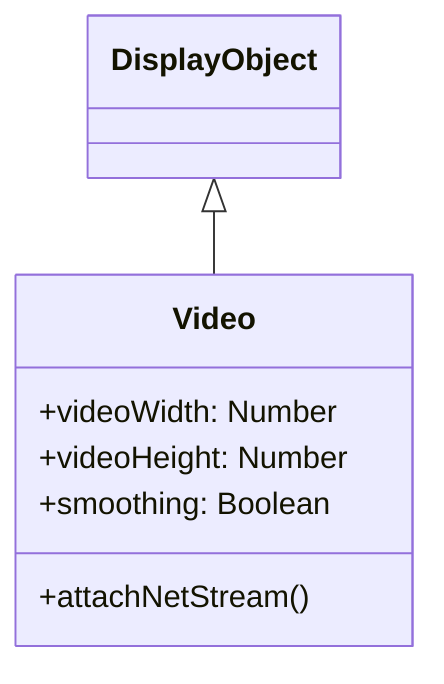

# Video

Videoは、動画コンテンツを再生するためのDisplayObjectです。WebM、MP4などの動画フォーマットに対応しています。

## 継承関係



## プロパティ

| プロパティ | 型 | 説明 |
|-----------|------|------|
| `videoWidth` | Number | 動画の元の幅（読み取り専用） |
| `videoHeight` | Number | 動画の元の高さ（読み取り専用） |
| `smoothing` | Boolean | スムージング処理の有効化 |

## NetStreamとの連携

VideoクラスはNetStreamと連携して動画を再生します。

### NetStreamプロパティ

| プロパティ | 型 | 説明 |
|-----------|------|------|
| `time` | Number | 現在の再生位置（秒） |
| `bytesLoaded` | Number | ロード済みバイト数 |
| `bytesTotal` | Number | 総バイト数 |

### NetStreamメソッド

| メソッド | 説明 |
|---------|------|
| `play(url)` | 動画の再生を開始 |
| `pause()` | 再生を一時停止 |
| `resume()` | 再生を再開 |
| `close()` | ストリームを閉じる |
| `seek(seconds)` | 指定位置にシーク |

## 使用例

### 基本的な動画再生

```javascript
import { next2d } from "@next2d/player";

// Videoオブジェクトを作成
const video = new next2d.media.Video(640, 360);

// NetConnectionを作成
const nc = new next2d.net.NetConnection();
nc.connect(null);

// NetStreamを作成
const ns = new next2d.net.NetStream(nc);

// VideoにNetStreamをアタッチ
video.attachNetStream(ns);

// ステージに追加
stage.addChild(video);

// 動画を再生
ns.play("video.mp4");
```

### 再生コントロール

```javascript
const video = new next2d.media.Video(640, 360);
const nc = new next2d.net.NetConnection();
nc.connect(null);
const ns = new next2d.net.NetStream(nc);

video.attachNetStream(ns);
stage.addChild(video);

// 再生ボタン
playButton.addEventListener("click", () => {
  ns.resume();
});

// 一時停止ボタン
pauseButton.addEventListener("click", () => {
  ns.pause();
});

// 停止ボタン
stopButton.addEventListener("click", () => {
  ns.pause();
  ns.seek(0);
});

// 10秒進む
forwardButton.addEventListener("click", () => {
  ns.seek(ns.time + 10);
});

// 10秒戻る
backButton.addEventListener("click", () => {
  ns.seek(Math.max(0, ns.time - 10));
});

ns.play("video.mp4");
```

### メタデータの取得

```javascript
const ns = new next2d.net.NetStream(nc);

// メタデータイベントハンドラ
ns.client = {
  onMetaData: (info) => {
    console.log("Duration:", info.duration);
    console.log("Width:", info.width);
    console.log("Height:", info.height);
    console.log("Framerate:", info.framerate);

    // 動画サイズに合わせてVideoをリサイズ
    video.width = info.width;
    video.height = info.height;
  }
};

video.attachNetStream(ns);
ns.play("video.mp4");
```

### 再生進捗の表示

```javascript
const video = new next2d.media.Video(640, 360);
const ns = new next2d.net.NetStream(nc);

let duration = 0;

ns.client = {
  onMetaData: (info) => {
    duration = info.duration;
  }
};

video.attachNetStream(ns);
stage.addChild(video);

// フレームごとに進捗を更新
stage.addEventListener("enterFrame", () => {
  if (duration > 0) {
    const progress = ns.time / duration;
    progressBar.scaleX = progress;
    timeLabel.text = formatTime(ns.time) + " / " + formatTime(duration);
  }
});

function formatTime(seconds) {
  const min = Math.floor(seconds / 60);
  const sec = Math.floor(seconds % 60);
  return `${min}:${sec.toString().padStart(2, '0')}`;
}

ns.play("video.mp4");
```

### 音量コントロール

```javascript
const ns = new next2d.net.NetStream(nc);

// SoundTransformで音量を制御
const soundTransform = new next2d.media.SoundTransform();
soundTransform.volume = 0.5;  // 50%
ns.soundTransform = soundTransform;

// 音量スライダー
volumeSlider.addEventListener("change", (event) => {
  const st = new next2d.media.SoundTransform();
  st.volume = event.target.value;  // 0.0 ~ 1.0
  ns.soundTransform = st;
});

// ミュートトグル
let isMuted = false;
muteButton.addEventListener("click", () => {
  const st = new next2d.media.SoundTransform();
  isMuted = !isMuted;
  st.volume = isMuted ? 0 : 1;
  ns.soundTransform = st;
});
```

### フルスクリーン対応

```javascript
const video = new next2d.media.Video(640, 360);

// フルスクリーントグル
fullscreenButton.addEventListener("click", () => {
  if (stage.displayState === "normal") {
    // フルスクリーンに切り替え
    stage.displayState = "fullScreen";
    video.width = stage.stageWidth;
    video.height = stage.stageHeight;
  } else {
    // 通常表示に戻す
    stage.displayState = "normal";
    video.width = 640;
    video.height = 360;
  }
});
```

### 動画の完了検知

```javascript
const ns = new next2d.net.NetStream(nc);

ns.client = {
  onMetaData: (info) => {
    duration = info.duration;
  },
  onPlayStatus: (info) => {
    if (info.code === "NetStream.Play.Complete") {
      console.log("動画の再生が完了しました");
      // ループ再生
      ns.seek(0);
      ns.resume();
    }
  }
};
```

### 動画プレイヤーコンポーネント

```javascript
class VideoPlayer extends next2d.display.Sprite {
  constructor(width, height) {
    super();

    this._width = width;
    this._height = height;

    this._video = new next2d.media.Video(width, height);
    this._nc = new next2d.net.NetConnection();
    this._nc.connect(null);
    this._ns = new next2d.net.NetStream(this._nc);

    this._video.attachNetStream(this._ns);
    this.addChild(this._video);

    this._ns.client = {
      onMetaData: this._onMetaData.bind(this)
    };
  }

  _onMetaData(info) {
    this._duration = info.duration;
  }

  load(url) {
    this._ns.play(url);
    this._ns.pause();
  }

  play() {
    this._ns.resume();
  }

  pause() {
    this._ns.pause();
  }

  seek(time) {
    this._ns.seek(time);
  }

  get currentTime() {
    return this._ns.time;
  }

  get duration() {
    return this._duration || 0;
  }

  set volume(value) {
    const st = new next2d.media.SoundTransform();
    st.volume = value;
    this._ns.soundTransform = st;
  }
}

// 使用例
const player = new VideoPlayer(640, 360);
stage.addChild(player);
player.load("video.mp4");
player.play();
```

## サポートフォーマット

| フォーマット | 拡張子 | 対応状況 |
|--------------|--------|----------|
| MP4 (H.264) | .mp4 | 推奨 |
| WebM (VP8/VP9) | .webm | 対応 |
| Ogg Theora | .ogv | ブラウザ依存 |

## 関連項目

- [DisplayObject](./display-object.md)
- [イベントシステム](./events.md)
