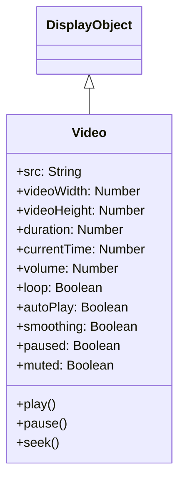

# Video

Videoは、動画コンテンツを再生するためのDisplayObjectです。WebM、MP4などの動画フォーマットに対応しています。

## 継承関係



## プロパティ

| プロパティ | 型 | デフォルト | 説明 |
|-----------|------|----------|------|
| `src` | String | "" | 動画ファイルのURL |
| `videoWidth` | Number | 0 | 動画の幅（読み取り専用） |
| `videoHeight` | Number | 0 | 動画の高さ（読み取り専用） |
| `duration` | Number | 0 | 動画の長さ（秒） |
| `currentTime` | Number | 0 | 現在の再生位置（秒） |
| `volume` | Number | 1 | 音量（0.0～1.0） |
| `loop` | Boolean | false | ループ再生 |
| `autoPlay` | Boolean | true | 自動再生 |
| `smoothing` | Boolean | true | スムージング処理 |
| `paused` | Boolean | true | 一時停止状態 |
| `muted` | Boolean | false | ミュート状態 |

## メソッド

| メソッド | 説明 |
|---------|------|
| `play()` | 動画を再生（Promiseを返す） |
| `pause()` | 動画を一時停止 |
| `seek(offset)` | 指定位置にシーク |

## 使用例

### 基本的な動画再生

```typescript
const { Video } = next2d.media;

// Videoオブジェクトを作成（幅、高さを指定）
const video = new Video(640, 360);

// 動画のURLを設定（設定すると自動的に読み込み開始）
video.src = "video.mp4";

// プロパティ設定
video.autoPlay = true;   // 自動再生
video.loop = false;      // ループしない
video.smoothing = true;  // スムージング有効

// ステージに追加
stage.addChild(video);
```

### 再生コントロール

```typescript
const { Video, VideoEvent } = next2d.media;

const video = new Video(640, 360);
video.autoPlay = false;  // 自動再生を無効化
video.src = "video.mp4";

stage.addChild(video);

// 再生ボタン
playButton.addEventListener("click", async () => {
    await video.play();
});

// 一時停止ボタン
pauseButton.addEventListener("click", () => {
    video.pause();
});

// 停止ボタン（先頭に戻って停止）
stopButton.addEventListener("click", () => {
    video.pause();
    video.seek(0);
});

// 10秒進む
forwardButton.addEventListener("click", () => {
    video.seek(video.currentTime + 10);
});

// 10秒戻る
backButton.addEventListener("click", () => {
    video.seek(Math.max(0, video.currentTime - 10));
});
```

### イベントリスニング

```typescript
const { Video, VideoEvent } = next2d.media;

const video = new Video(640, 360);

// メタデータ受信イベント
video.addEventListener(VideoEvent.METADATA_RECEIVED, () => {
    console.log("Duration:", video.duration);
    console.log("Size:", video.videoWidth, "x", video.videoHeight);
});

// 再生イベント
video.addEventListener(VideoEvent.PLAY, () => {
    console.log("再生開始");
});

// 一時停止イベント
video.addEventListener(VideoEvent.PAUSE, () => {
    console.log("一時停止");
});

// シークイベント
video.addEventListener(VideoEvent.SEEK, () => {
    console.log("シーク:", video.currentTime);
});

// 終了イベント
video.addEventListener(VideoEvent.ENDED, () => {
    console.log("再生終了");
});

video.src = "video.mp4";
stage.addChild(video);
```

### 再生進捗の表示

```typescript
const { Video, VideoEvent } = next2d.media;

const video = new Video(640, 360);
video.src = "video.mp4";
stage.addChild(video);

// フレームごとに進捗を更新
stage.addEventListener("enterFrame", () => {
    if (video.duration > 0) {
        const progress = video.currentTime / video.duration;
        progressBar.scaleX = progress;
        timeLabel.text = formatTime(video.currentTime) + " / " + formatTime(video.duration);
    }
});

function formatTime(seconds) {
    const min = Math.floor(seconds / 60);
    const sec = Math.floor(seconds % 60);
    return `${min}:${sec.toString().padStart(2, '0')}`;
}
```

### 音量コントロール

```typescript
const { Video } = next2d.media;

const video = new Video(640, 360);
video.src = "video.mp4";
video.volume = 0.5;  // 50%

stage.addChild(video);

// 音量スライダー
volumeSlider.addEventListener("change", (event) => {
    video.volume = event.target.value;  // 0.0 ~ 1.0
});

// ミュートトグル
muteButton.addEventListener("click", () => {
    video.muted = !video.muted;
});
```

### ループ再生

```typescript
const { Video } = next2d.media;

const video = new Video(640, 360);
video.loop = true;  // ループ有効
video.src = "video.mp4";

stage.addChild(video);
```

## VideoEvent

| イベント | 説明 |
|----------|------|
| `VideoEvent.METADATA_RECEIVED` | メタデータ受信時 |
| `VideoEvent.PLAY` | 再生開始時 |
| `VideoEvent.PAUSE` | 一時停止時 |
| `VideoEvent.SEEK` | シーク時 |
| `VideoEvent.ENDED` | 再生終了時 |

## サポートフォーマット

| フォーマット | 拡張子 | 対応状況 |
|--------------|--------|----------|
| MP4 (H.264) | .mp4 | 推奨 |
| WebM (VP8/VP9) | .webm | 対応 |
| Ogg Theora | .ogv | ブラウザ依存 |

## 関連項目

- [DisplayObject](./display-object.md)
- [イベントシステム](./events.md)
